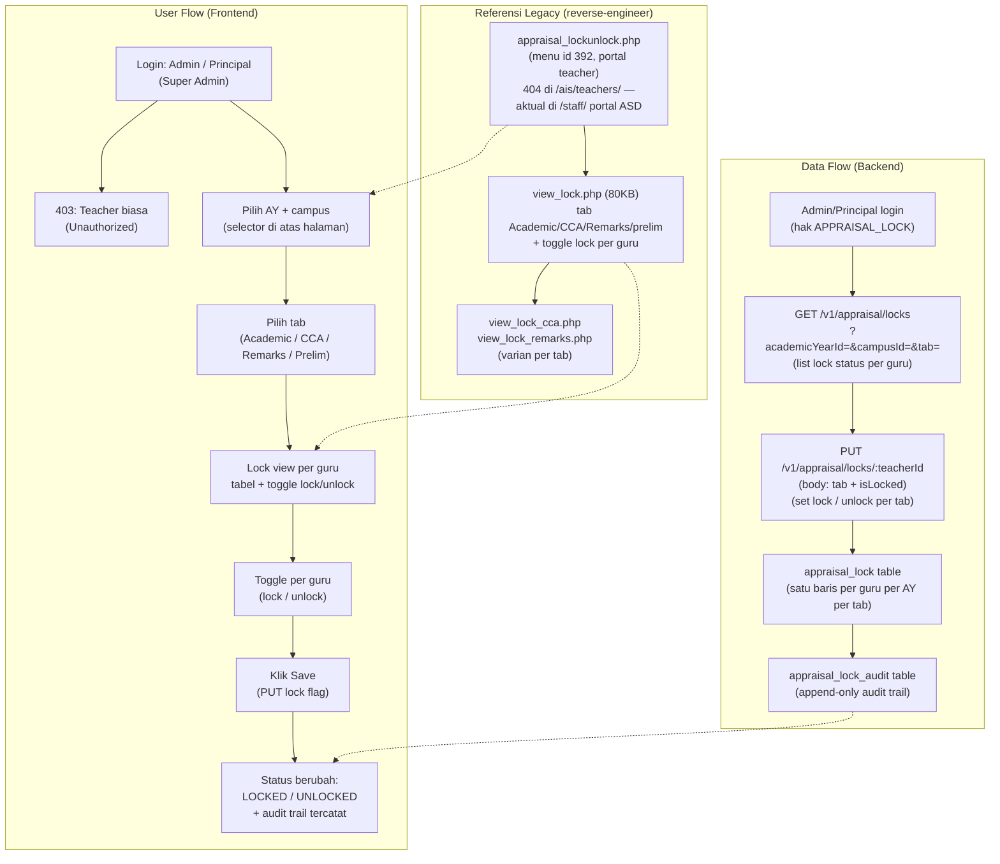
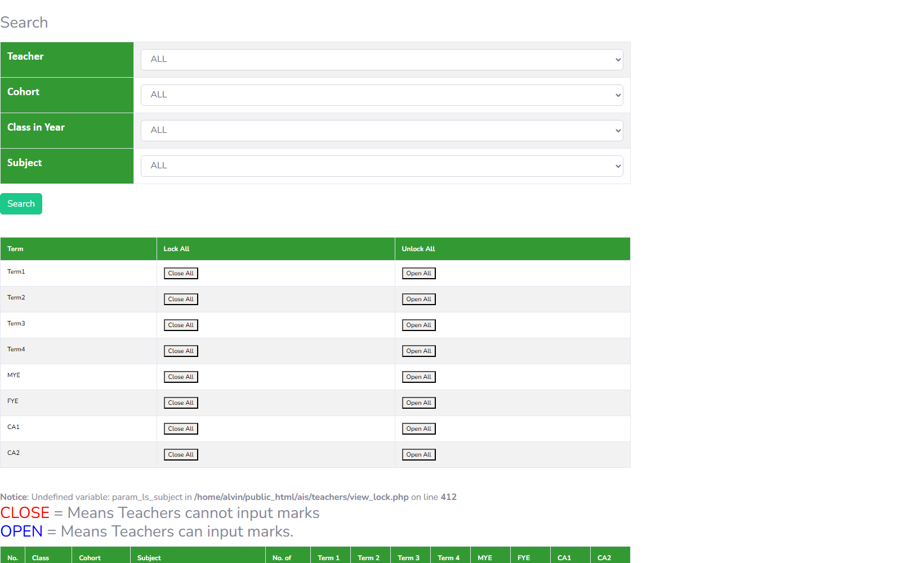

# Appraisal Lock/Unlock

## Overview

Fitur **Appraisal Lock/Unlock** adalah lapisan **workflow control** di atas modul Appraisal & Performance. Admin/Principal dapat **mengunci (lock)** atau **membuka kunci (unlock)** entri appraisal per guru, sehingga guru tidak dapat lagi mengubah skor yang sudah disubmit setelah melewati cutoff. Fitur ini berlaku per **Academic Year (AY)**, per **campus**, dan per **tab** (Academic, CCA, Remarks, dan prelim), mengikuti tampilan tab di halaman legacy `view_lock.php`.

Status yang dipakai: **LOCKED** (terkunci — tidak bisa diedit) dan **UNLOCKED** (terbuka — bisa diedit/dikoreksi).

Direplikasi dari teacher web: menu "Appraisal Lock/Unlock" id 392 di portal teacher (arah ke halaman yang sebenarnya hidup di bawah `/staff/` di zone portal ASD). Halaman utama yang dianalisis adalah `view_lock.php` (80KB) — halaman lock summary besar dengan tab Academic/CCA/Remarks (dan prelim), satu baris per guru dengan toggle lock/unlock.

> **Lapisan di atas status SUBMITTED.** Fitur ini TIDAK menggantikan status DRAFT/SUBMITTED di `features/epms/` maupun skor di `features/petals/`, `features/appraisal-new/`, dan `features/appraisal-summary/`. Lock/unlock adalah kontrol tambahan pasca-submit: konsisten dengan `EC-EP-07` (brief EPMS) yang sudah menetapkan bahwa review SUBMITTED ditolak edit-nya dengan 409 — fitur ini yang secara eksplisit mengelola pembukaan kembali (unlock) untuk koreksi.

## Workflow / Flowchart

### Flowchart



### Penjelasan Langkah-langkah

**1. Alur Pengguna (User Flow) — Sisi Frontend**

| Langkah | Aksi | Hasil |
|---------|------|-------|
| 1.1 | Login sebagai Admin / Principal / Super Admin | Sistem cek permission: jika teacher biasa → 403 Unauthorized. Jika berhak → redirect ke halaman Appraisal Lock/Unlock. |
| 1.2 | Pilih Academic Year + Campus | Selector AY dan campus di atas halaman; default AY aktif + campus milik user. |
| 1.3 | Pilih tab | Tab Academic / CCA / Remarks / Prelim — mengikuti halaman legacy `view_lock.php`. |
| 1.4 | Lock view per guru | Tabel menampilkan satu baris per guru dengan status lock saat ini (LOCKED/UNLOCKED) dan tombol toggle. |
| 1.5 | Toggle lock/unlock | Admin mengubah status per guru (atau bulk jika disediakan). |
| 1.6 | Save | PUT lock flag dikirim; status tersimpan di `appraisal_lock` dan dicatat di `appraisal_lock_audit`. |
| 1.7 | Dampak | Guru tidak bisa lagi mengedit skor pada tab yang LOCKED; setelah UNLOCKED, guru bisa mengoreksi kembali. |

**2. Alur Data (Data Flow) — Sisi Backend**

| Langkah | Proses | Keterangan |
|---------|--------|------------|
| 2.1 | List lock status | `GET /v1/appraisal/locks?academicYearId=&campusId=&tab=` — join `appraisal_lock` ke daftar guru (employee) untuk campus + AY terpilih; guru tanpa baris lock dianggap UNLOCKED. |
| 2.2 | Set lock/unlock | `PUT /v1/appraisal/locks/:teacherId` — body `{ tab, isLocked }`; upsert ke `appraisal_lock` (create jika belum ada, update jika sudah). |
| 2.3 | Audit | Setiap perubahan menulis satu baris ke `appraisal_lock_audit` (siapa, kapan, dari status apa ke status apa, untuk tab apa). |
| 2.4 | Enforce | Saat endpoint edit skor appraisal dipanggil, backend mengecek `appraisal_lock.is_locked = true` untuk (teacher, AY, tab) → tolak dengan 409. |

**3. Skenario Lengkap (End-to-End)**

```
[Admin/Principal Login]
    ↓
[Buka Menu Appraisal Lock/Unlock (id 392)]
    ↓
[Pilih AY 2026/2027 + Campus PIK-S]
    ↓
[Tab Academic → list guru + status lock]
    ↓
[Toggle "Lock" pada guru "Devie Lana" → Save]
    ↓
[Status guru = LOCKED; audit trail tercatat (admin, timestamp)]
    ↓
[Guru buka form skor → form disabled / PUT ditolak 409]
    ↓
[Selesai cutoff: admin unlock bila perlu koreksi → guru edit → lock lagi]
```

## Problem / Motivation

- Teacher web legacy memiliki menu "Appraisal Lock/Unlock" id 392 di portal teacher (`appraisal_lockunlock.php`), namun probe di `/ais/teachers/appraisal_lockunlock.php` mengembalikan 404 — halaman aktual berada di bawah `/staff/` di zone portal ASD. Artinya fungsi ini sebenarnya adalah fungsi admin/principal-side, bukan aksi teacher biasa.
- Halaman legacy `view_lock.php` (80KB) menampilkan lock summary besar dengan tab Academic/CCA/Remarks (dan prelim), satu baris per guru dengan toggle lock/unlock. Tidak ada API terstruktur — semuanya di-render PHP server-side.
- Smartbag (`bbs` + `api_nest`) belum punya entitas lock appraisal sama sekali — tidak ada `AppraisalLock` atau `AppraisalLockAudit`.
- Tanpa lock layer, guru bisa mengubah skor yang sudah disubmit kapan saja setelah cutoff, sehingga hasil appraisal (summary report, analysis) tidak stabil. Konsisten dengan `EC-EP-07` (EPMS): review SUBMITTED harus ditolak edit-nya (409) kecuali admin override — fitur ini menyediakan mekanisme override eksplisit (unlock) yang tercatat.
- Perlu kontrol lock/unlock per guru, per AY, per tab (academic/cca/remarks/prelim) dengan audit trail yang jelas.

## Referensi Analisis (dari teacher web)

| Item | Nilai |
|------|-------|
| Halaman legacy | `appraisal_lockunlock.php` — menu "Appraisal Lock/Unlock" id 392 di portal teacher; probe `/ais/teachers/appraisal_lockunlock.php` → **404** (halaman aktual di bawah `/staff/` di zone portal ASD) |
| Halaman utama (portal ASD/principals) | `view_lock.php` — **80KB**, lock summary page, tab **Academic / CCA / Remarks (dan prelim)**, satu baris per guru + toggle lock |
| Varian per tab | `view_lock_cca.php`, `view_lock_remarks.php` |
| View terkait | `teacher_score.php` — teacher score view (skor guru per item) |
| Menu id (teacher portal) | 392 — "Appraisal Lock/Unlock" |
| Status | `LOCKED` (terkunci — tidak bisa diedit) / `UNLOCKED` (terbuka — bisa diedit) |
| Pemetaan legacy | Halaman muncul di portal teacher tapi 404 di path teacher → fungsi ini bersifat **ASD/principal-side admin** |
| Kaitan EPMS | `EC-EP-07` — review SUBMITTED ditolak edit (409) kecuali admin `PETALS_MANAGE` override |
| Menu terkait (modul Appraisal) | Appraisal Summary Report (322), Appraisal Data Analysis (325), Appraisal Raw Data (326), New Appraisal Teachers (3218), EPMS (391) |

## Scope

### In Scope
- Lock/unlock appraisal **per teacher**, **per AY**, per **tab** (ACADEMIC / CCA / REMARKS / PRELIM / APPRAISAL).
- Halaman lock view: list guru + status lock (toggle) — CDataTable.
- Filter AY + campus + tab.
- Set lock flag: `PUT /v1/appraisal/locks/:teacherId` (upsert).
- Enforce: endpoint edit skor appraisal ditolak 409 jika tab terkait LOCKED.
- Audit trail (`appraisal_lock_audit`) — mencatat siapa mengunci/membuka, kapan, dari/ke status apa.
- Permission: hanya Admin / Principal / Super Admin — teacher biasa mendapat 403.
- Frontend Admin Portal (`client/`) dan Teacher Portal (`client-teacher/`) — mirroring.

### Out of Scope
- Appraisal Summary Report / Data Analysis / Raw Data — modul terpisah (`features/appraisal-summary/`).
- Input skor PETALS / EPMS / New Appraisal — modul terpisah (`features/petals/`, `features/petals-observation/`, `features/epms/`, `features/appraisal-new/`).
- Dashboard E-PETALS (`features/epetals-dashboard/`).
- Perhitungan score/grade otomatis.
- Lock otomatis berbasis tanggal cutoff (enhancement — brief ini lock manual via admin).

## User Stories

### As an Admin / Principal
I want to lock or unlock the appraisal entry of each teacher per academic year and per tab (academic/cca/remarks)
So that teachers cannot modify their submitted scores after a cutoff, and corrections can be re-opened explicitly.

### As an Admin / Principal
I want to see the current lock status of all teachers in one lock view (per AY, per campus, per tab)
So that I can quickly verify who is still open and who is already locked.

### As an Admin
I want every lock/unlock action recorded in an audit trail
So that I can trace who changed the lock status and when.

## Acceptance Criteria

- [ ] **AC-1:** Halaman menampilkan lock view per guru dengan filter AY, campus, dan tab (Academic/CCA/Remarks/Prelim) — CDataTable.
- [ ] **AC-2:** Setiap baris guru menampilkan status saat ini (LOCKED / UNLOCKED) dengan toggle lock/unlock.
- [ ] **AC-3:** Toggle + Save mengirim `PUT /v1/appraisal/locks/:teacherId` dan status tersimpan di `appraisal_lock`.
- [ ] **AC-4:** Guru yang tab-nya LOCKED tidak bisa mengedit skor — backend menolak edit dengan 409 dan frontend menonaktifkan form.
- [ ] **AC-5:** Unlock membuka kembali entri untuk koreksi (guru bisa edit lagi).
- [ ] **AC-6:** Setiap perubahan status tercatat di `appraisal_lock_audit` (actor, timestamp, dari/ke status, tab).
- [ ] **AC-7:** Hanya role Admin/Principal/Super Admin yang bisa mengakses — teacher biasa mendapat 403.
- [ ] **AC-8:** Guru yang belum pernah di-lock/unlock dianggap UNLOCKED (default) — tidak perlu seeding baris lock.

## UI / UX Changes

### UI / UI Guidelines

1. **Selector atas halaman**: dropdown Academic Year + Campus + Tab (Academic/CCA/Remarks/Prelim).
2. **Lock view**: CDataTable — kolom Name, Branch/NIP, Status (LOCKED/UNLOCKED dengan badge), aksi toggle switch per guru.
3. **Toggle**: switch component (on = LOCKED, off = UNLOCKED); perubahan baru dikirim setelah klik tombol Save.
4. **Konfirmasi**: saat mengunci tab yang guru-nya masih aktif mengedit, tampilkan konfirmasi "Mengunci akan menolak edit skor guru. Lanjutkan?".
5. **Audit view**: halaman/tab terpisah untuk melihat riwayat `appraisal_lock_audit`.
6. **Screenshot referensi dari teacher web:**

   **Lock view legacy (`view_lock.php` — tab Academic/CCA/Remarks + toggle per guru):**
   

### Affected Portals
- [x] Admin (client/) — **pengguna utama** (Admin/Principal/ASD-side lock management lintas campus)
- [ ] Student (client-student/)
- [x] Teacher (client-teacher/) — mirroring; Principal mengelola lock per campus-nya; guru melihat status lock (read-only)

### Dual Portal (Mirroring)

| Portal | Lokasi | Peran |
|--------|--------|-------|
| Admin Portal | `bbs/client/src/views/appraisal-lock/` | **Pengguna utama** — Admin/ASD mengelola lock lintas campus lintas AY. |
| Teacher Portal | `bbs/client-teacher/src/views/appraisal-lock/` | **Mirroring** — Principal mengelola lock per campus-nya (`req.user` campusId); guru biasa hanya melihat status (read-only). |

Aturan akses backend:
- Teacher Portal: Principal mengelola lock per campus-nya; guru biasa tidak bisa mengubah lock (403).
- Admin Portal: admin dengan permission `PETALS_MANAGE` (atau permission appraisal setara, e.g. `APPRAISAL_LOCK`) dapat mengelola lintas campus.

## API Changes

| Method | Path | Description |
|--------|------|-------------|
| GET | `/api/v1/appraisal/locks?academicYearId=&campusId=&tab=` | List guru + status lock per tab (untuk lock view) |
| PUT | `/api/v1/appraisal/locks/:teacherId` | Set lock/unlock per tab (`{ tab, isLocked }`) — upsert |
| GET | `/api/v1/appraisal/locks/audit?academicYearId=&campusId=` | Riwayat audit lock/unlock (filter AY + campus) |

Detail lengkap di `api-contract.md`.

## Database Changes

### New Tables
- `appraisal_lock` — status lock per guru per AY per tab
- `appraisal_lock_audit` — audit trail append-only dari semua aksi lock/unlock

### Migrations
- `npm run migration:generate --name=create-appraisal-lock` (di `api_nest`)

### Seed Data
- Tidak ada seed data — baris `appraisal_lock` dibuat (upsert) saat admin pertama kali mengunci guru. Guru tanpa baris dianggap **UNLOCKED**.

Detail lengkap di `schema.md`.

## Business Rules / Validation

1. **Permission:** hanya Admin / Principal / Super Admin yang bisa lock/unlock. Teacher biasa → 403.
2. **Satu baris per (teacher_id, academic_year_id, tab):** UNIQUE constraint; upsert saat toggle.
3. **Enforce:** tab yang `is_locked = true` menolak edit skor appraisal — backend return **409** (konsisten dengan `EC-EP-07` EPMS).
4. **Unlock:** membuka kembali entri untuk koreksi; setelah guru selesai mengoreksi, admin harus lock lagi.
5. **Default:** guru tanpa baris `appraisal_lock` = UNLOCKED.
6. **Audit trail:** setiap perubahan status (lock/unlock) wajib menulis baris audit — append-only, tidak bisa di-edit/di-hapus.
7. **Tab valid:** enum `ACADEMIC | CCA | REMARKS | PRELIM | APPRAISAL` — sesuai tab legacy `view_lock.php`.
8. **Cross-tab:** lock pada satu tab tidak otomatis mengunci tab lain (kecuali tab `APPRAISAL` yang bersifat menyeluruh — lihat `edgecases.md` EC-AL-03).
9. **AY non-aktif:** hanya AY dengan `activeStatus = ACTIVE` yang bisa di-lock/unlock (lihat EC-AL-05).

## Error Handling

| Error | HTTP Code | Message |
|-------|-----------|---------|
| Teacher not found | 404 | "Teacher not found" |
| Academic year not found/inactive | 400 | "Academic year not found or inactive" |
| Invalid tab | 400 | "Invalid lock tab" |
| Unauthorized (teacher role) | 403 | "You don't have permission to lock appraisal" |
| Entry is locked | 409 | "Appraisal entry is locked. Ask admin to unlock to edit." |
| Campus mismatch | 400 | "Teacher is not in your campus" |
| Conflict (simultaneous admin) | 409 | "Lock status was changed by another admin. Reload and try again." |

## Dependencies

- Backend (`api_nest`):
  - Entity `Employee` (`src/modules/employee/entities/employee.entity.ts`) — guru & admin/principal actor.
  - Entity `Campus`, `AcademicYear` — relasi.
  - Decorator: `@CheckPermissions`, `@Auth`.
  - Modul appraisal (skor) yang di-enforce — endpoint edit skor harus cek `appraisal_lock` (`features/appraisal-new/`, `features/petals/`, `features/epms/`).
- Frontend:
  - `bbs-client-common`, `CDataTable`, `makeApiRequestThunk` + `fromApi.js` + `useFromApi`.
- Brief terkait (cross-reference, tanpa duplikasi):
  - `features/epms/` — EC-EP-07 (SUBMITTED → 409) sebagai dasar aturan enforce.
  - `features/appraisal-new/`, `features/appraisal-summary/` — modul skor & report yang dilindungi lock.
  - `features/petals/`, `features/petals-observation/`, `features/epetals-dashboard/` — instrumen appraisal lain.
