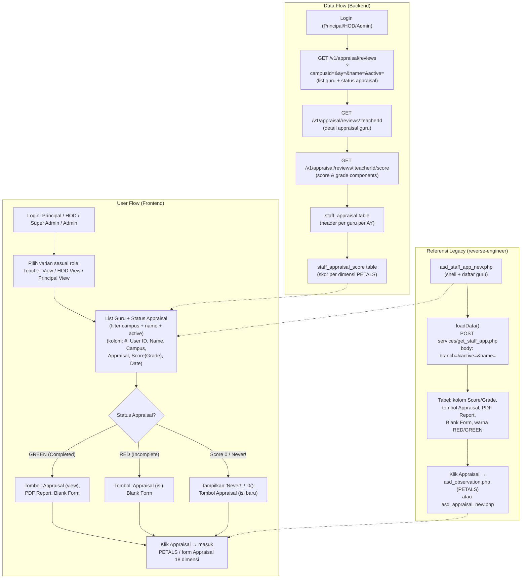

# New Appraisal / Staff Database (Gateway Appraisal)

## Overview

Fitur **New Appraisal** — di legacy dikenal sebagai **Staff Database** — adalah halaman gateway utama modul **Appraisal & Performance** (Staff/HR). Halaman ini menampilkan daftar seluruh guru (staff) beserta status appraisal mereka, berfungsi sebagai **pintu masuk** ke form PETALS Lesson Observation (`asd_observation.php`) dan form Appraisal 18 dimensi (`asd_appraisal_new.php`).

Direplikasi dari portal ASD: `staff/asd_staff_app_new.php` (judul halaman "BBS Staff Database"), dengan varian:
- **Teacher view** — `asd_staff_app_new.php` (menu id 3218) — daftar ~640 guru, kolom Score/Grade, tombol Appraisal (RED/GREEN).
- **HOD view** — `asd_staff_app_hod_new.php` (menu id 3219) — daftar ~69 guru, kolom Appraisal Teacher(80%) + Appraisal HOD(20%), combined score 80/20 weighting.
- **Principal view** — `asd_staff_app_principal_new.php` (menu id 32110) — daftar ~15 guru, kolom score, menampilkan "Never!" jika belum pernah di-appraise.

> **Fitur ini adalah GATEWAY, bukan instrumen penilaian.** Instrumen penilaian (PETALS Lesson Observation, EPMS Work Review) berada di brief terpisah:
> - **PETALS Lesson Observation** — `features/petals-observation/` (18 item rubrik, mark 0-4, total 76 = 100%).
> - **PETALS Summary Report** — `features/petals/` (tampilan report hasil observasi).
> - **EPMS Work Review** — `features/epms/` (Work Review tahunan 7 section).
> - **E-PETALS Dashboard** — `features/epetals-dashboard/` (multi-campus dashboard + petal chart).

## Workflow / Flowchart

### Flowchart



### Penjelasan Langkah-langkah

**1. Alur Pengguna (User Flow) — Sisi Frontend**

| Langkah | Aksi | Hasil |
|---------|------|-------|
| 1.1 | Login sebagai Principal / HOD / Super Admin / Admin | Sistem cek role: jika teacher biasa tanpa akses → 403. Jika berhak → redirect ke halaman New Appraisal sesuai varian role. |
| 1.2 | Filter daftar guru | Halaman menampilkan daftar guru (dari employee) dengan filter campus (All Campus, KJP, KJS, PIKP, PIKS, BDGP, BDGS, SMGP, SMGS, MLGP, MLGS, BPNP, BPNS), filter Name (text input), dan filter Active (YES/NO). |
| 1.3 | Lihat status appraisal | Setiap baris menampilkan tombol Appraisal berwarna **RED** (Incomplete) atau **GREEN** (Completed), kolom Score (Grade) seperti "95.520833333333(A)", "80.364583333333(B)", atau "0()" jika belum diisi, dan tanggal submit terakhir. |
| 1.4 | Klik tombol Appraisal | Membuka form PETALS Lesson Observation (`asd_observation.php`) atau form Appraisal 18 dimensi (`asd_appraisal_new.php`). |
| 1.5 | PDF Report / Blank Form | Jika status Completed, tombol PDF Report tersedia untuk download laporan. Blank Form untuk mencetak form kosong. |

**2. Alur Data (Data Flow) — Sisi Backend**

| Langkah | Proses | Keterangan |
|---------|--------|------------|
| 2.1 | List guru + status | `GET /v1/appraisal/reviews?campusId=&ay=&name=&active=` — membaca dari employee + `staff_appraisal` untuk status per guru. |
| 2.2 | Detail appraisal | `GET /v1/appraisal/reviews/:teacherId` — detail appraisal guru, termasuk skor per dimensi. |
| 2.3 | Score & grade | Perhitungan score dari `staff_appraisal_score` (aggregate dimensi PETALS), grade A/B/C/D berdasarkan threshold. |
| 2.4 | Varian HOD | Teacher score 80% + HOD score 20% = combined score. |
| 2.5 | Status | Appraisal dianggap `COMPLETED` jika semua dimensi PETALS terisi. Status `INCOMPLETE` jika belum. |

**3. Skenario Lengkap (End-to-End)**

```
[Principal Login (PIK-S)]
    ↓
[Buka Menu New Appraisal (id 3218)]
    ↓
[List Guru PIK-S untuk AY 2026/2027 muncul — ~640 guru]
    ↓
[Filter: Name = "Devie", Campus = "PIK-S", Active = "YES"]
    ↓
[Guru "Devie Lana" muncul — Score 95.52(A), tombol GREEN]
    ↓
[Klik "Appraisal" → masuk form PETALS / Appraisal 18 dimensi]
    ↓
[Isi/selesai → kembali ke list, status berubah]
```

## Problem / Motivation

- Teacher web legacy memiliki halaman `staff/asd_staff_app_new.php` (menu "New Appraisal Teachers" id 3218) yang menampilkan daftar guru + status appraisal — tidak ada API terstruktur, data dimuat via POST `services/get_staff_app.php` (body: `branch=4&active=1&name=`).
- Smartbag (`bbs` + `api_nest`) belum punya modul gateway Appraisal yang terintegrasi — tidak ada entitas `StaffAppraisal` atau `StaffAppraisalScore`.
- Data status appraisal saat ini tersimpan di database legacy (staff module) dan tidak bisa diakses dari sistem baru tanpa API.
- Perlu halaman gateway yang menjadi **single entry point** untuk seluruh modul Appraisal & Performance (PETALS, EPMS, dll) — mirip fungsi legacy sebagai landing page.

## Referensi Analisis (dari teacher web)

| Item | Nilai |
|------|-------|
| Halaman legacy | `staff/asd_staff_app_new.php` — title "BBS Staff Database" (Teacher view) |
| Varian HOD | `staff/asd_staff_app_hod_new.php` — menu id 3219, 80/20 weighting |
| Varian Principal | `staff/asd_staff_app_principal_new.php` — menu id 32110, "Never!" jika skor 0 |
| Menu id (portal ASD) | 3218 — "New Appraisal Teachers" → `asd_staff_app_new.php`; 3219 — "HOD" → `asd_staff_app_hod_new.php`; 32110 — "Principal" → `asd_staff_app_principal_new.php` |
| Menu id (teacher portal) | 341 — "Appraisal Summary Report"; 342 — "HOD Appraisal Summary"; 392 — "Appraisal Lock/Unlock" |
| JS handler | `loadData()` — POST `services/get_staff_app.php` (body: `branch=4&active=1&name=`) |
| Load data | POST `services/get_staff_app.php` — parameter: `branch` (campus id), `active` (Y/N), `name` (filter nama) |
| Kolom tabel (Teacher) | #, User ID, Name, Campus, Appraisal (tombol warna), Score (Grade), Date |
| Kolom tabel (HOD) | #, User ID, Name, Campus, Appraisal Teacher(80%), Appraisal HOD (20%), Score (Grade) |
| Kolom tabel (Principal) | #, User ID, Name, Campus, Appraisal, Score (Grade) |
| Warna tombol | RED = Incomplete (belum selesai), GREEN = Completed (selesai) |
| Score format | `95.520833333333(A)` — angka desimal + grade dalam kurung; `0()` jika belum diisi |
| Tanggal | Format `2026-04-14 08:30:02` — last submit timestamp |
| HOD weighting | Teacher 80% + HOD 20% = combined score (contoh: 91.979 + 90.625 → 91.708) |
| Grade | A/B/C/D — berdasarkan threshold nilai (detail threshold di Business Rules) |
| Campus list | All Campus, KJP, KJS, PIKP, PIKS, BDGP, BDGS, SMGP, SMGS, MLGP, MLGS, BPNP, BPNS |
| Tombol aksi | "Appraisal" (buka form), "PDF Report" (jika completed), "Blank Form" (cetak kosong) |

## Scope

### In Scope
- Halaman daftar guru (Staff Database) dengan filter: **Campus** (dropdown 13 campus), **Name** (text input), **Active** (YES/NO select).
- Kolom tabel: #, User ID, Name, Campus, Appraisal (tombol warna), Score (Grade), Date (last submit).
- Tombol aksi per baris: **Appraisal** (membuka form PETALS/appraisal), **PDF Report** (jika completed), **Blank Form**.
- Status color: **RED** (Incomplete) / **GREEN** (Completed) pada tombol Appraisal.
- Score & Grade: menampilkan angka desimal + grade (A/B/C/D) — atau "0()" jika belum diisi.
- Tiga varian halaman: **Teacher View** (score tunggal), **HOD View** (80/20 weighting), **Principal View** (score tunggal + "Never!").
- Empty state untuk guru yang belum pernah di-appraise: menampilkan "Never!" atau score "0()".
- Frontend Teacher Portal (`client-teacher`) — pengguna utama (Principal/HOD role).
- Frontend Admin Portal (`client/`) — mirroring: admin dapat melihat/mengelola lintas campus.

### Out of Scope
- PETALS Lesson Observation form — terpisah (`features/petals-observation/`).
- PETALS Summary Report — terpisah (`features/petals/`).
- EPMS Work Review — terpisah (`features/epms/`).
- E-PETALS Dashboard & Petal Chart — terpisah (`features/epetals-dashboard/`).
- Appraisal Summary Report / Appraisal Data Analysis — modul terpisah di legacy.
- Appraisal Lock/Unlock workflow — menu id 392 di teacher portal.
- Export Excel / Print daftar guru (enhancement).
- Perhitungan grade otomatis — enhancement (legacy menghitung di belakang; brief ini menyimpan score mentah).

## User Stories

### As a Principal
I want to see a list of all teachers in my campus with their appraisal status
So that I can monitor which teachers have completed their appraisals and which still need to finish.

### As a Principal
I want to click the Appraisal button to open the PETALS observation form
So that I can conduct or review a lesson observation for a specific teacher.

### As a Principal (HOD View)
I want to see the combined score (Teacher 80% + HOD 20%) for each teacher
So that I can evaluate the overall appraisal result with proper weighting.

### As an Admin
I want to access the Staff Database for any campus
So that I can support principals and HODs in managing appraisals across campuses.

### As a Principal
I want to see "Never!" when a teacher has never been appraised
So that I can easily identify new teachers who have not received any appraisal.

## Acceptance Criteria

- [ ] **AC-1:** Halaman menampilkan daftar guru dengan filter Campus (13 pilihan), Name (text input), Active (YES/NO) — filter bekerja secara real-time atau via tombol Search.
- [ ] **AC-2:** Kolom tabel menampilkan #, User ID, Name, Campus, Appraisal (tombol warna), Score (Grade), Date — sesuai legacy.
- [ ] **AC-3:** Tombol Appraisal berwarna RED jika status appraisal Incomplete, GREEN jika Completed.
- [ ] **AC-4:** Score ditampilkan dalam format desimal dengan grade dalam kurung, misal "95.520833333333(A)" — atau "0()" jika belum diisi.
- [ ] **AC-5:** Tombol PDF Report hanya muncul jika status appraisal Completed.
- [ ] **AC-6:** Tombol Blank Form selalu tersedia untuk mencetak form kosong.
- [ ] **AC-7:** HOD View menampilkan dua kolom score terpisah: Appraisal Teacher(80%) dan Appraisal HOD (20%) + combined Score (Grade).
- [ ] **AC-8:** Principal View menampilkan "Never!" pada kolom Score jika guru belum pernah di-appraise (score 0).
- [ ] **AC-9:** Klik Appraisal membuka form PETALS Lesson Observation (di-handle oleh `features/petals-observation/`).
- [ ] **AC-10:** Empty state jika tidak ada guru yang cocok dengan filter yang dipilih.
- [ ] **AC-11:** Hanya role Principal/HOD/Super Admin/Admin yang bisa mengakses — teacher biasa mendapat 403 jika tidak punya permission.

## UI / UX Changes

### UI / UI Guidelines

1. **List guru**: tabel (CDataTable) — kolom #, User ID, Name, Campus, Appraisal (tombol warna RED/GREEN), Score (Grade), Date, aksi (Appraisal, PDF Report, Blank Form).
2. **Filter bar**: di atas tabel — dropdown Campus (13 campus), text input Name, select Active (YES/NO/All), tombol Search.
3. **Tombol Appraisal**: berwarna RED (#DC2626) untuk Incomplete, GREEN (#16A34A) untuk Completed — dengan icon checklist atau emblem.
4. **Score column**: format desimal + grade dalam kurung, atau "Never!" (Principal view) untuk skor 0.
5. **Date column**: format `YYYY-MM-DD HH:MM:SS` — menampilkan last submit timestamp.
6. **Varian HOD**: dua kolom "Appraisal Teacher(80%)" dan "Appraisal HOD (20%)" + combined Score (Grade) — menampilkan weighting 80/20.
7. **Actions**: tombol teks "Appraisal" (view/edit), "PDF Report" (download), "Blank Form" (print kosong).
8. **Screenshot referensi dari teacher web:** (belum tersedia — placeholder untuk screenshots/)

### Affected Portals
- [x] Admin (client/) — mirroring; admin dapat melihat/mengelola lintas campus
- [ ] Student (client-student/)
- [x] Teacher (client-teacher/) — pengguna utama (Principal / HOD / Admin role)

### Dual Portal (Mirroring)

| Portal | Lokasi | Peran |
|--------|--------|-------|
| Teacher Portal | `bbs/client-teacher/src/views/appraisal-new/` | **Pengguna utama** — Principal/HOD melihat daftar guru + status appraisal per campus-nya. |
| Admin Portal | `bbs/client/src/views/appraisal-new/` | **Mirroring** — admin melihat/mengelola daftar guru lintas campus. |

Aturan akses backend:
- Teacher Portal: Principal/HOD mengelola data per campus-nya (`req.user` campusId).
- Admin Portal: admin punya permission tambahan `APPRAISAL_MANAGE` sehingga dapat akses lintas campus.

## API Changes

| Method | Path | Description |
|--------|------|-------------|
| GET | `/api/v1/appraisal/reviews?campusId=&ay=&name=&active=&type=` | List guru + status appraisal (untuk Staff Database) |
| GET | `/api/v1/appraisal/reviews/:teacherId` | Detail appraisal untuk satu guru |
| GET | `/api/v1/appraisal/reviews/:teacherId/score` | Score & grade breakdown (termasuk komponen Teacher/HOD untuk HOD view) |
| PUT | `/api/v1/appraisal/reviews/:teacherId/status` | Update status appraisal (submit/complete) |

Detail lengkap di `api-contract.md`.

## Database Changes

### New Tables
- `staff_appraisal` — header appraisal per guru per AY (mirroring `asd_staff_app_new.php` legacy)
- `staff_appraisal_score` — skor per dimensi PETALS / appraisal (reuse konfigurasi dimensi dari `features/petals-observation/`)

### Migrations
- `npm run migration:generate --name=create-staff-appraisal` (di `api_nest`)

### Seed Data
- Tidak ada seed data khusus untuk fitur ini — data appraisal adalah hasil review dari PETALS / form Appraisal 18 dimensi.
- Tabel `staff_appraisal` diisi saat pertama kali appraisal dibuat (trigger dari PETALS form).
- Grade threshold (A/B/C/D) bisa dijadikan config terpisah (lihat `Business Rules`).

Detail lengkap di `schema.md`.

## Business Rules / Validation

1. **Score & Grade**: Score dihitung dari aggregate dimensi PETALS (18 item, mark 0-4, total 76 = 100%). Grade A/B/C/D berdasarkan threshold:
   - A: >= 90
   - B: >= 75
   - C: >= 60
   - D: < 60
   (Threshold ini mengikuti legacy — perlu diverifikasi dengan data aktual.)
2. **HOD Weighting 80/20**: Teacher score (80%) + HOD score (20%) = combined score. Untuk HOD view, dua kolom ditampilkan terpisah.
3. **Status**: `INCOMPLETE` (belum semua dimensi terisi) / `COMPLETED` (semua dimensi terisi & submit).
4. **Never!**: Jika score = 0 dan belum pernah ada submit, tampilkan "Never!" di Principal view — atau "0()" di Teacher view.
5. **Satu guru per AY**: Satu record `staff_appraisal` per (teacher_id, academic_year_id) — update jika ada perubahan.
6. **Appraisal type**: `TEACHER` (self/HOD/Principal menilai guru), `HOD` (HOD-specific appraisal), `PRINCIPAL` (Principal-specific appraisal).
7. **PDF Report**: Hanya bisa di-download jika status = `COMPLETED`.
8. **Blank Form**: Selalu tersedia — mencetak form appraisal kosong (PDF).
9. **Tanggal submit**: Diisi otomatis saat status berubah menjadi `COMPLETED`.
10. **Fitur ini tidak menyimpan data PETALS** — hanya membaca status dan score dari `staff_appraisal_score` yang diisi oleh modul PETALS.

## Error Handling

| Error | HTTP Code | Message |
|-------|-----------|---------|
| Teacher not found | 404 | "Teacher not found" |
| Teacher not in campus | 400 | "Teacher is not in your campus" |
| No appraisal record | 404 | "No appraisal record found for this teacher" |
| Unauthorized (teacher role) | 403 | "You don't have permission to access New Appraisal" |
| Academic year not found | 400 | "Academic year not found or inactive" |
| Invalid campus filter | 400 | "Invalid campus ID" |

## Dependencies

- Backend (`api_nest`):
  - Entity `Employee` (`src/modules/employee/entities/employee.entity.ts`) — guru dan reviewer.
  - Entity `Campus`, `AcademicYear` — relasi.
  - Entity `StaffAppraisal` dan `StaffAppraisalScore` — tabel baru (schema.md).
  - Decorator: `@CheckPermissions`, `@Auth`.
- Frontend:
  - `bbs-client-common`, `CDataTable`, `makeApiRequestThunk` + `fromApi.js` + `useFromApi`.
- Modul PETALS (`features/petals-observation/`) — menyediakan data score per dimensi yang dibaca oleh fitur ini.
- Modul EPMS (`features/epms/`) — sesama modul Appraisal & Performance (tidak ada relasi data langsung).