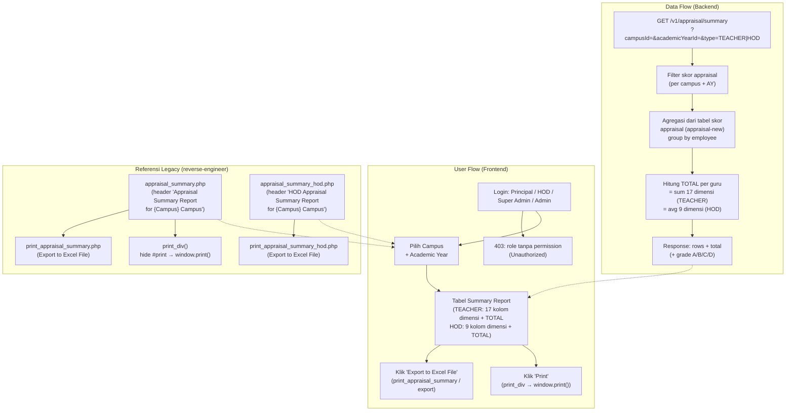
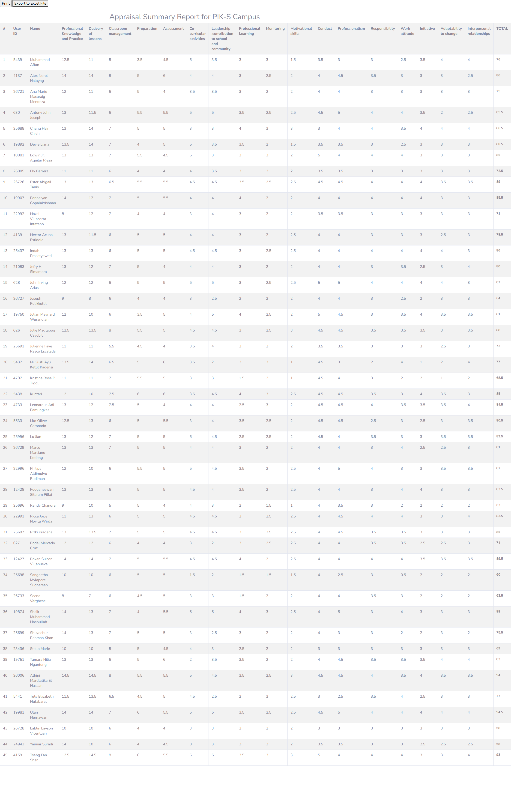
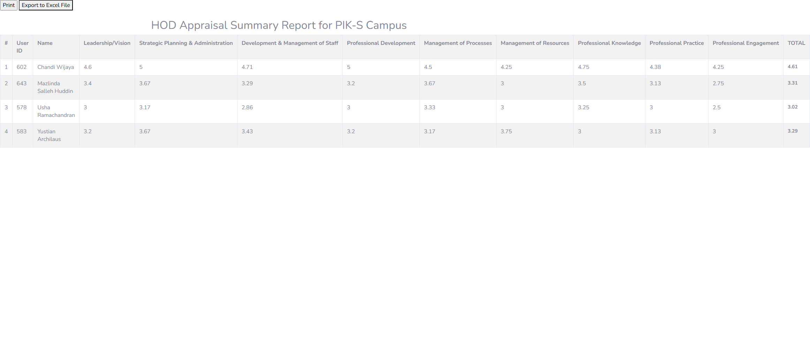

# Appraisal Summary Report

## Overview

Fitur **Appraisal Summary Report** adalah laporan ringkasan agregat skor appraisal per campus. Berbeda dari form input appraisal (`features/appraisal-new/` — New Appraisal / Staff Database gateway) dan PETALS observation (`features/petals-observation/`), fitur ini adalah **read-only report view** yang mengagregasi skor appraisal yang sudah di-input dari halaman gateway menjadi tabel ringkasan: satu baris per guru, dengan kolom per dimensi kompetensi dan kolom TOTAL.

Terdapat dua varian utama:
- **Teacher summary** — 17 dimensi kompetensi guru + kolom TOTAL (skala maks per dimensi berbeda-beda, total berkisar 76-100).
- **HOD summary** — 9 dimensi kompetensi HOD + kolom TOTAL (skala 0-5, nilai total berupa rata-rata ~4.6, 3.31, dst).

Direplikasi dari teacher web:
- `staff/appraisal_summary.php` (teacher version) — menu id **341** "Appraisal Summary Report" di portal teacher.
- `staff/appraisal_summary_hod.php` (HOD version) — menu id **342** "HOD Appraisal Summary" di portal teacher.
- `staff/appraisal_summary_asd.php?campus=1&cname=KJP` (ASD/campus version) — menu id **322** "Appraisal Summary Report" di portal ASD.

> **Appraisal Summary Report ≠ PETALS.** Meskipun set dimensi teacher (17 dimensi) sangat mirip/overlap dengan PETALS, ini adalah **pandangan agregat** dari skor appraisal yang sudah di-input (data dari gateway `features/appraisal-new/`), BUKAN form observasi input. Skor di sini hanya dibaca dan dijumlahkan, tidak bisa diedit.

## Workflow / Flowchart

### Flowchart



### Penjelasan Langkah-langkah

**1. Alur Pengguna (User Flow) — Sisi Frontend**

| Langkah | Aksi | Hasil |
|---------|------|-------|
| 1.1 | Login sebagai Principal / HOD / Super Admin / Admin | Sistem cek permission: jika role tanpa akses appraisal → 403 Unauthorized. Jika berhak → redirect ke halaman Appraisal Summary Report. |
| 1.2 | Pilih campus + AY | Dropdown campus dan academic year (default campus dari `req.user`, AY aktif). |
| 1.3 | Tampilkan summary | Tabel ringkasan: baris per guru, kolom 17 dimensi teacher (atau 9 dimensi HOD) + kolom TOTAL. Header "Appraisal Summary Report for {Campus} Campus" / "HOD Appraisal Summary Report for {Campus} Campus". |
| 1.4 | Export Excel | Klik "Export to Excel File" → download file Excel dari data tabel yang sama. |
| 1.5 | Print | Klik "Print" → tombol print disembunyikan (`#print` visibility collapse) → `window.print()` → `self.close()`. |

**2. Alur Data (Data Flow) — Sisi Backend**

| Langkah | Proses | Keterangan |
|---------|--------|------------|
| 2.1 | Query summary | `GET /v1/appraisal/summary?campusId=&academicYearId=&type=` — membaca skor appraisal dari tabel skor (lihat `schema.md`, bersumber dari `features/appraisal-new/`). |
| 2.2 | Agregasi | Skor per dimensi di-group by employee; guru yang belum di-appraise / skor null tidak muncul di report. |
| 2.3 | Hitung TOTAL | TEACHER: sum 17 dimensi. HOD: rata-rata 9 dimensi (skala 0-5). |
| 2.4 | Response | `{ data: [...rows], count }` — tiap row memuat 17/9 field dimensi + total. |

**3. Skenario Lengkap (End-to-End)**

```
[Principal Login (PIK-S)]
    ↓
[Buka Menu Appraisal Summary Report (id 341)]
    ↓
[Pilih Campus PIK-S + AY aktif]
    ↓
[Tabel Summary muncul: 45 guru, kolom 17 dimensi + TOTAL]
    ↓
[Contoh baris: Muhammad Affan (5439) → TOTAL 76]
    ↓
[Klik "Export to Excel File" → download .xls]
    ↓
[Atau klik "Print" → window.print() untuk cetak]
```

## Problem / Motivation

- Teacher web legacy memiliki halaman `staff/appraisal_summary.php` (menu "Appraisal Summary Report" id 341), `staff/appraisal_summary_hod.php` (id 342), dan `staff/appraisal_summary_asd.php?campus=1&cname=KJP` (portal ASD id 322) yang menampilkan ringkasan agregat skor appraisal per campus — semua di-render PHP server-side tanpa API terstruktur.
- Smartbag (`bbs` + `api_nest`) belum punya modul report summary appraisal — skor yang di-input di gateway (`features/appraisal-new/`) belum bisa dilihat dalam bentuk tabel agregat per dimensi + total per guru.
- Data skor tersimpan di tabel skor appraisal (database legacy / modul appraisal) dan tidak bisa diakses dari sistem baru tanpa endpoint agregasi.
- Perlu laporan read-only yang mengagregasi skor appraisal per campus + AY, lengkap dengan varian teacher (17 dimensi) dan HOD (9 dimensi), export Excel, dan print — terpisah dari form input.

## Referensi Analisis (dari teacher web)

| Item | Nilai |
|------|-------|
| Halaman legacy (teacher) | `staff/appraisal_summary.php` — header "Appraisal Summary Report for {Campus} Campus" |
| Halaman legacy (HOD) | `staff/appraisal_summary_hod.php` — header "HOD Appraisal Summary Report for {Campus} Campus" |
| Halaman legacy (ASD/campus) | `staff/appraisal_summary_asd.php?campus=1&cname=KJP` — varian dengan param campus + campus name |
| Menu id (teacher portal) | 341 — "Appraisal Summary Report"; 342 — "HOD Appraisal Summary" |
| Menu id (portal ASD) | 322 — "Appraisal Summary Report" |
| Shell title | "BBS Staff Database" (keduanya) |
| Export | Link `print_appraisal_summary.php` (teacher) & `print_appraisal_summary_hod.php` (HOD) → tombol "Export to Excel File" |
| Print | `print_div()` — hide elemen `#print` → `window.print()` → `self.close()`; tombol `<input type="button" name="print" value="Print">` |
| Tabel | `<table id="dataTable" class="table table-bordered table-striped">` — kolom #, User ID, Name, dimensi..., TOTAL |
| Jumlah baris (probe) | 45 guru (teacher summary PIK-S), 4 HOD (HOD summary PIK-S) |
| Menu terkait (portal ASD) | Appraisal Summary Report (322), Appraisal Data Analysis (325), Appraisal Raw Data (326), New Appraisal Teachers (3218), HOD (3219) |
| Menu terkait (teacher portal) | Appraisal Lock/Unlock (392), EPMS (391) |

### Kolom Tabel Teacher (17 dimensi + TOTAL)

| # | Kolom (persis dari HTML legacy) | Contoh nilai (Muhammad Affan, ID 5439) |
|---|----------------------------------|---------------------------------------|
| 1 | Professional Knowledge and Practice | 12.5 |
| 2 | Delivery of lessons | 11 |
| 3 | Classroom management | 5 |
| 4 | Preparation | 3.5 |
| 5 | Assessment | 4.5 |
| 6 | Co-curricular activities | 5 |
| 7 | Leadership ,contribution to school and community | 3.5 |
| 8 | Professional Learning | 3 |
| 9 | Monitoring | 3 |
| 10 | Motivational skills | 1.5 |
| 11 | Conduct | 3.5 |
| 12 | Professionalism | 3 |
| 13 | Responsibility | 3 |
| 14 | Work attitude | 2.5 |
| 15 | Initiative | 3.5 |
| 16 | Adaptability to change | 4 |
| 17 | Interpersonal relationships | 4 |
| — | **TOTAL** | **76** (bold) |

> Total = jumlah 17 nilai dimensi: 12.5+11+5+3.5+4.5+5+3.5+3+3+1.5+3.5+3+3+2.5+3.5+4+4 = **76** ✓ (terverifikasi dari dump HTML).

### Kolom Tabel HOD (9 dimensi + TOTAL)

| # | Kolom (persis dari HTML legacy) | Contoh nilai (Chandi Wijaya, ID 602) |
|---|----------------------------------|--------------------------------------|
| 1 | Leadership/Vision | 4.6 |
| 2 | Strategic Planning & Administration | 5 |
| 3 | Development & Management of Staff | 4.71 |
| 4 | Professional Development | 5 |
| 5 | Management of Processes | 4.5 |
| 6 | Management of Resources | 4.25 |
| 7 | Professional Knowledge | 4.75 |
| 8 | Professional Practice | 4.38 |
| 9 | Professional Engagement | 4.25 |
| — | **TOTAL** | **4.61** (bold) |

> HOD summary memakai skala **0-5** (nilai 4.6, 3.31, 3.02, 3.29 — rata-rata dari dimensi, bukan sum). Mazlinda Salleh Huddin total **3.31**.

### Skala & Maks per Dimensi Teacher (observasi dari data probe)

| Dimensi | Maks teramati (nilai max di data) |
|---------|-----------------------------------|
| Professional Knowledge and Practice | 14.5 (14) |
| Delivery of lessons | 14.5 (14) |
| Classroom management | 8 |
| Preparation | 6 |
| Assessment | 6 |
| Co-curricular activities | 5 |
| Leadership ,contribution to school and community | 5 |
| Professional Learning | 4 |
| Monitoring | 3 |
| Motivational skills | 3 |
| Conduct | 5 |
| Professionalism | 5 |
| Responsibility | 4 |
| Work attitude | 4 |
| Initiative | 4 |
| Adaptability to change | 4 |
| Interpersonal relationships | 4 |

> Maks per dimensi **berbeda-beda** (tidak seragam) — total teoretis ±99, total tertinggi teramati 94.5 (Ulan Hernawan). Ini penting untuk validasi di `schema.md` (kolom `max_mark` per dimensi).

## Scope

### In Scope
- Summary report per campus: tabel ringkasan skor appraisal, satu baris per guru.
- Varian **Teacher**: 17 kolom dimensi + kolom TOTAL (skala maks per dimensi berbeda).
- Varian **HOD**: 9 kolom dimensi + kolom TOTAL (skala 0-5).
- Filter campus + academic year.
- Tombol "Export to Excel File".
- Tombol "Print" (print_div → window.print()).
- Hanya role berwenang (Principal / HOD / Super Admin / Admin) — teacher biasa mendapat 403.
- Frontend Teacher Portal (`client-teacher`) — pengguna utama (Principal/HOD).
- Frontend Admin Portal (`client/`) — mirroring: admin dapat melihat/export lintas campus.

### Out of Scope
- Input skor PETALS observation — terpisah (`features/petals-observation/`).
- Input/update skor appraisal (New Appraisal) — terpisah (`features/appraisal-new/`, gateway).
- Appraisal Data Analysis (`appdata_index.php`, menu 325) dan Appraisal Raw Data (menu 326).
- Appraisal Lock/Unlock workflow (menu 392).
- Edit skor dari report (report murni read-only).
- Grade otomatis A/B/C/D — enhancement (lihat Business Rules).

## User Stories

### As a Principal
I want to view the appraisal summary report of my campus
So that I can see the aggregated appraisal scores of all teachers across all 17 dimensions with their total, and export or print the report.

### As an HOD
I want to view the HOD appraisal summary report of my campus
So that I can see the aggregated 9-dimension scores of all HODs on a 0-5 scale with their average total.

### As an Admin
I want to access the appraisal summary report for any campus
So that I can review and export appraisal results across campuses (mirroring).

## Acceptance Criteria

- [ ] **AC-1:** Halaman menampilkan tabel summary per campus dengan kolom #, User ID, Name, 17 dimensi teacher, dan kolom TOTAL — label persis seperti dump legacy (`probe_appraisal_summary.html`).
- [ ] **AC-2:** Varian HOD menampilkan kolom #, User ID, Name, 9 dimensi, dan kolom TOTAL dengan skala 0-5 — label persis seperti `probe_appraisal_summary_hod.html`.
- [ ] **AC-3:** TOTAL teacher = jumlah 17 dimensi; TOTAL HOD = rata-rata 9 dimensi (0-5).
- [ ] **AC-4:** Ada filter campus + academic year; default campus dari `req.user`, AY aktif.
- [ ] **AC-5:** Tombol "Export to Excel File" men-download file Excel berisi data tabel yang sama.
- [ ] **AC-6:** Tombol "Print" menjalankan print — elemen tombol disembunyikan saat print (seperti `print_div()` legacy).
- [ ] **AC-7:** Header halaman "Appraisal Summary Report for {Campus} Campus" / "HOD Appraisal Summary Report for {Campus} Campus".
- [ ] **AC-8:** Guru yang belum di-appraise (skor null) tidak muncul di report.
- [ ] **AC-9:** Hanya role Principal/HOD/Super Admin/Admin yang bisa mengakses — role lain mendapat 403.
- [ ] **AC-10:** Empty state jika campus tidak punya data appraisal untuk AY terpilih.

## UI / UX Changes

### UI / UI Guidelines

1. **Tabel summary**: CDataTable full-width, kolom #, User ID, Name, 17 kolom dimensi (teacher) / 9 kolom dimensi (HOD), kolom TOTAL (bold, seperti legacy `font-weight: bold`). Horizontal scroll untuk layar kecil.
2. **Toolbar atas**: dropdown Campus + dropdown Academic Year + tombol "Export to Excel File" + tombol "Print".
3. **Print**: tombol Print dan dropdown disembunyikan saat `window.print()` (mirror `print_div()` legacy yang menyembunyikan elemen `#print`).
4. **Export Excel**: download file (mis. `.xls`/`.csv`) berisi header kolom + semua baris.
5. **Screenshot referensi dari teacher web:**

   **Teacher Appraisal Summary Report untuk PIK-S (probe `probe_appraisal_summary.png`):**
   

   **HOD Appraisal Summary Report untuk PIK-S (probe `probe_appraisal_summary_hod.png`):**
   

### Affected Portals
- [x] Admin (client/) — mirroring; admin dapat melihat/export lintas campus
- [ ] Student (client-student/)
- [x] Teacher (client-teacher/) — pengguna utama (Principal / HOD role)

### Dual Portal (Mirroring)

| Portal | Lokasi | Peran |
|--------|--------|-------|
| Teacher Portal | `bbs/client-teacher/src/views/appraisal-summary/` | **Pengguna utama** — Principal/HOD melihat summary report per campus-nya. |
| Admin Portal | `bbs/client/src/views/appraisal-summary/` | **Mirroring** — admin melihat/export summary lintas campus. |

Aturan akses backend:
- Teacher Portal: Principal/HOD melihat data per campus-nya (`req.user` campusId) — type TEACHER untuk principal, HOD bisa melihat teacher summary; type HOD untuk HOD summary.
- Admin Portal: admin punya permission tambahan `PETALS_MANAGE` (atau permission appraisal setara) sehingga dapat melihat/export lintas campus.

## API Changes

| Method | Path | Description |
|--------|------|-------------|
| GET | `/api/v1/appraisal/summary?campusId=&academicYearId=&type=TEACHER\|HOD` | Summary report: rows 17/9 dimensi + total per guru |
| GET | `/api/v1/appraisal/summary/export?format=excel&campusId=&academicYearId=&type=` | Export summary ke file Excel |
| GET | `/api/v1/appraisal/summary/print?campusId=&academicYearId=&type=` | Print view summary (data untuk print-friendly page) |

Detail lengkap di `api-contract.md`.

## Database Changes

### New Tables
- **Tidak ada tabel baru yang wajib** — fitur ini adalah read/aggregation view di atas tabel skor appraisal (dari `features/appraisal-new/`, lihat `schema.md`).
- **Opsional**: `appraisal_dimension` — config dimensi (17 teacher + 9 HOD) dengan `max_mark`, untuk memvalidasi batas maks per dimensi (rekomendasi).
- **Opsional**: `appraisal_summary_cache` — materialized summary table untuk caching agregasi (hanya jika performa agregasi jadi masalah).

### Migrations
- (Opsional) `npm run migration:generate --name=create-appraisal-dimension` (config dimensi).
- (Opsional) `npm run migration:generate --name=create-appraisal-summary-cache`.

### Seed Data
- **TIDAK ada skor yang di-seed** — skor adalah hasil input di gateway (`features/appraisal-new/`), report hanya membaca & mengagregasi.
- (Opsional) Seed 26 dimensi ke `appraisal_dimension` (17 teacher + 9 HOD) dengan label persis dari legacy.

Detail lengkap di `schema.md`.

## Business Rules / Validation

1. **TOTAL teacher** = sum dari 17 nilai dimensi (contoh: Muhammad Affan 12.5+11+5+3.5+4.5+5+3.5+3+3+1.5+3.5+3+3+2.5+3.5+4+4 = 76).
2. **TOTAL HOD** = rata-rata dari 9 nilai dimensi, skala 0-5 (contoh: Chandi Wijaya 4.61; Mazlinda Salleh Huddin 3.31).
3. Skor per dimensi teacher memakai **maks yang berbeda per dimensi** (mis. Professional Knowledge 14, Classroom management 8, Monitoring 3) — validasi mengacu config `appraisal_dimension.max_mark`.
4. Guru yang belum di-appraise (skor null / tidak ada record skor untuk AY+campus) **tidak muncul** di report.
5. **Grade A/B/C/D** — enhancement opsional: konversi dari total (legacy menghitung di belakang, mis. 86.04(B)); untuk fase 1 report cukup menampilkan total mentah.
6. Report bersifat **read-only** — tidak ada endpoint tulis di fitur ini.
7. Filter campus kosong → default ke campus `req.user` (teacher portal) atau wajib diisi (admin).
8. Hanya AY dengan `activeStatus = ACTIVE` yang bisa ditampilkan.

## Error Handling

| Error | HTTP Code | Message |
|-------|-----------|---------|
| Academic year not found / inactive | 400 | "Academic year not found or inactive" |
| Campus not found | 404 | "Campus not found" |
| Invalid type | 400 | "Type must be TEACHER or HOD" |
| Unauthorized (role tanpa permission) | 403 | "You don't have permission to access appraisal summary" |
| No data for campus+AY | 200 + empty array | `{ data: [], count: 0 }` — frontend tampilkan empty state |
| Export format unsupported | 400 | "Format must be excel" |

## Dependencies

- Backend (`api_nest`):
  - Tabel skor appraisal dari `features/appraisal-new/` (gateway) — sumber data agregasi.
  - Entity `Employee`, `Campus`, `AcademicYear` — relasi filter.
  - Decorator: `@CheckPermissions`, `@Auth`.
  - Library export: `exceljs` (lihat keputusan D-03 di `features/petals/notes.md`).
- Frontend:
  - `bbs-client-common`, `CDataTable`, `makeApiRequestThunk` + `fromApi.js` + `useFromApi`.
- Modul sesama Appraisal & Performance (referensi, tidak duplikasi):
  - `features/appraisal-new/` — gateway input skor (sumber data).
  - `features/petals/`, `features/petals-observation/`, `features/epetals-dashboard/` — sesama modul.
  - `features/epms/` — Work Review (instrumen terpisah).
