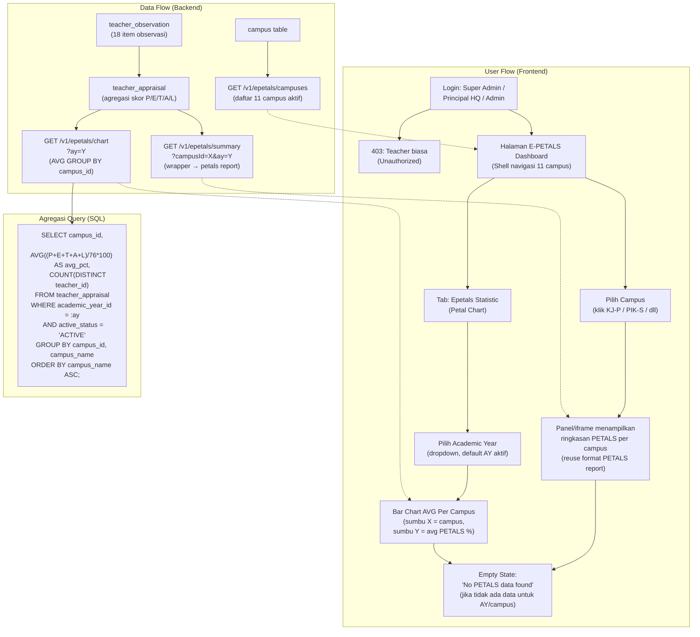
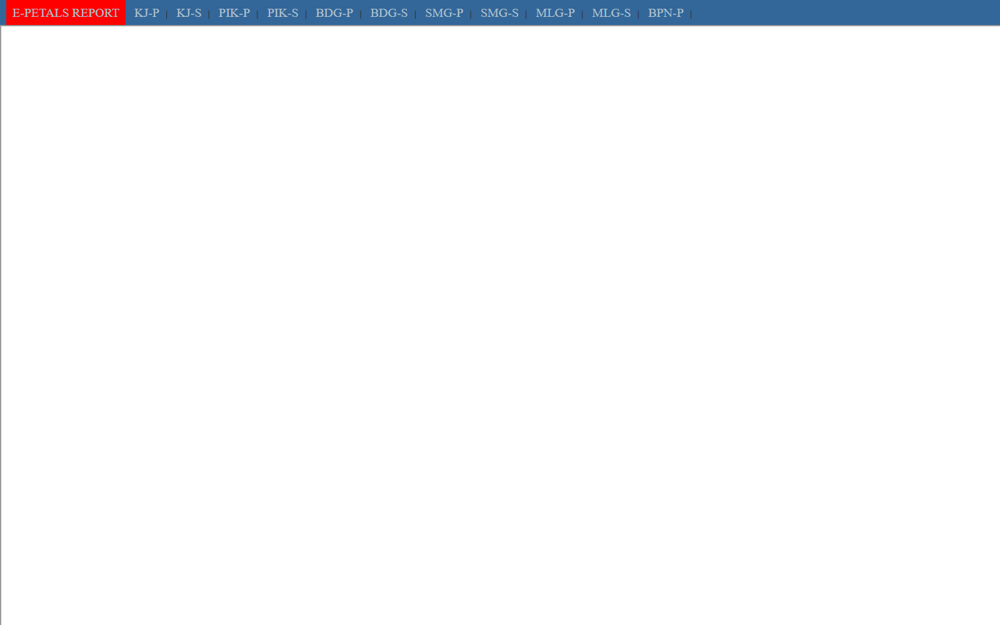
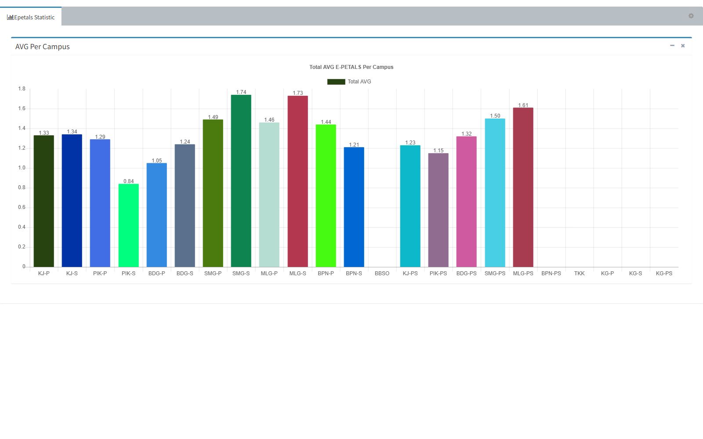

# E-PETALS Dashboard & Petal Chart

## Overview

Fitur **E-PETALS Dashboard** adalah varian multi-campus dari PETALS Summary Report (`features/petals/`). Berbeda dengan `petals_summary.php` yang hanya menampilkan satu campus (hardcoded PIK-S), halaman E-PETALS menampilkan **shell navigasi lintas campus** — 11 campus (KJ-P, KJ-S, PIK-P, PIK-S, BDG-P, BDG-S, SMG-P, SMG-S, MLG-P, MLG-S, BPN-P) — masing-masing membuka ringkasan PETALS per campus di dalam iframe. Ditambah **Petal Chart** (`epetal_chart.php`), sebuah bar chart "AVG Per Campus" berbasis Chart.js yang menampilkan rata-rata skor PETALS per campus untuk Academic Year tertentu.

Direplikasi dari teacher web: `staff/epetals_summary_asd.php` (shell), `staff/epetals_summary.php?camp_id=X` (konten per campus), `ais/asd/epetal_chart.php` (chart).

## Workflow / Flowchart

Berikut adalah workflow E-PETALS Dashboard yang mencakup alur data (data flow) dan alur pengguna (user flow) dalam satu diagram.

### Flowchart



### Penjelasan Langkah-langkah

**1. Alur Data (Data Flow) — Sisi Backend**

| Langkah | Proses | Keterangan |
|---------|--------|------------|
| 1.1 | Input Observasi | Principal/HOD mengisi 18 item observasi PETALS di `teacher_observation` (modul `petals-observation`). Skor per item mark 0-4. |
| 1.2 | Agregasi ke `teacher_appraisal` | Setelah observasi di-submit, skor di-agregasi per dimensi: P(3 item max 12), E(3 item max 12), T(5 item max 20), A(6 item max 24), L(2 item max 8) → total 76 = 100%. Disimpan di tabel `teacher_appraisal`. |
| 1.3 | API Campus List | `GET /v1/epetals/campuses` membaca dari tabel `campus` — mengembalikan 11 campus aktif (KJ-P s/d BPN-P) untuk navigasi shell. |
| 1.4 | API Summary per Campus | `GET /v1/epetals/summary?campusId=X&ay=Y` — wrapper yang meneruskan query ke modul petals report. Mengembalikan daftar guru + skor per campus. |
| 1.5 | API Chart | `GET /v1/epetals/chart?ay=Y` — menjalankan query agregasi `AVG((P+E+T+A+L)/76*100) GROUP BY campus_id` untuk satu AY tertentu. |

**2. Alur Pengguna (User Flow) — Sisi Frontend**

| Langkah | Aksi | Hasil |
|---------|------|-------|
| 2.1 | Login sebagai Super Admin / Principal HQ / Admin | Sistem cek role: jika teacher biasa → 403 Unauthorized. Jika berhak → redirect ke E-PETALS Dashboard. |
| 2.2 | Shell navigasi 11 campus | Halaman menampilkan menu horizontal 11 campus (KJ-P, KJ-S, PIK-P, PIK-S, BDG-P, BDG-S, SMG-P, SMG-S, MLG-P, MLG-S, BPN-P). Campus aktif ditandai (highlight). |
| 2.3 | Pilih campus | Klik campus → panel/iframe menampilkan ringkasan PETALS campus tersebut (reuse tabel dari modul petals report). Data di-load via `GET /v1/epetals/summary?campusId=X`. |
| 2.4 | Buka Petal Chart | Pindah ke tab "Epetals Statistic" → box "AVG Per Campus" menampilkan bar chart. Sumbu X = 11 campus, sumbu Y = rata-rata PETALS (%). |
| 2.5 | Filter Academic Year | Pilih AY dari dropdown (default AY aktif). Chart & data ter-update otomatis. |
| 2.6 | Empty State | Jika tidak ada data untuk AY/campus terpilih → tampilkan pesan "No PETALS data found for the selected academic year" (BBSNoItemCard). |

**3. Skenario Lengkap (End-to-End)**

```
[Principal HQ Login]
    ↓
[Melihat Shell E-PETALS dengan 11 campus]
    ↓
[Klik "PIK-S"] → [Iframe menampilkan ringkasan PETALS PIK-S]
    ↓
[Pindah ke Tab "Epetals Statistic"]
    ↓
[Pilih AY "2026/2027" (default)]
    ↓
[Bar Chart muncul: KJ-P=82.4%, PIK-S=85.5%, BDG-P=78.1%, ...]
    ↓
[Principal melihat campus dengan skor terendah → tindak lanjut]
```

## Problem / Motivation

- PETALS Summary Report (`features/petals/`) hanya menampilkan **satu campus** (PIK-S hardcoded). Principal/Admin di level atas (Super Admin, Principal HQ, atau Admin lintas campus) perlu **membandingkan skor PETALS antar campus** dalam satu halaman.
- Teacher web legacy memiliki halaman `epetals_summary_asd.php` yang merupakan shell navigasi 11 campus + iframe, dan `epetal_chart.php` yang menampilkan chart rata-rata per campus — keduanya belum ada API terstruktur di sistem baru.
- Data di halaman ini adalah **agregasi** dari tabel `teacher_appraisal` (atau `teacher_observation`) yang sama dengan modul PETALS report — tidak ada tabel baru tambahan selain view/query agregasi.

## Referensi Analisis (dari teacher web)

| Item | Nilai |
|------|-------|
| Shell multi-campus | `staff/epetals_summary_asd.php` — title "E-PETALS", hidden `userid=586`, `camp_id=0` |
| Menu campus | 11 tautan: KJ-P(1), KJ-S(2), PIK-P(3), PIK-S(4), BDG-P(5), BDG-S(6), SMG-P(7), SMG-S(8), MLG-P(9), MLG-S(10), BPN-P(12) → `epetals_summary.php?camp_id=X` di `target="ifrm"` |
| Konten per campus | `staff/epetals_summary.php?camp_id=X` — ringkasan PETALS per campus (di-load di iframe `ifrm`) |
| Chart | `ais/asd/epetal_chart.php` — Chart.js v2.7.2, tab "Epetals Statistic", box "AVG Per Campus", `canvas#perCampusChart` (height 500), hidden `ay=27`, `current_ay=27`, JS `js/epetals_chart.js` |
| Akses di home | `epetal_chart.php` + `staff/epetals_summary_asd.php` (menu dashboard home) |
| AY | hidden input `ay` dan `current_ay` bernilai 27 (2026/2027) |

### Menu Referensi (Section 8 — E-PETALS & Petal Chart)

| Menu | File legacy | Deskripsi | Komponen di brief ini |
|------|-------------|-----------|----------------------|
| E-PETALS Summary | `/staff/epetals_summary_asd.php` | Ringkasan E-PETALS (1.9KB) — shell navigasi 11 campus | Shell multi-campus (AC-1) |
| E-PETALS Data | `epetals_summary.php` | Data E-PETALS per campus | Konten per campus, di-load via `epetals_summary.php?camp_id=X` (AC-2) |
| Petal Chart | `ais/asd/epetal_chart.php` | Chart petal (6.3KB) — bar chart "AVG Per Campus" | Petal Chart (AC-3) |

## Scope

### In Scope
- **Shell E-PETALS**: halaman dengan menu navigasi 11 campus (dropdown/tab), memilih campus → menampilkan ringkasan PETALS per campus (bisa via iframe/panel/route).
- **Petal Chart**: bar chart "AVG Per Campus" untuk satu AY — sumbu X = campus, sumbu Y = average PETALS (%).
- Filter Academic Year pada chart (dropdown AY, default AY aktif).
- Data agregasi dari endpoint report PETALS (reuse) + endpoint chart khusus.
- Permission: hanya Principal/Admin level atas + Admin Portal (mirroring lintas campus). Teacher biasa → 403.
- Frontend Teacher Portal (`client-teacher`) untuk Principal HQ / Super Admin.
- Frontend Admin Portal (`client/`) — mirroring: admin melihat chart & ringkasan lintas campus.

### Out of Scope
- Input skor PETALS — terpisah (`features/petals-observation/`).
- PETALS Summary Report single-campus — terpisah (`features/petals/`).
- Drill-down per guru dari chart.
- Perbandingan antar AY (trend line) — enhancement.
- Export chart sebagai gambar.

## User Stories

### As a Principal (HQ) / Super Admin
I want to see the average PETALS score for all campuses in one chart
So that I can quickly identify which campuses need improvement.

### As a Principal (HQ) / Super Admin
I want to navigate between campuses to view each campus's PETALS summary
So that I can compare and monitor appraisal progress across the organization.

### As an Admin
I want to see the E-PETALS dashboard for any campus
So that I can support principals in monitoring appraisal data (mirroring).

## Acceptance Criteria

- [ ] **AC-1:** Halaman E-PETALS menampilkan navigasi 11 campus (KJ-P, KJ-S, PIK-P, PIK-S, BDG-P, BDG-S, SMG-P, SMG-S, MLG-P, MLG-S, BPN-P).
- [ ] **AC-2:** Memilih campus → ringkasan PETALS campus tersebut tampil (format sama dengan PETALS Summary Report).
- [ ] **AC-3:** Petal Chart menampilkan bar chart "AVG Per Campus" untuk AY terpilih — satu bar per campus, nilai = rata-rata average PETALS (%).
- [ ] **AC-4:** Filter Academic Year tersedia (default AY aktif); saat berubah, chart & data ter-update.
- [ ] **AC-5:** Hanya role Principal/Super Admin/Admin yang bisa mengakses — teacher biasa mendapat 403.
- [ ] **AC-6:** Empty state jika tidak ada data untuk AY/campus terpilih.

## UI / UX Changes

### UI / UI Guidelines

1. **Shell**: menu horizontal campus (seperti `.menu` + `forecastmenu1` di legacy) — pilihan campus aktif ditandai.
2. **Konten**: panel/iframe menampilkan ringkasan per campus (reuse tabel PETALS report).
3. **Chart**: tab "Epetals Statistic" — box "AVG Per Campus" dengan bar chart (Chart.js v2.7.2 di legacy; di sistem baru pakai library chart existing di frontend, mis. recharts/echarts yang sudah dipakai bbs).
4. **Screenshot referensi dari teacher web:**
   - Shell — menu horizontal 11 campus (KJ-P s/d BPN-P), title "E-PETALS REPORT":

   **Shell E-PETALS (navigasi 11 campus):**
   

   - Chart — tab "Epetals Statistic", box "AVG Per Campus", bar chart Total AVG per campus:

   **Petal Chart — AVG Per Campus:**
   

### Affected Portals
- [x] Admin (client/) — mirroring; admin melihat E-PETALS lintas campus
- [ ] Student (client-student/)
- [x] Teacher (client-teacher/) — pengguna utama (Principal HQ / Super Admin role)

### Dual Portal (Mirroring)

| Portal | Lokasi | Peran |
|--------|--------|-------|
| Teacher Portal | `bbs/client-teacher/src/views/epetals-dashboard/` | **Pengguna utama** — Principal HQ / Super Admin melihat chart & ringkasan lintas campus. |
| Admin Portal | `bbs/client/src/views/epetals-dashboard/` | **Mirroring** — admin melihat data lintas campus (read-only, tanpa input). |

Aturan akses backend:
- Teacher Portal: hanya user dengan role Principal (HQ) / Super Admin — scope lintas campus (`req.user` punya akses semua campus atau parameter `campusIds`).
- Admin Portal: admin dengan permission `PETALS_MANAGE` dapat melihat lintas campus.

## API Changes

| Method | Path | Description |
|--------|------|-------------|
| GET | `/api/v1/epetals/campuses` | Daftar campus untuk navigasi shell (id + short name) |
| GET | `/api/v1/epetals/summary?campusId=&ay=` | Ringkasan PETALS per campus (reuse report petals, wrapper) |
| GET | `/api/v1/epetals/chart?ay=` | Data agregat avg PETALS per campus untuk chart |

Detail lengkap di `api-contract.md`.

## Database Changes

### New Tables
- Tidak ada tabel baru — semua data di-agregasi dari `teacher_appraisal` (modul PETALS report).

### Views / Query
- `AVG(averagePct) GROUP BY campus_id, academic_year_id` untuk chart.

Detail lengkap di `schema.md`.

## Business Rules / Validation

1. Chart menampilkan rata-rata `averagePct` per campus untuk satu AY: `AVG((P+E+T+A+L)/76*100)` per campus.
2. Hanya campus yang punya data yang muncul di chart (campus tanpa data di-skip atau ditampilkan 0 sesuai keputusan EC-EP-03).
3. Navigasi shell menampilkan 11 campus tetap (KJ-P s/d BPN-P) — bisa dikurangi jika campus tidak aktif.
4. AY filter default = AY aktif (`current_ay`).
5. Data chart & summary hanya untuk AY yang sama (tidak campur).

## Error Handling

| Error | HTTP Code | Message |
|-------|-----------|---------|
| No data for AY/campus | 404 | "No PETALS data found for the selected academic year" |
| Unauthorized (teacher role) | 403 | "You don't have permission to access E-PETALS dashboard" |
| Invalid AY | 400 | "Academic year not found" |

## Dependencies

- Backend (`api_nest`):
  - Modul `petals` (report) — reuse agregasi `teacher_appraisal`.
  - Entity `Campus`, `AcademicYear`, `Employee`.
  - Decorator: `@CheckPermissions`, `@Auth`.
- Frontend:
  - `bbs-client-common`, chart library yang sudah ada di bbs (cek recharts/echarts — ganti Chart.js legacy).
  - `makeApiRequestThunk` + `fromApi.js` + `useFromApi`.
