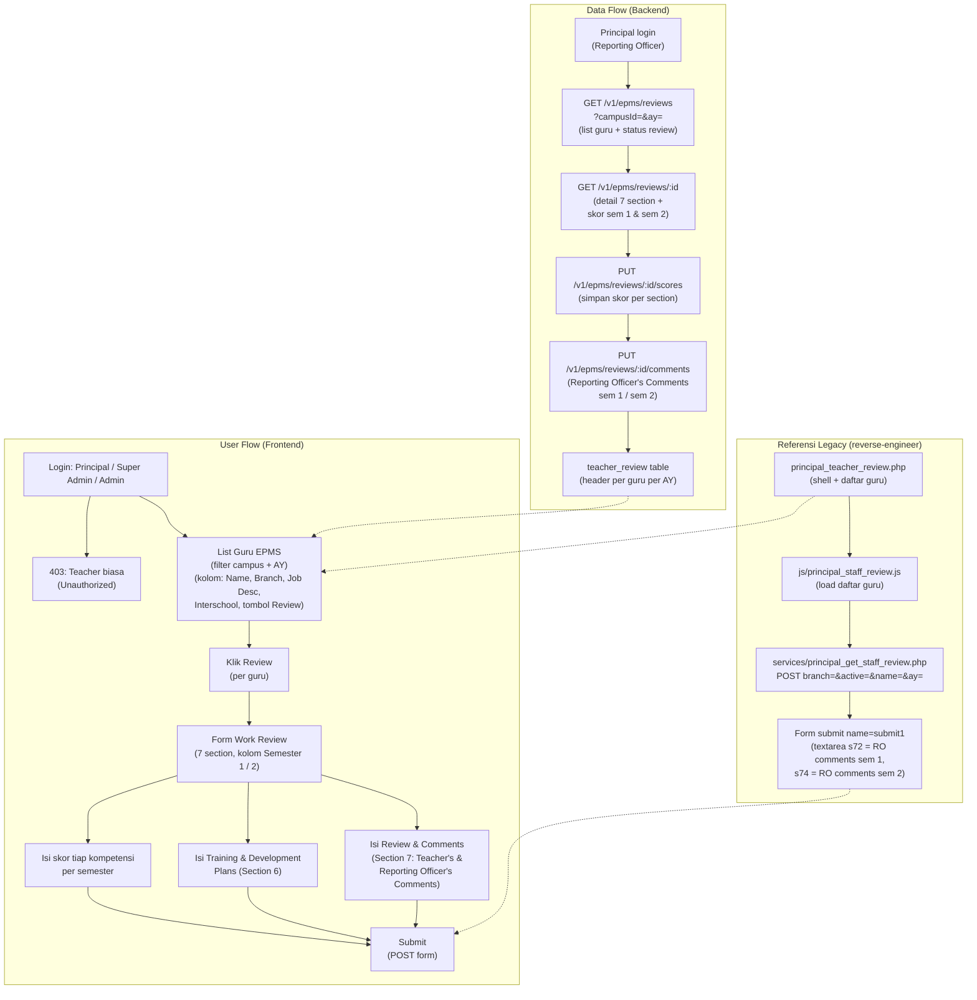
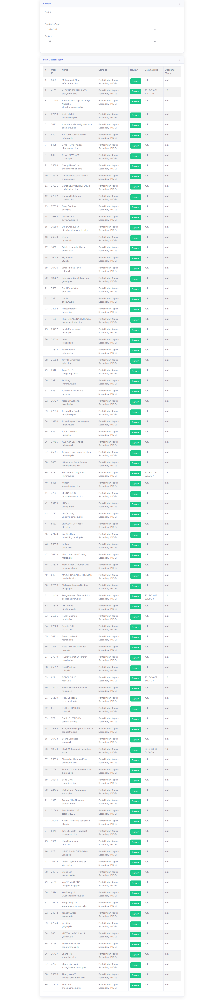
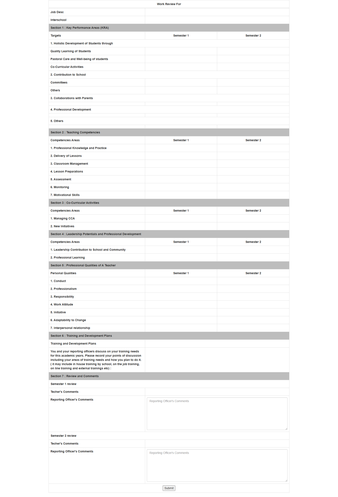

# EPMS Work Review (Employee Performance Management System)

## Overview

Fitur **EPMS (Employee Performance Management System)** — di legacy dikenal sebagai **Work Review** — adalah form penilaian kinerja tahunan guru oleh Principal (Reporting Officer). Berbeda dengan PETALS yang menilai kualitas **satu kali observasi kelas**, EPMS menilai **kinerja menyeluruh guru selama satu tahun ajaran** melalui 7 section kompetensi, masing-masing dinilai **per semester** (Semester 1 dan Semester 2), ditambah kolom Review/Comments dari guru dan reporting officer.

Direplikasi dari teacher web: `staff/principal_teacher_review.php` (judul halaman "BBS Teacher Review", menu "EPMS" id 391 di portal teacher).

> **EPMS ≠ PETALS.** Keduanya berada dalam satu modul **Staff/HR — Appraisal & Performance**, tetapi merupakan instrumen penilaian yang terpisah:
> - **PETALS** = Lesson Observation (18 item rubrik, mark 0-4, total 76 = 100%) — `features/petals/` & `features/petals-observation/`.
> - **EPMS** = Work Review tahunan (7 section, skor per semester, total ~100, grade A/B/C/D) — fitur ini.

## Workflow / Flowchart

### Flowchart



### Penjelasan Langkah-langkah

**1. Alur Pengguna (User Flow) — Sisi Frontend**

| Langkah | Aksi | Hasil |
|---------|------|-------|
| 1.1 | Login sebagai Principal (Reporting Officer) / Super Admin / Admin | Sistem cek role: jika teacher biasa → 403 Unauthorized. Jika berhak → redirect ke halaman EPMS Work Review. |
| 1.2 | List guru | Halaman menampilkan daftar guru (dari employee, filter campus + AY) dengan kolom Name, Branch, Job Desc, Interschool, dan tombol Review per guru. |
| 1.3 | Klik Review | Form Work Review terbuka — header "Work Review For {Nama Guru}", tabel 7 section dengan kolom Semester 1 dan Semester 2. |
| 1.4 | Isi skor | Principal mengisi skor/kompetensi pada tiap section per semester. |
| 1.5 | Isi Section 6 (Training & Development Plans) | Textarea untuk mencatat poin diskusi kebutuhan training guru (in-house, on-the-job, online, external). |
| 1.6 | Isi Section 7 (Review & Comments) | Textarea "Teacher's Comments" dan "Reporting Officer's Comments" per semester (Semester 1 review & Semester 2 review). |
| 1.7 | Submit | Form di-submit → data tersimpan per guru per AY. |

**2. Alur Data (Data Flow) — Sisi Backend**

| Langkah | Proses | Keterangan |
|---------|--------|------------|
| 2.1 | List guru | `GET /v1/epms/reviews?campusId=&ay=` — membaca dari employee + status review per guru. |
| 2.2 | Detail review | `GET /v1/epms/reviews/:id` — 7 section + skor per semester + komentar. |
| 2.3 | Simpan skor | `PUT /v1/epms/reviews/:id/scores` — simpan skor tiap kompetensi (bulk per section). |
| 2.4 | Simpan komentar | `PUT /v1/epms/reviews/:id/comments` — simpan Teacher's / Reporting Officer's Comments per semester. |
| 2.5 | Status | Review dianggap lengkap bila Section 1-7 terisi; status `IN_PROGRESS` / `SUBMITTED`. |

**3. Skenario Lengkap (End-to-End)**

```
[Principal Login (PIK-S)]
    ↓
[Buka Menu EPMS (Work Review)]
    ↓
[List Guru PIK-S untuk AY 2026/2027 muncul]
    ↓
[Klik "Review" pada guru "Devie Lana"]
    ↓
[Form Work Review terbuka: 7 section, kolom Semester 1 & 2]
    ↓
[Isi skor Section 1-5 per semester]
    ↓
[Isi Training & Development Plans (Section 6)]
    ↓
[Isi Review & Comments (Section 7) → Submit]
    ↓
[Data tersimpan; status guru menjadi Completed]
```

## Problem / Motivation

- Teacher web legacy memiliki halaman `staff/principal_teacher_review.php` (menu "EPMS" id 391) yang menampilkan form Work Review guru — tidak ada API terstruktur, di-render PHP server-side, data dimuat via POST `services/principal_get_staff_review.php` (body: `branch=4&active=1&name=&ay=19`).
- Smartbag (`bbs` + `api_nest`) belum punya modul EPMS/Work Review sama sekali — tidak ada entitas `TeacherReview` atau `EpmsScore`.
- Data EPMS saat ini tersimpan di database legacy (staff module) dan tidak bisa diakses dari sistem baru tanpa API.
- Perlu form input untuk Principal (Reporting Officer) mengisi penilaian kinerja tahunan guru, lengkap dengan skor per semester dan komentar — terpisah dari PETALS (Lesson Observation).

## Referensi Analisis (dari teacher web)

| Item | Nilai |
|------|-------|
| Halaman legacy | `staff/principal_teacher_review.php` — title "BBS Teacher Review" (probe `probe_epms_review.html`) / "BBS Staff Review" (form plain `probe_teacher_review_plain.html`) |
| Menu id (teacher portal) | 391 — "EPMS" → `../../staff/principal_teacher_review.php` |
| JS handler | `staff/js/principal_staff_review.js` (3,987 bytes, load daftar guru saat halaman dibuka) |
| Load data | POST `services/principal_get_staff_review.php` (body: `branch=4&active=1&name=&ay=19`) |
| Submit | Form `<form name="form1">` → tombol `submit1`; textarea `s72` (Reporting Officer's Comments Sem 1) & `s74` (Sem 2) |
| Judul form | "Work Review For {Nama}" |
| Struktur | 7 section (KRA, Teaching Competencies, Co-Curricular, Leadership, Professional Qualities, Training & Development Plans, Review & Comments) |
| Kolom skor | Semester 1 / Semester 2 per kompetensi |
| Tingkatan | Teacher / HOD / Principal (varian `asd_staff_app_new.php`, `asd_staff_app_hod_new.php`, `asd_staff_app_principal_new.php`) |
| Menu terkait (portal ASD) | Appraisal Summary Report (322), Appraisal Data Analysis (325), Appraisal Raw Data (326), campus charts (3231-3234), New Appraisal Teachers (3218), HOD (3219), Principal (32110) |
| Menu terkait (teacher portal) | Appraisal Summary Report (341), HOD Appraisal Summary (342), Appraisal Lock/Unlock (392) |

### Struktur Form (dari `reference/work_review_form.html`)

Header form: **Job Desc** dan **Interschool** (2 field di atas section).

| Section | Nama | Item (kompetensi) | Kolom |
|---------|------|-------------------|-------|
| 1 | Key Performance Areas (KRA) | 1. Holistic Development of Students through (Quality Learning, Pastoral Care & Well-being, Co-Curricular Activities); 2. Contribution to School (Committees, Others); 3. Collaborations with Parents; 4. Professional Development; 5. Others | Semester 1 / Semester 2 |
| 2 | Teaching Competencies | 1. Professional Knowledge and Practice; 2. Delivery of Lessons; 3. Classroom Management; 4. Lesson Preparations; 5. Assessment; 6. Monitoring; 7. Motivational Skills | Semester 1 / Semester 2 |
| 3 | Co-Curricular Activities | 1. Managing CCA; 2. New Initiatives | Semester 1 / Semester 2 |
| 4 | Leadership Potentials and Professional Development | 1. Leadership Contribution to School and Community; 2. Professional Learning | Semester 1 / Semester 2 |
| 5 | Professional Qualities of A Teacher | 1. Conduct; 2. Professionalism; 3. Responsibility; 4. Work Attitude; 5. Initiative; 6. Adaptability to Change; 7. Interpersonal relationship | Semester 1 / Semester 2 |
| 6 | Training and Development Plans | Textarea — poin diskusi kebutuhan training (in-house, on-the-job, online, external) | colspan 2 |
| 7 | Review and Comments | Semester 1 review: Teacher's Comments + Reporting Officer's Comments (`s72`); Semester 2 review: Teacher's Comments + Reporting Officer's Comments (`s74`) | colspan 2 |

## Scope

### In Scope
- Form Work Review per guru: 7 section kompetensi, skor per **Semester 1** dan **Semester 2**.
- Field Job Desc & Interschool di header form.
- Section 6: Training and Development Plans (textarea).
- Section 7: Review & Comments — Teacher's Comments + Reporting Officer's Comments per semester.
- List guru untuk review (dari modul employee, filter campus + AY) dengan tombol Review per guru.
- Save/Submit form (simpan skor + komentar).
- Permission: hanya Principal (Reporting Officer) / Super Admin / Admin — teacher biasa mendapat 403.
- Frontend Teacher Portal (`client-teacher`) — pengguna utama (Principal role).
- Frontend Admin Portal (`client/`) — mirroring: admin dapat membantu input lintas campus.

### Out of Scope
- Lesson Observation PETALS — terpisah (`features/petals/`, `features/petals-observation/`).
- Appraisal summary report / chart — modul terpisah (Appraisal Summary Report, campus charts di legacy).
- Appraisal Lock/Unlock workflow.
- Export Excel/Print form Work Review (enhancement).
- Grade otomatis A/B/C/D — enhancement (legacy menghitung di belakang; brief ini menyimpan skor mentah).

## User Stories

### As a Principal (Reporting Officer)
I want to fill the annual Work Review form for each teacher in my campus
So that I can record the teacher's performance across KRA, teaching competencies, and professional qualities for both semesters.

### As a Principal (Reporting Officer)
I want to write Training & Development Plans and Review/Comments for each teacher
So that the teacher gets structured feedback and a documented development plan.

### As an Admin
I want to access the EPMS Work Review for any campus
So that I can support principals in managing performance appraisals (mirroring).

## Acceptance Criteria

- [ ] **AC-1:** Halaman menampilkan list guru untuk review (filter campus + AY) dengan kolom Name, Branch, Job Desc, Interschool, dan tombol Review.
- [ ] **AC-2:** Form Work Review menampilkan 7 section (KRA, Teaching Competencies, Co-Curricular, Leadership, Professional Qualities, Training & Development Plans, Review & Comments) dengan kolom Semester 1 dan Semester 2 — label persis seperti `reference/work_review_form.html`.
- [ ] **AC-3:** Skor per kompetensi dapat diisi per semester dan tersimpan via API.
- [ ] **AC-4:** Section 6 (Training & Development Plans) berupa textarea dan tersimpan.
- [ ] **AC-5:** Section 7 (Review & Comments) menyediakan Teacher's Comments dan Reporting Officer's Comments untuk Semester 1 dan Semester 2 — tersimpan.
- [ ] **AC-6:** Tombol Submit menyimpan seluruh data form (skor + komentar) dan menandai review selesai.
- [ ] **AC-7:** Hanya role Principal/Super Admin/Admin yang bisa mengakses — teacher biasa mendapat 403.
- [ ] **AC-8:** Empty state jika tidak ada guru di campus untuk AY terpilih.

## UI / UX Changes

### UI / UI Guidelines

1. **List guru**: tabel (CDataTable) — kolom Name, Branch, Job Desc, Interschool, Status (In Progress/Completed), aksi tombol "Review".
2. **Form Work Review**: layout satu kolom tabel full-width, header "Work Review For {TeacherName}", 7 section dengan baris kompetensi dan 2 kolom input (Semester 1 / Semester 2). Bagian atas ada 2 field Job Desc & Interschool.
3. **Section 6 & 7**: textarea full-width (colspan 2) seperti legacy.
4. **Actions**: tombol Submit di bawah tabel.
5. **Screenshot referensi dari teacher web:**

   **List guru + tombol Review EPMS (probe `epms_review.png`):**
   

   **Form Work Review setelah klik Review (probe `epms_after_click.png`):**
   

   **Form plain Work Review (probe `work_review_form.png` — struktur 7 section):**
   

   **Appraisal Summary Report untuk PIK-S (konteks modul Appraisal & Performance):**
   

### Affected Portals
- [x] Admin (client/) — mirroring; admin dapat membantu input lintas campus
- [ ] Student (client-student/)
- [x] Teacher (client-teacher/) — pengguna utama (Principal / Reporting Officer role)

### Dual Portal (Mirroring)

| Portal | Lokasi | Peran |
|--------|--------|-------|
| Teacher Portal | `bbs/client-teacher/src/views/epms/` | **Pengguna utama** — Principal mengisi Work Review per campus-nya. |
| Admin Portal | `bbs/client/src/views/epms/` | **Mirroring** — admin input/edit atas nama Principal lintas campus. |

Aturan akses backend:
- Teacher Portal: Principal mengelola data per campus-nya (`req.user` campusId).
- Admin Portal: admin punya permission tambahan `PETALS_MANAGE` (atau permission appraisal setara) sehingga dapat akses lintas campus.

## API Changes

| Method | Path | Description |
|--------|------|-------------|
| GET | `/api/v1/epms/reviews?campusId=&ay=&name=` | List guru + status review (untuk list EPMS) |
| GET | `/api/v1/epms/reviews/:id` | Detail review: 7 section, skor per semester, komentar |
| POST | `/api/v1/epms/reviews` | Buat review baru untuk guru (draft) |
| PUT | `/api/v1/epms/reviews/:id/scores` | Simpan skor per kompetensi per semester (bulk) |
| PUT | `/api/v1/epms/reviews/:id/comments` | Simpan Teacher's / Reporting Officer's Comments + Training & Development Plans |
| PUT | `/api/v1/epms/reviews/:id` | Update header (job_desc, interschool) + status (submit) |

Detail lengkap di `api-contract.md`.

## Database Changes

### New Tables
- `teacher_review` — header Work Review per guru per AY (mirroring `principal_teacher_review.php` legacy)
- `teacher_review_score` — skor per kompetensi per semester
- `epms_review_item` — config item kompetensi 7 section (di-seed)

### Migrations
- `npm run migration:generate --name=create-epms-review` (di `api_nest`)

### Seed Data
- **`seed-data.json`** di folder ini — **item kompetensi EPMS Section 1-5** (KRA 8 item, Teaching Competencies 7, Co-Curricular 2, Leadership 2, Professional Qualities 7 = **26 item**) — static config, di-seed sekali ke tabel `epms_review_item`. Item inilah yang di-skor per semester.
- Section 6 (Training & Development Plans) dan Section 7 (Review & Comments) **bukan item seed** — berupa field teks di `teacher_review` (training_plan + 4 komentar per semester).
- Skor guru TIDAK di-seed — skor adalah hasil review (modul ini), bukan data awal.

Detail lengkap di `schema.md`.

## Business Rules / Validation

1. Skor per kompetensi per semester: nilai sesuai rubrik legacy (skala per kompetensi; di legacy berupa kolom input bebas — di sistem baru divalidasi 0-100 atau skala rubrik sesuai config item).
2. Satu guru bisa punya banyak review (beda AY/reviewer). Kombinasi unik `(teacher_id, academic_year_id, reviewer_id)` untuk review aktif.
3. Reviewer diambil dari `req.user.id` (Principal yang login).
4. Status: `DRAFT` (belum lengkap) / `SUBMITTED` (lengkap & dikunci) — mirip Completed/Incomplete di legacy.
5. Job Desc & Interschool opsional; Teacher's / Reporting Officer's Comments opsional, max 1000 karakter.
6. Section 1-5 dinilai per semester (kolom Semester 1 & Semester 2); Section 6 & 7 berupa teks.
7. **EPMS tidak terkait data PETALS** — keduanya instrumen terpisah dalam modul Appraisal & Performance.

## Error Handling

| Error | HTTP Code | Message |
|-------|-----------|---------|
| Teacher not found | 404 | "Teacher not found" |
| Teacher not in campus | 400 | "Teacher is not in your campus" |
| Item not found | 404 | "Review item not found" |
| Score out of range | 400 | "Score must be between 0 and 100" |
| Unauthorized (teacher role) | 403 | "You don't have permission to access EPMS review" |
| Review already submitted | 409 | "Review is already submitted" |

## Dependencies

- Backend (`api_nest`):
  - Entity `Employee` (`src/modules/employee/entities/employee.entity.ts`) — teacher/reviewer.
  - Entity `Campus`, `AcademicYear` — relasi.
  - Decorator: `@CheckPermissions`, `@Auth`.
- Frontend:
  - `bbs-client-common`, `CDataTable`, `makeApiRequestThunk` + `fromApi.js` + `useFromApi`.
- Modul PETALS (`features/petals/`) — sesama modul Appraisal & Performance (tidak ada relasi data).
