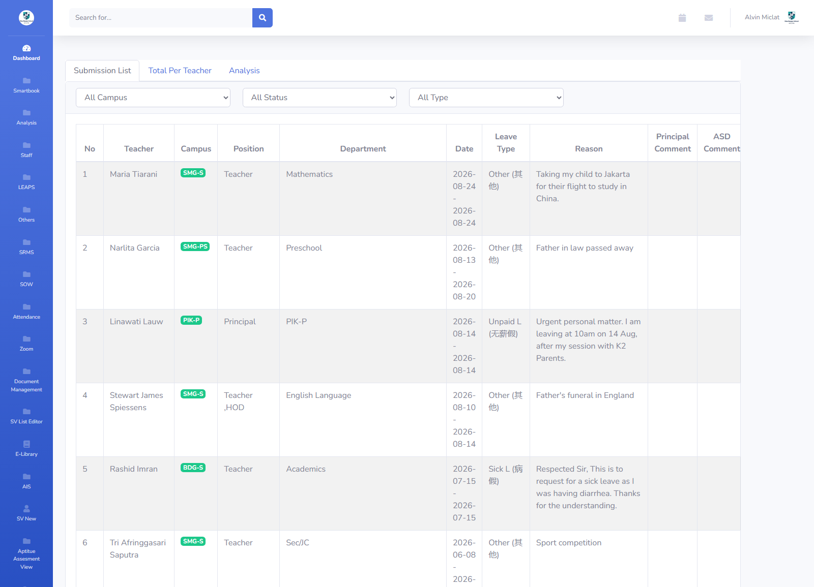
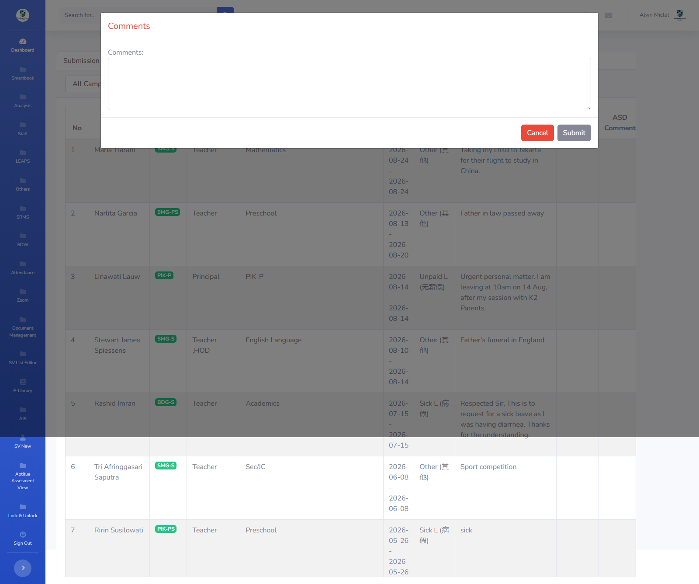
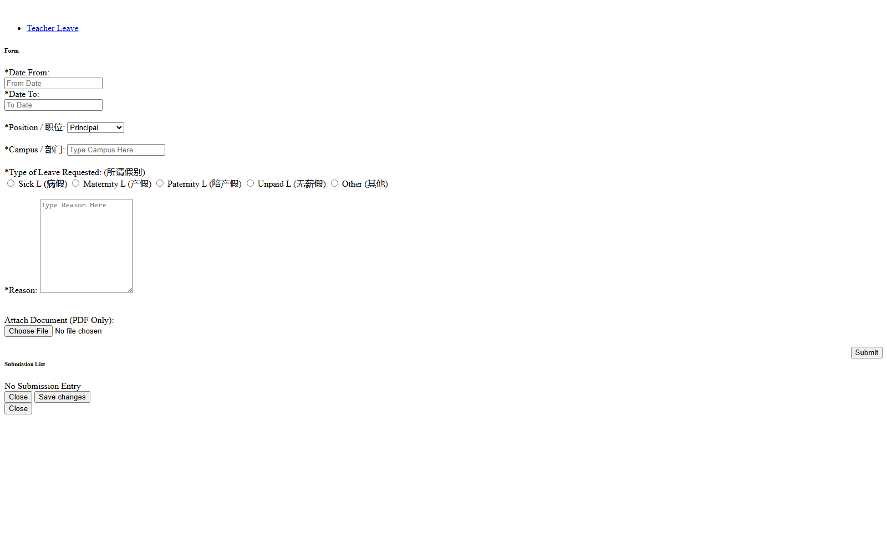

# Form Leave Workflow — Approval HOD/Principal

## Overview

Fitur lanjutan (fase 2) dari **Form Leave** (`features/form-leave/`). Setelah guru mengajukan izin/cuti (record `teacher_leave` tersimpan dengan status default `PENDING`), **Admin/Principal** meninjau pengajuan tersebut dan mengubah status: `PENDING → APPROVED_BY_ADMIN → APPROVED_BY_PRINCIPAL` atau `REJECTED`, dengan opsi menulis komentar (Admin: `commentsleave`; Principal: `comments_principal`).

Fitur ini menjawab temuan analisis `ais_legacy`: di teacher web legacy, modul leave **punya konsep status/approval** yang di-handle di varian Admin (`home.php?vmenu=form_leave_teacher`) melalui endpoint **`POST /ais/asd/services/savestatusLeave.php`** — nama endpointnya sendiri ("save **status** leave") membuktikan ada workflow status, bukan sekadar create/list.

## Problem / Motivation

- **Fase 1 (`form-leave`)** sengaja TANPA approval flow — hanya create + list + soft delete milik guru. NQ-03 di `form-leave/notes.md` di-mark "PERLU KONFIRMASI" karena ada indikasi kuat workflow status di legacy.
- **Bukti di `ais_legacy`** (mengkonfirmasi NQ-03 = ADA workflow):
  - `bbs_tools/leave_form.html` (98KB, Admin dashboard) memuat iframe `vmenu/form_leave_teacher.php` (baris 836) yang menampilkan **dropdown status per record**.
  - Handler JS (baris 1194–1212): ganti status → `$.post('services/savestatusLeave.php', {status, rec, tipe: '1'})` — `tipe: '1'` = field `commentsleave` (Admin).
  - Handler `#submitcommentleave` (baris 1214–1231): `$.post('services/savestatusLeave.php', {comment, status, rec, tipe: '1'})` — simpan komentar + status sekaligus.
  - Blok di-comment out (baris 1233–1246): `dataMap['field'] = 'comments_principal'; tipe: '2'` — indikasi **komentar Principal terpisah** (`comments_principal`).
  - `<form id="form_param">` (baris 1275–1279): base64 `user_id="NTg2"` (586), `fullname`, `campus`, `campus_name` — konteks user yang mereview.
- **Endpoint legacy**: `services/savestatusLeave.php` (update status) ditemukan di `principals_tool/endpoint_analysis.json` dan `bbs_tools/endpoint_analysis.json`; `services/save_form_teacher_leave.php` (create) juga ada.
- Smartbag (`api_nest`) setelah fase 1 hanya punya `teacher_leave` tanpa kolom status approval — fase 2 menambah kolom status + komentar + audit siapa/mengubah kapan.

## Referensi Analisis (dari ais_legacy)

| Item | Nilai |
|------|-------|
| Halaman Admin | `home.php?vmenu=form_leave_teacher` → iframe `vmenu/form_leave_teacher.php` (`leave_form.html:836`) |
| Endpoint update status | **`POST /ais/asd/services/savestatusLeave.php`** — payload `{status, rec, tipe}` / `{comment, status, rec, tipe}` |
| Field Admin | `commentsleave` (textarea, `tipe: '1'`) |
| Field Principal | `comments_principal` (di-comment out, `tipe: '2'`) — komentar terpisah per role |
| Konteks reviewer | `form_param` base64: `user_id`, `fullname`, `campus`, `campus_name` |
| Status dropdown | Dropdown status per record di daftar pengajuan (nilai status legacy perlu dikonfirmasi saat implementasi — lihat notes.md NQ-05) |
| Create endpoint | `services/save_form_teacher_leave.php` (dipakai fase 1 sebagai referensi, diganti `POST /v1/teacher-leaves`) |

## Scope

### In Scope
- **Status approval** pada record `teacher_leave` yang sudah ada (extend schema fase 1):
  - Kolom baru: `leave_status` (enum), `admin_comment`, `principal_comment`, `status_changed_by`, `status_changed_at`.
  - Default status saat create = `PENDING` (record baru dari fase 1 otomatis PENDING).
- **Transisi status valid** (state machine):
  - `PENDING → APPROVED_BY_ADMIN` (Admin menyetujui tahap pertama).
  - `APPROVED_BY_ADMIN → APPROVED_BY_PRINCIPAL` (Principal menyetujui final).
  - `PENDING → REJECTED` (Admin/Principal menolak).
  - `APPROVED_BY_ADMIN → REJECTED` (Principal menolak setelah Admin approve).
  - Semua transisi lain → 400 (invalid transition), termasuk tidak boleh kembali ke `PENDING`, tidak boleh set status yang sama, tidak boleh approve setelah reject.
- **Endpoint baru**: `PATCH /v1/teacher-leaves/:id/status` — ubah status + komentar (owner check: hanya Admin/Principal dengan permission `TEACHER_LEAVE_MANAGE`).
- **Komentar**: `adminComment` ditulis oleh Admin (`tipe '1'` analog `commentsleave`); `principalComment` ditulis oleh Principal (`tipe '2'` analog `comments_principal`). Komentar boleh kosong saat approve, **wajib** saat reject (lihat EC-10).
- **Audit**: `statusChangedBy` (user id reviewer) + `statusChangedAt` (timestamp) tercatat otomatis di service.
- **Frontend Admin Portal (`client/`)**: Submission List menampilkan kolom **Status** + dropdown/aksi update status + textarea komentar (replicate `leave_form.html` — dropdown status per record).
- **Frontend Teacher Portal (`client-teacher/`)**: Submission List menampilkan status (badge/tag) read-only — guru **tidak** bisa mengubah status, hanya melihat.
- **Permission**: role Admin/Principal dengan `TEACHER_LEAVE_MANAGE` (tambah entri baru di `ModulesTypeEnum`, lihat NQ-04 fase 1).

### Out of Scope
- **Notifikasi** ke guru saat status berubah (email/push/in-app) — enhancement (lihat notes.md).
- **Auto-integrasi ke Attendance** — cuti APPROVED_BY_PRINCIPAL otomatis menandai absen — enhancement.
- **Riwayat transisi status lengkap** (audit trail per perubahan) — hanya `statusChangedBy/At` terakhir di fase 2; history table = enhancement.
- **Edit record leave oleh Admin** — fase 2 hanya ubah **status + komentar**, bukan isi form (dates/type/reason).
- **Filter/bulk action** multi-record (approve semua sekaligus) — enhancement.
- Halaman khusus "View All Request" di Teacher Portal untuk Principal — akses lintas guru via Admin Portal (fase 2 tetap di Admin Portal, konsisten dengan fase 1).

## User Stories

### As an admin
I want to review teacher leave submissions and set their status (approve/reject) with an optional comment
So that the teacher knows whether their leave request is accepted.

### As a principal
I want to give the final approval on admin-approved leave requests with my own comment
So that leave requests are properly validated at the school level before being finalized.

### As a teacher
I want to see the current status and reviewer comment on my leave submission
So that I know whether my leave is pending, approved, or rejected.

## Acceptance Criteria

- [ ] **AC-1:** Record leave baru dari fase 1 otomatis berstatus `PENDING` (tanpa perlu input ekstra saat create).
- [ ] **AC-2:** Halaman Admin (Submission List di `client/`) menampilkan kolom Status dan kontrol ubah status per record (dropdown + tombol/textarea komentar) — replicate `leave_form.html`.
- [ ] **AC-3:** `PATCH /v1/teacher-leaves/:id/status` memvalidasi transisi — transisi tidak valid dikembalikan 400 "Invalid status transition" (state machine sesuai Scope).
- [ ] **AC-4:** Komentar Admin tersimpan di `adminComment`; komentar Principal tersimpan di `principalComment` (terpisah, analog `commentsleave` vs `comments_principal`).
- [ ] **AC-5:** Reject WAJIB menyertakan komentar — tanpa komentar → 400 "Comment is required when rejecting a leave request" (lihat EC-10).
- [ ] **AC-6:** `statusChangedBy` diisi `req.user.id` (reviewer) dan `statusChangedAt` di-set otomatis — tidak bisa dipalsukan dari body.
- [ ] **AC-7:** Hanya user dengan permission `TEACHER_LEAVE_MANAGE` yang bisa memanggil endpoint status; guru (owner) mendapat 403 — owner check tetap di-enforce (record harus milik guru yang sama? — lihat Business Rules #4).
- [ ] **AC-8:** Teacher Portal menampilkan status + komentar reviewer read-only (badge/tag status, komentar di detail/list).
- [ ] **AC-9:** Status tampil di response GET list/detail fase 1 (`leaveStatus`, `adminComment`, `principalComment`, `statusChangedBy`, `statusChangedAt`).
- [ ] **AC-10:** Record yang sudah `activeStatus = INACTIVE` (soft deleted) TIDAK bisa diubah statusnya → 404.

## API Changes

| Method | Path | Description |
|--------|------|-------------|
| PATCH | `/api/v1/teacher-leaves/:id/status` | Ubah status + komentar (approve/reject) — endpoint BARU fase 2 |
| GET | `/api/v1/teacher-leaves` | Response list ditambah field status (extend fase 1) |
| GET | `/api/v1/teacher-leaves/:id` | Response detail ditambah field status + komentar (extend fase 1) |

Detail request/response: lihat `api-contract.md`.

## Database Changes

### Modified Tables
- `teacher_leave` — **ALTER TABLE** (bukan tabel baru), tambah kolom:
  - `leave_status` (enum, default `PENDING`)
  - `admin_comment` (text, nullable)
  - `principal_comment` (text, nullable)
  - `status_changed_by` (int FK → employee.id, nullable)
  - `status_changed_at` (timestamptz, nullable)

### Migrations
- `npm run migration:generate --name=add-teacher-leave-status` (di `api_nest`, pakai `migration-source.ts`), file di `src/database/migrations/`.
- Migrasi data: backfill `leave_status = 'PENDING'` untuk record existing (default kolom cukup, tapi pastikan backfill eksplisit untuk keamanan).

## Business Rules / Validation

1. Default `leaveStatus = PENDING` saat create (dari fase 1 — tidak ada field status di body create).
2. Transisi status mengikuti state machine di Scope — transisi lain → 400.
3. `statusChangedBy` = `req.user.id` (reviewer dari token) — TIDAK dari body.
4. **Owner check**: record harus milik guru di campus reviewer (scope per campus); Admin/Principal hanya bisa ubah status leave guru di campus yang sama — `campusId` record dibandingkan dengan campus reviewer (mirroring fase 1). Detail keputusan di notes.md D-07.
5. Reject wajib komentar (EC-10); approve boleh tanpa komentar.
6. Komentar Admin → `adminComment`; komentar Principal → `principalComment`.
7. Record `activeStatus = INACTIVE` tidak bisa diubah statusnya (404).
8. Hanya status + komentar yang bisa diubah lewat endpoint ini — field form (dates/type/reason) tidak.

## Error Handling

| Error | HTTP Code | Message |
|-------|-----------|---------|
| Invalid status transition | 400 | "Invalid status transition" |
| Comment required on reject | 400 | "Comment is required when rejecting a leave request" |
| Leave not found / soft-deleted | 404 | "Teacher leave not found" |
| Not allowed (bukan reviewer scope) | 403 | "You don't have permission to update this leave request" |
| Status enum invalid | 400 | "Leave status is not valid" |

## Dependencies

- Backend (`api_nest`):
  - **Modul fase 1**: `src/modules/teacher-leave/` (entity `TeacherLeave`, controller, service) — EXTEND, bukan modul baru.
  - Enums: `ModulesTypeEnum.TEACHER_LEAVE` (fase 1) + permission `TEACHER_LEAVE_MANAGE` (tambah).
  - Decorator: `@CheckPermissions` (`src/decorators/permission.decorator.ts`), `@Auth` (`src/decorators/auth.decorator.ts`).
  - Modul referensi untuk state machine: cari pola status enum + valid transition di modul existing (mis. `lesson`, `bmt`) saat implementasi.
- Frontend Admin Portal (`bbs/client`):
  - View fase 1: `src/views/formLeave/` — tambah kolom status + dropdown/aksi (replicate `leave_form.html`).
  - `bbs-client-common` (bbsConfirm, bbsToaster, BBSSelect/BBSControlledSelect, BBSTag/BBSBadge untuk status badge).
- Frontend Teacher Portal (`bbs/client-teacher`):
  - View fase 1: `src/views/formLeave/` — status badge read-only + tampilkan komentar reviewer.

## Konvensi Implementasi

### Backend (`api_nest`)
- Controller: tambah handler di `teacher-leave.controller.ts` — `@Patch(':id/status')`, `@CheckPermissions(PermissionEnum.X, ModulesTypeEnum.TEACHER_LEAVE)`, `@Req() req: Request`, `ParseIntPipe`.
- DTO baru: `update-teacher-leave-status.dto.ts` — `leaveStatus` (enum, wajib), `comment` (opsional; wajib saat reject).
- Service: method `updateStatus(id, dto, user)` — validasi transisi (state machine map), validasi scope campus, set `statusChangedBy/At`, simpan komentar sesuai role.
- Entity: tambah 5 kolom status (lihat schema.md) — kolom `leaveStatus` dgn `@Column({ type: 'enum', enum: TeacherLeaveStatusEnum, default: PENDING })`.

### Frontend Admin Portal (`bbs/client`) — Reviewer
- View `src/views/formLeave/FormLeave.jsx`: kolom Status (BBSTag/BBSBadge) + kontrol aksi (dropdown status + textarea komentar + tombol Save) per record — replicate dropdown status `leave_form.html`.
- Redux `src/actions/fromApi.js`: tambah `updateTeacherLeaveStatus` thunk + endpoint di registry.
- Confirmation sebelum ubah status (bbsConfirm) + toast sukses/error (bbsToaster).

### Frontend Teacher Portal (`bbs/client-teacher`) — Read-only
- View `src/views/formLeave/FormLeave.jsx`: kolom Status (badge read-only) + tampilkan komentar reviewer (admin/principal) di row/detail.
- Tidak ada kontrol ubah status untuk guru.

## Screenshot Referensi

**Halaman Admin — View All Teacher Leave (daftar SEMUA pengajuan + dropdown status per record):**  
*Capture via login admin `bbs_mng` — menampilkan tabel guru, posisi, departemen, tipe cuti, alasan, komentar, dan filter All Campus/All Status/All Type.*

**Modal Komentar Admin/ASD (`#ModalComments` + textarea `commentsleave`, label "Comment AB") — muncul saat klik tombol comment pada record:**

**Form Principal (versi principal dari form, position sebagai dropdown — fase 1):**

**Form Leave guru kosong (fase 1 — guru mengajukan, otomatis PENDING):**

**Form Leave guru terisi:**

**Setelah submit (Submission List milik guru):**

### Referensi HTML Approval (modal komentar + handler JS)

File `D:\Work\BBS\requirement\ais_legacy\bbs_tools\leave_form.html` (Admin dashboard shell) — berisi elemen UI approval yang tidak ada di screenshot di atas (modal komentar di dalam iframe):

| Baris | Elemen | Bukti approval workflow |
|-------|--------|--------------------------|
| 882–888 | Modal `#ModalComments` + textarea `#commentsleave` + hidden `#recleave`/`#statleave` | Form komentar Admin saat approve/reject |
| 1179–1212 | Handler `[id^="changestatusReqLeave_"]` (change) → `$.post('services/savestatusLeave.php', {status, rec, tipe:'1'})` | **Dropdown status per record** (id `changestatusReqLeave_<rec>`) |
| 1214–1231 | `#submitcommentleave` → `$.post('services/savestatusLeave.php', {comment, status, rec, tipe:'1'})` | Simpan komentar + status Admin sekaligus |
| 1233–1246 | Blok di-comment out: `dataMap['field'] = 'comments_principal'; tipe: '2'` | Komentar Principal terpisah (`comments_principal`) |
| 1275–1279 | `<form id="form_param">` base64 `user_id`, `fullname`, `campus`, `campus_name` | Konteks reviewer yang mengubah status |
