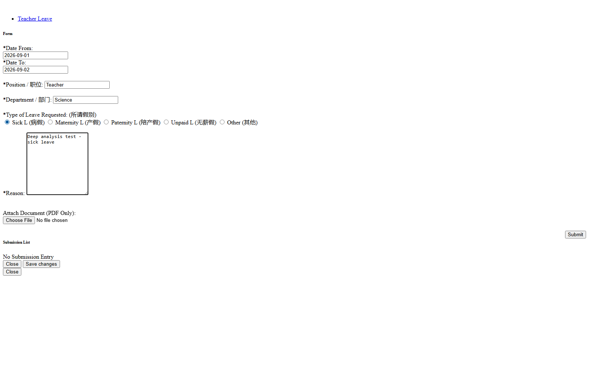
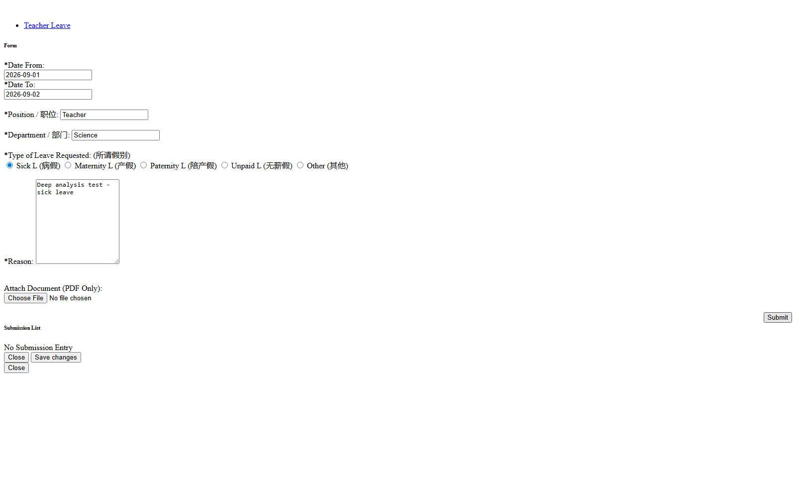

# Form Leave — Teacher File Leave Form

## Overview

Fitur **Form Leave** memungkinkan guru mengajukan izin/cuti (leave) melalui form digital — menggantikan halaman PHP `teacher_file_leave_form.php` di teacher web legacy. Guru mengisi tanggal mulai–selesai, posisi, departemen, jenis cuti (Sick/Maternity/Paternity/Unpaid/Other), alasan, dan lampiran dokumen PDF (opsional). Data tersimpan sebagai riwayat "Submission List" milik guru, bisa dihapus (soft delete), dan menjadi dasar integrasi dengan modul Attendance/HR di masa depan.

## Problem / Motivation

- Teacher web legacy memiliki halaman `teacher_file_leave_form.php` (menu sidebar "Teacher File Leave Form") yang di-render PHP server-side tanpa API terstruktur — endpoint penyimpanan tidak terpapar (handler JS tidak terikat saat halaman diakses langsung, semua kandidat `/services/*.php` mengembalikan 404).
- Smartbag (`bbs` + `api_nest`) belum punya modul leave/izin guru sama sekali — audit `api_nest/src/modules/` tidak menemukan modul `leave` atau `teacher-leave`.
- Perlu form digital yang reusable, terintegrasi dengan auth JWT (`req.user.id`), permission CASL, dan modul `file` untuk upload PDF, sehingga data izin guru tercatat rapi dan bisa dipakai untuk reporting.

## Referensi Analisis (dari teacher web)

| Item | Nilai |
|------|-------|
| Halaman legacy | `teacher_file_leave_form.php` (200 OK, 23KB) |
| Menu sidebar | "Teacher File Leave Form" (`menu="teacher_file_leave_form"`, `home_direct.html:456`) |
| Navigasi | `home.php?rmenu=teacher_file_leave_form` (iframe kosong — jalur broken) |
| Tab | "Teacher Leave" (aktif); "Set Per Badges" (di-comment out) |
| Fields | `date_from`, `date_to`, `position`, `department`, `leavetype_id`, `reason`, `filesname` |
| Leave types (radio) | 1=Sick L (病假), 3=Maternity L (产假), 4=Paternity L (陪产假), 5=Unpaid L (无薪假), 6=Other (其他) |
| Hidden fields | `userid` (21046), `campus` (4), `currentdate` (2026-08-26) |
| Submit | Tombol `#saveLeaveform` (AJAX, tidak memicu navigasi) |
| Submission List | Panel kanan, empty state "No Submission Entry" |
| Upload | "Attach Document (PDF Only)" — `input[type=file]` |

## Scope

### In Scope
- CRUD pengajuan leave milik guru sendiri (create, list, detail, soft delete).
- Form fields: `dateFrom`, `dateTo`, `position`, `department`, `leaveType` (enum), `reason`, `attachmentFileId` (opsional, PDF).
- Upload PDF attachment memakai modul `file` existing (`FileEntityTypeEnum.ATTACHMENT_FILE`).
- Validasi: `dateTo >= dateFrom`, `leaveType` wajib, `reason` wajib, PDF-only untuk lampiran.
- Soft delete via `activeStatus` (pola modul `lesson`).
- Permission CASL baru: `ModulesTypeEnum.TEACHER_LEAVE`.
- Frontend: halaman Form Leave di `client-teacher` (form + submission list dalam satu view, tab "Teacher Leave").

### Out of Scope
- Workflow approval (HOD/Principal approve/reject) — teacher web hanya menyimpan, tidak ada approval flow.
- Auto-integrasi ke Attendance (cuti otomatis menandai absen) — enhancement.
- Edit pengajuan yang sudah submit (teacher web tidak punya; hanya create + list).
- Role Principal/HOD untuk melihat semua leave — hanya milik sendiri (fase 1).

## User Stories

### As a teacher
I want to submit a leave request with dates, leave type, reason, and optional PDF attachment
So that my absence is formally recorded without paper forms.

### As a teacher
I want to see my leave submission history
So that I can track what I have submitted and their status.

### As a teacher
I want to cancel/delete a leave request I created
So that I can correct mistakes before the leave date.

## Acceptance Criteria

- [ ] **AC-1:** Guru dapat mengakses halaman Form Leave yang menampilkan form (kiri) dan Submission List miliknya (kanan) — replicate layout teacher web.
- [ ] **AC-2:** Form memiliki fields: Date From, Date To, Position (default dari profile), Department, Type of Leave Requested (radio 5 opsi), Reason (textarea), Attach Document (PDF only, opsional).
- [ ] **AC-3:** Validasi form: Date From & Date To wajib + `dateTo >= dateFrom`; Type of Leave wajib; Reason wajib; lampiran harus PDF — error ditampilkan via inline validation (yup) dan bbsToaster.
- [ ] **AC-4:** Submit berhasil → data tersimpan, list di kanan langsung refresh, toast sukses.
- [ ] **AC-5:** Submission List menampilkan kolom: Type, Date Range, Reason, Attachment (link download PDF jika ada), Status, Created At, aksi Hapus.
- [ ] **AC-6:** Delete memakai `bbsConfirm` → soft delete (`activeStatus = INACTIVE`) → item hilang dari list.
- [ ] **AC-7:** Permission: hanya guru (login user) yang bisa create/list/delete leave miliknya; `teacherId` diambil dari `req.user.id`, tidak bisa dipalsukan dari body.
- [ ] **AC-8:** Upload PDF memakai endpoint modul `file` (`POST /v1/files` dengan entityType attachment); `attachmentFileId` disimpan di record leave.
- [ ] **AC-9:** Empty state Submission List menampilkan "No Submission Entry" (BBSNoItemCard) saat belum ada data.
- [ ] **AC-10:** Halaman route di `client-teacher` dengan lazy loading + guard auth (mengikuti pola routes.js).

## UI / UX Changes

### UI / UI Guidelines (komponen yang WAJIB dipakai di client-teacher)

1. **Shared components** dari `bbs-client-common` (`lib/index.js`):

| Komponen | Pemakaian |
|----------|-----------|
| `BBSHeader` | Header halaman "Form Leave / Teacher Leave" |
| `BBSSelect` / `BBSControlledSelect` | Dropdown (jika type of leave dibuat dropdown; teacher web pakai radio) |
| `BBSTextField` | Input Date From, Date To, Position, Department |
| `BBSTextArea` | Textarea Reason |
| `BBSButton` | Tombol Submit |
| `BBSSpinner` | Loading state saat fetch/submit |
| `BBSNoItemCard` | Empty state Submission List ("No Submission Entry") |
| `BBSTag` / `BBSBadge` | Status leave (optional) |
| `bbsConfirm` | Konfirmasi delete |
| `bbsToaster` | Toast sukses/error |

2. **List / data table**: pakai `CDataTable` dari `@coreui/react` (bukan DataTables jQuery) — mengikuti pola `Leaps.jsx:241`.

3. **Form handling**: `react-hook-form` (`useForm`) + `yup` resolver untuk validasi — mengikuti pola `LeapsForm.jsx`.

4. **API pattern**: `makeApiRequestThunk` (`src/actions/makeApiRequest.js`) + endpoint registry `src/actions/fromApi.js` + hook `useFromApi` + JSON:API Redux state — **BUKAN axios**. Endpoint baru ditambahkan ke `fromApi.js`.

5. **Layout**: dua kolom — kiri form (col-6/7), kanan Submission List (col-5/6), replicate `teacher_file_leave_form.php` (lihat screenshot di bawah).

6. **Screenshot referensi dari teacher web:**

   **Form Leave kosong (halaman utama):**
   

   **Form Leave terisi:**
   

   **Setelah submit (Submission List):**
   

7. **Referensi view existing**: `src/views/form-class/leaps/` (Leaps.jsx list/DataTable, LeapsForm.jsx create/edit) sebagai blueprint; `src/views/lessonBuilder/` untuk pola form.

### Affected Portals
- [ ] Admin (client/)
- [ ] Student (client-student/)
- [x] Teacher (client-teacher/)

## API Changes

| Method | Path | Description |
|--------|------|-------------|
| GET | `/api/v1/teacher-leaves` | List leave milik guru (paginated) |
| POST | `/api/v1/teacher-leaves` | Buat pengajuan leave |
| GET | `/api/v1/teacher-leaves/:id` | Detail leave |
| PATCH | `/api/v1/teacher-leaves/:id` | Update (opsional — extensibility) |
| DELETE | `/api/v1/teacher-leaves/:id` | Soft delete (owner only) |
| POST | `/api/v1/files` | Upload PDF attachment (modul file existing) |

Detail request/response: lihat `api-contract.md`.

## Database Changes

### New Tables
- `teacher_leave` — lihat `schema.md` (entitas `TeacherLeave`)

### Modified Tables
- Tidak ada (file upload memakai tabel `file` existing)

### Migrations
- `npm run migration:generate --name=create-teacher-leave` (di `api_nest`, pakai `migration-source.ts`), file di `src/database/migrations/`

## Business Rules / Validation

1. `teacherId` diambil dari `req.user.id` — TIDAK boleh dari body.
2. `campusId` diambil dari `req.user` (campus guru) — TIDAK boleh dari body.
3. `leaveType` hanya 5 nilai: `SICK_L | MATERNITY_L | PATERNITY_L | UNPAID_L | OTHER` (mapping dari legacy id 1/3/4/5/6).
4. `dateTo >= dateFrom` — validasi di service + yup di frontend.
5. `reason` wajib diisi (non-empty setelah trim).
6. Lampiran opsional, tapi jika ada harus PDF (MIME `application/pdf`).
7. Delete hanya oleh owner (`req.user.id == teacher_leave.teacherId`) → 403 jika bukan owner.
8. Soft delete via `activeStatus = INACTIVE` (pola modul `lesson`), bukan hard delete.

## Error Handling

| Error | HTTP Code | Message |
|-------|-----------|---------|
| Leave type invalid | 400 | "Leave type is not valid" |
| Date range invalid | 400 | "Date To must be greater than or equal to Date From" |
| Reason empty | 400 | "Reason is required" |
| Not owner | 403 | "You don't have permission to access this leave request" |
| Leave not found | 404 | "Teacher leave not found" |
| File type not PDF | 400 | "Attachment must be a PDF file" (dari ParseFilePipe) |
| Duplicate overlapping leave | 409 | "You already have a leave request in this date range" (opsional, lihat edgecases) |

## Dependencies

- Backend (`api_nest`):
  - Modul `file` (`src/modules/file/`) — upload PDF, `FileEntityTypeEnum.ATTACHMENT_FILE` sudah tersedia di `src/types/enums/file-entity-type.ts:12`.
  - Entity `Employee` (`src/modules/employee/entities/employee.entity.ts`) — relasi `teacherId`.
  - Enums: `ModulesTypeEnum` (tambah `TEACHER_LEAVE` di `src/types/enums/acl-module-type.ts`), `StatusTypeEnum`.
  - Decorator: `@CheckPermissions` (`src/decorators/permission.decorator.ts`), `@Auth` (`src/decorators/auth.decorator.ts`).
  - Pagination: `PageOptionsDto` / `PageMetaDto` (`src/common/dto/`).
  - Modul referensi: `src/modules/lesson/` (pola CRUD + soft delete).
- Frontend (`bbs/client-teacher`):
  - `bbs-client-common` (shared lib), `makeApiRequestThunk` + `fromApi.js` + `useFromApi` (BUKAN axios), `utils/buildQueryStr.js`.
  - `@coreui/react` `CDataTable`, `react-hook-form` + `yup`.
  - Routing: `src/routes.js` (React.lazy).

## Konvensi Implementasi

### Backend (`api_nest`)
- Controller: `src/modules/teacher-leave/teacher-leave.controller.ts` — `@Controller({ version: '1', path: 'teacher-leaves' })`, `@CheckPermissions`, `@Req() req: Request`, `ParseIntPipe`, `{ data }` wrapper.
- Entity: `teacher-leave.entity.ts` — extends `BaseEntityWithDates`, `@Index()` FK, `@ManyToOne` + `@JoinColumn`, `Relation<T>`, `StatusTypeEnum`.
- DTO: `create-teacher-leave.dto.ts`, `update-teacher-leave.dto.ts`, `get-teacher-leaves.dto.ts` (extends `PageOptionsDto`).
- Service: `teacher-leave.service.ts` — query builder + relations employee; owner check di service.
- Migration: `src/database/migrations/` via `npm run migration:generate`.

### Frontend (`bbs/client-teacher`)
- View: `src/views/formLeave/` — `FormLeave.jsx` (form + submission list), komponen sub-form jika perlu.
- Routing: `src/routes.js` — `React.lazy(() => import("./views/formLeave/FormLeave"))`.
- Redux: `src/actions/fromApi.js` tambah `getTeacherLeaves`, `createTeacherLeave`, `deleteTeacherLeave`; reducer pakai `createSimpleReducer.js`.
- Role: semua teacher yang login bisa akses (tidak dibatasi role khusus).
