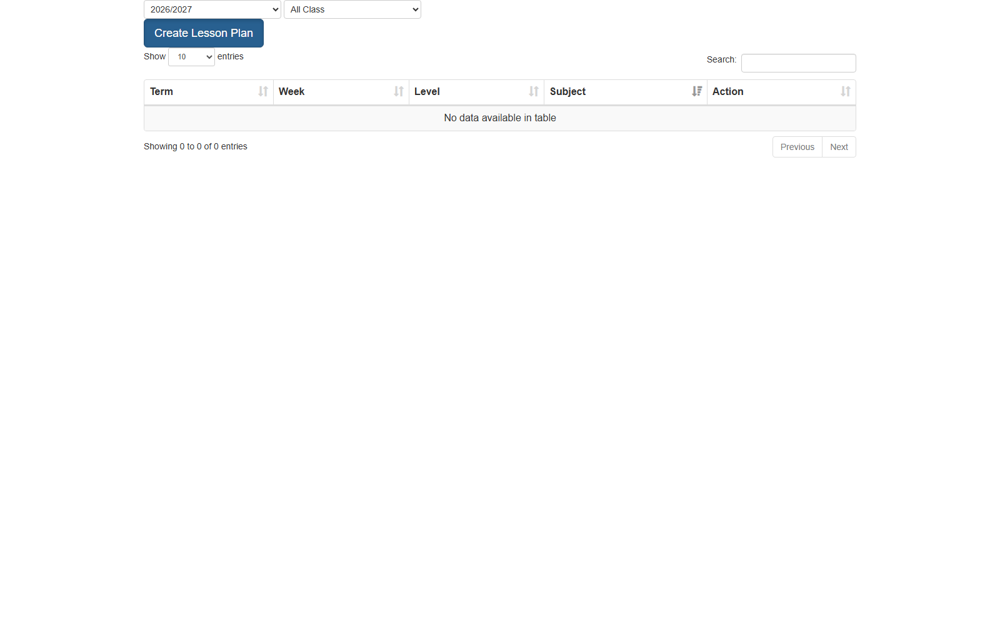
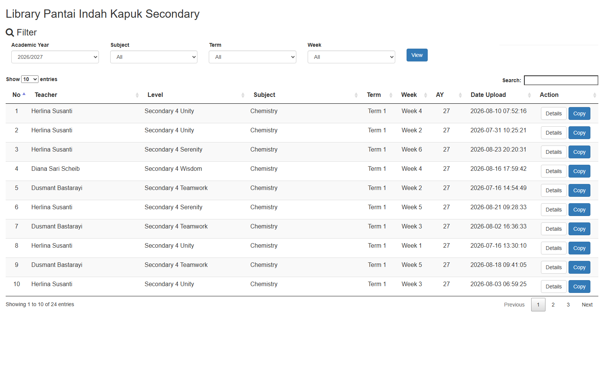

# Lesson Plan

## Overview

Fitur Lesson Plan memungkinkan guru membuat, melihat, menyalin (copy), dan mengelola rencana pembelajaran (lesson plan) per **term + week** untuk kelas yang diampu. Lesson plan terhubung ke **SOW (Scheme of Work)** sebagai referensi untuk mengisi Main Objectives (guru menyalin manual dari dokumen SOW), dan bisa dikomentari oleh **HOD** dan **Principal**. Semua guru di satu campus bisa melihat lesson plan guru lain melalui **Lesson Plan Library**.

Direplikasi dari teacher web: `https://teachers.binabangsaschool.com/new_lesson_plan/` (referensi: `teachers_tool/` di workspace).

**Target implementasi:**
- Backend: `api_nest/src/modules/lesson-plan/` (NestJS 10 + TypeORM 0.3.10 + PostgreSQL)
- Frontend: `bbs/client-teacher/src/views/lessonPlan/` (React + Redux, JavaScript)

## Problem / Motivation

Teacher web saat ini sudah punya fitur lesson plan lengkap, tapi belum ada di sistem baru (`api_nest` + `client-teacher`). Fitur ini dibutuhkan untuk:

1. Guru wajib mengupload lesson plan mingguan — HOD/Principal perlu memonitor siapa yang belum submit (ada halaman khusus "No Lesson Plan Submission").
2. Standarisasi format: setiap lesson plan harus punya objectives, pedagogy, activities, assessment, assignment, dan reflection.
3. Sharing/reuse: guru bisa **copy** lesson plan dari guru lain (termasuk antar academic year dan antar kelas) supaya tidak mulai dari nol.

## Referensi Analisis (dari teacher web, 2026-08-26)

Temuan dari bedah teacher web (`teachers_tool/`):

| Aspek | Temuan |
|-------|--------|
| Halaman utama | `new_lesson_plan/` — list lesson plan guru + filter AY (`#ay`) & Class/Subject (`#classsub`) |
| Form create | `create2.php` — POST `lesson_form2.php`; field: `topic`, `term` (1-4), `week` (dinamis via `js/selectterm.js`), `class`, `ay` (hidden, diisi JS); teacher auto dari session (disabled) |
| Edit header | Tombol `edithead` (kon=0/1) toggle enable `topic/term/week/class`; `saveupdate` → simpan |
| Detail | `details.php?lpid=` — semua field readonly; Main Objectives (dari SOW), Higher Order Thinking Skills Objectives, Pedagogy, Material/Resources, Activities, Assessment (Before/During/After), Assignment, Reflection |
| Comments | `savecommen(x,y)` → POST `savecomment.php` dengan `{recid, comment, tipe, campustipe=2, staff_id}` — HOD & Principal comments |
| Library | `new_viewer_lesson_plan_principal_teacher_shared/` — "Library {Campus} Secondary"; filter AY/Subject/Term/Week + View; DataTable: No, Teacher, Level, Subject, Term, Week, AY, Date Upload, Action (Details + Copy) |
| Library API | `php/viewer.php` (POST: `classroom_id, classsubject_id, term, week, ay`), `php/classroom.php` (POST: `ay`), `php/subject.php` (POST: `classroom_id, ay`) |
| Copy | Modal "Copy Lesson Plan" → POST `get_copy.php` dengan `{recid, ay_copy, class_copy}` |
| Detail principal | `details_p.php?lpid=` — varian detail dengan comment area principal |
| No submission | `teachers/new_viewer_lesson_plan_principal/no_submitted.php` — list guru yang belum submit |
| Hidden ids | `user_id=21046`, `staff_id=40`, `camp_id=4` (contoh session teacher) |
| Week ranges | Term 1-4 dengan rentang week dinamis (JS `selectterm.js`: term 1 → week 1-10, dst per kalender akademik) |

## Scope

### In Scope

- **Backend (`api_nest`)**: modul `lesson-plan` baru dengan 3 entitas (`LessonPlan`, `LessonPlanDetail`, `LessonPlanComment`) + CRUD + copy + library query + comments + no-submission list.
- **Frontend (`client-teacher`)**: halaman Lesson Plan (list + filter), form create/edit, halaman detail + comments, Lesson Plan Library, modal Copy, halaman No Submission.
- Fitur Copy lesson plan (antar AY & antar class).
- Integrasi data: daftar kelas yang diampu guru per AY, referensi dokumen SOW, Academic Year + Week.

### Out of Scope

- Manajemen SOW itu sendiri (fitur terpisah, modul `sow` sudah ada — dependency saja).
- HBL resources attachment (endpoint `list_HBLresources.php` di teacher web — referensi saja, ditandai TODO).
- Approval workflow (lesson plan tidak butuh approve; hanya comment).
- Portal Student & Admin (hanya Teacher Portal).
- Migrasi data dari PHP legacy (tidak ada data awal; greenfield).

## User Stories

### Sebagai guru
Saya ingin membuat lesson plan per term + week untuk kelas yang saya ampu, sehingga saya punya rencana mengajar yang terstruktur dan bisa di-review HOD/Principal.

### Sebagai guru
Saya ingin menyalin lesson plan dari guru lain / dari AY sebelumnya, sehingga saya tidak perlu mengetik ulang dari nol.

### Sebagai HOD / Principal
Saya ingin melihat semua lesson plan guru di campus saya (Lesson Plan Library) dan memberi komentar, sehingga saya bisa memonitor kualitas pengajaran.

### Sebagai HOD / Principal
Saya ingin melihat daftar guru yang belum submit lesson plan untuk term/week tertentu, sehingga saya bisa menindaklanjuti.

## Acceptance Criteria

- [ ] **AC-1:** Guru membuka halaman Lesson Plan → melihat list lesson plan miliknya dengan kolom Term, Week, Level, Subject, Action; filter Academic Year dan Class tersedia.
- [ ] **AC-2:** Guru klik "Create Lesson Plan" → form create terbuka dengan field: Topic, Term (1-4), Week (dinamis per term), Teacher (auto, disabled), Class (dropdown kelas yang diampu).
- [ ] **AC-3:** Setelah memilih Term, dropdown Week otomatis terisi sesuai term (dari `academicYearWeek`).
- [ ] **AC-4:** Guru submit form → lesson plan tersimpan (POST `/v1/lesson-plans`) dan muncul di list.
- [ ] **AC-5:** Guru bisa edit header (Topic/Term/Week/Class) — PATCH `/v1/lesson-plans/:id` dengan body terbatas (header fields).
- [ ] **AC-6:** Detail lesson plan menampilkan semua field: Topic, Term, Week, Teacher, Class, Main Objectives (diisi guru mengacu SOW), Higher Order Thinking Skills Objectives, Pedagogy, Material/Resources, Activities, Assessment (Before/During/After Lesson), Assignment, Reflection.
- [ ] **AC-7:** HOD/Principal bisa mengisi komentar di detail (HOD Comments + Principal Comments) → POST `/v1/lesson-plans/:id/comments`; hanya role yang berhak (HOD → HOD comment, Principal → Principal comment).
- [ ] **AC-8:** Lesson Plan Library menampilkan lesson plan semua guru di campus, dengan filter Academic Year, Subject, Term, Week + tombol View; kolom: No, Teacher, Level, Subject, Term, Week, AY, Date Upload, Action (Details + Copy).
- [ ] **AC-9:** Tombol Copy membuka modal "Copy Lesson Plan" dengan pilihan Copy to AY dan Copy to Class → POST `/v1/lesson-plans/:id/copy` → reload list.
- [ ] **AC-10:** Halaman "No Lesson Plan Submission" menampilkan guru-guru yang belum submit untuk AY/term/week tertentu (GET `/v1/lesson-plans/no-submission`).
- [ ] **AC-11:** Validasi unik: create/copy ke kombinasi `(teacherId, classSubjectId, ay, term, week)` yang sudah ada → 409 Conflict.
- [ ] **AC-12:** Akses terproteksi: semua endpoint memakai JWT auth + `@CheckPermissions` dengan subject `LESSON_PLAN` (modul baru di `ModulesTypeEnum`).

## UI / UX Changes

### Affected Portals
- [ ] Admin (client/)
- [ ] Student (client-student/)
- [x] Teacher (client-teacher/)

### Struktur Halaman (client-teacher)

```
src/views/lessonPlan/
├── LessonPlan.jsx            # List page (halaman utama) — filter AY + Class, DataTable
├── LessonPlanCreate.jsx      # Form create lesson plan
├── LessonPlanEdit.jsx        # Form edit header (opsional: gabung di Create dengan mode edit)
├── LessonPlanDetail.jsx      # Detail read-only + comments (HOD/Principal)
├── LessonPlanLibrary.jsx     # Library viewer semua guru di campus + filter
├── LessonPlanNoSubmission.jsx # List guru yang belum submit
└── components/
    ├── LessonPlanForm.jsx    # Form reusable (create/edit)
    ├── LessonPlanCopyModal.jsx # Modal copy (Copy to AY + Copy to Class)
    └── LessonPlanComment.jsx # Section comment HOD/Principal
```

### Registrasi Route (routes.js)

```js
const LessonPlan = React.lazy(() => import("./views/lessonPlan/LessonPlan"));
const LessonPlanCreate = React.lazy(() => import("./views/lessonPlan/LessonPlanCreate"));
const LessonPlanDetail = React.lazy(() => import("./views/lessonPlan/LessonPlanDetail"));
const LessonPlanLibrary = React.lazy(() => import("./views/lessonPlan/LessonPlanLibrary"));
const LessonPlanNoSubmission = React.lazy(() => import("./views/lessonPlan/LessonPlanNoSubmission"));
```

Route pattern mengikuti konvensi existing (contoh: `views/form-class/leaps/Leaps.jsx` → route `"/form-class/leaps"`). Route baru:
- `/lesson-plan` — list + create button
- `/lesson-plan/new` — create form
- `/lesson-plan/:id` — detail + comments
- `/lesson-plan/library` — library viewer
- `/lesson-plan/no-submission` — guru belum submit

### Referensi UI (dari teacher web)

**Halaman utama (`new_lesson_plan/`):**
- Dropdown Academic Year — 5 tahun ke belakang (2022/2023 - 2026/2027).
- Dropdown Class/Subject — "All Class" + kelas yang diampu (contoh: SAMPLE-CHE, id 38103).
- Tombol besar "Create Lesson Plan".
- DataTable: Term | Week | Level | Subject | Action; default sort Subject desc.
- Modal "Copy Lesson Plan": Copy to AY + Copy to Class.

**Form create (`create2.php`):**
- Layout tabel bordered: TOPIC (text), Term (select 1-4) | Week (select dinamis), Teacher (disabled, auto) | Class (select).
- Save → POST; ada tombol Edit/Back untuk toggle enable field header (edit mode).

**Detail (`details.php?lpid=...`):**
- Semua field readonly/disabled.
- Main Objectives + Higher Order Thinking Skills Objectives (textarea).
- Pedagogy (label list), Material/Resources (ul), Activities (textarea), Assessment (Before/During/After), Assignment, Reflection.
- HOD Comments + Principal Comments (textarea + save).

**Lesson Plan Library (`new_viewer_lesson_plan_principal_teacher_shared/`):**
- Heading "Library {Campus} Secondary".
- Filter: Academic Year, Subject, Term, Week + tombol View.
- DataTable: No | Teacher | Level | Subject | Term | Week | AY | Date Upload | Action (Details + Copy).
- Load data via AJAX (endpoint library).

### UI / UI Guidelines (komponen yang WAJIB dipakai di client-teacher)

> Aturan: **jangan buat komponen UI baru** untuk hal yang sudah disediakan `bbs-client-common`. Pakai komponen yang ada supaya konsisten dengan aplikasi lain (LEAPS, SOW, dsb).

**1. Shared UI components — `bbs-client-common` (`lib/index.js`)**

Semua komponen di bawah di-import dari `bbs-client-common`:

| Komponen | Untuk apa di Lesson Plan |
|----------|--------------------------|
| `BBSHeader` | Header halaman (title "Lesson Plan", "Lesson Plan Library", dll) |
| `BBSSelect` / `BBSControlledSelect` | Dropdown filter Academic Year, Class/Subject, Term, Week |
| `BBSTextField` | Input text (Topic) |
| `BBSTextArea` | Textarea Main Objectives, Activities, Reflection, Comments |
| `BBSButton` | Tombol "Create Lesson Plan", "View", "Save", "Copy" |
| `bbsConfirm` | Konfirmasi sebelum aksi destruktif (delete, overwrite saat copy) |
| `bbsToaster` | Notifikasi sukses/error setelah save/copy/comment |
| `BBSSpinner` | Loading state saat fetch list/detail |
| `BBSNoItemCard` | Empty state (tidak ada lesson plan / tidak ada kelas diampu) |
| `BBSBadge` / `BBSTag` | Label status (mis. "NEW", term badge, comment type HOD/PRINCIPAL) |
| `BBSCheckbox` | Checkbox di form (jika ada opsi) |
| `BBSCommentCard` | Card untuk menampilkan komentar HOD/Principal di detail |

**2. Tabel — `@coreui/react`**

- Pakai `CDataTable` (dari `@coreui/react`) — lihat contoh `Leaps.jsx:241` (`<CDataTable ...>`).
- Definisi kolom sebagai array of objects (`columns={[...]}`) dengan `_props`/render function untuk kolom Action (tombol Details + Copy).
- Tidak pakai DataTables jQuery/HTML table manual (gaya teacher web PHP) — port ke `CDataTable`.

**3. Form — `react-hook-form` + `yup`**

- Pakai `useForm` dari `react-hook-form` + schema `yup` untuk validasi (contoh: `LeapsForm.jsx`).
- Validasi client-side: `topic` required, `term` 1-4, `week` required + range valid, `classSubjectId` required.
- Submit → dispatch API action → on success `bbsToaster.success(...)` + navigate ke list.

**4. Data fetching — `useFromApi` hook**

- Panggil endpoint via `useFromApi(fromApi.lessonPlanList({ ... }))` (tambah endpoint registry di `src/actions/fromApi.js`).
- Query params via `useQueryString` + util `src/utils/buildQueryStr.js` (lihat `Leaps.jsx:21`).
- Response JSON:API Redux state — akses `.data`, `.loading`, `.error` dari hook.

**5. Role-based visibility**

- `usePrincipalOrHod()` → true untuk HOD/Principal: tampilkan tombol/akses "Lesson Plan Library", "No Lesson Plan Submission", dan section comment.
- `useHomeroomTeacher()` → untuk guru biasa: tampilkan halaman utama + create + detail read-only.
- Token/user dari `src/global.js` (localStorage `bbs-teacher-web-token`) + Redux `state.selfUser`.

**6. Referensi implementasi terdekat — `src/views/form-class/leaps/`**

| File LEAPS | Dipakai sebagai contoh untuk |
|------------|-------------------------------|
| `Leaps.jsx` | List page + filter dropdown + `CDataTable` + tombol aksi |
| `LeapsForm.jsx` | Form create/edit (`react-hook-form` + `yup` + `BBSSelect` + `BBSTextField`) |
| `LeapsDetail.jsx` | Detail page + modals (konfirmasi, edit) — pola untuk `LessonPlanDetail` + `LessonPlanCopyModal` |

**7. Visual reference (screenshot teacher web)**

   **Halaman utama Lesson Plan (filter + DataTable):**
   

   **Lesson Plan Library (filter + table):**
   

   **Referensi HTML tambahan:**
   - `teachers_tool/html/new_lesson_plan.html` — struktur HTML lengkap halaman utama.
   - `teachers_tool/html/lp_create2.html` — form create.
   - `teachers_tool/html/lp_details.html` — detail + comment area.

## API Changes

### Endpoint Baru — Modul `lesson-plan` (api_nest)

| Method | Path | Description | Auth |
|--------|------|-------------|------|
| GET | `/v1/lesson-plans` | List lesson plan milik guru (filter: `ay`, `classSubjectId`, `term`, `week`, pagination) | Teacher |
| POST | `/v1/lesson-plans` | Buat lesson plan baru | Teacher |
| GET | `/v1/lesson-plans/:id` | Detail lesson plan + detail content + comments | Teacher/HOD/Principal |
| PUT | `/v1/lesson-plans/:id` | Update full (header + content) | Owner |
| PATCH | `/v1/lesson-plans/:id` | Update status / header-only | Owner |
| DELETE | `/v1/lesson-plans/:id` | Hapus lesson plan | Owner |
| POST | `/v1/lesson-plans/:id/copy` | Copy ke `ayCopy` + `classSubjectCopy` | Teacher |
| GET | `/v1/lesson-plans/library` | Library viewer semua guru di campus (filter: `ay`, `classSubjectId`, `term`, `week`, `campusId`) | Teacher/HOD/Principal |
| GET | `/v1/lesson-plans/library/classrooms` | Daftar kelas untuk filter library (`ay`) | Teacher/HOD/Principal |
| GET | `/v1/lesson-plans/library/subjects` | Daftar subject untuk filter library (`ay`, `classroomId`) | Teacher/HOD/Principal |
| GET | `/v1/lesson-plans/no-submission` | List guru yang belum submit (`ay`, `term`, `week`) | HOD/Principal |
| POST | `/v1/lesson-plans/:id/comments` | Simpan comment (body: `comment`, `commentType` = HOD | PRINCIPAL) | HOD/Principal |
| GET | `/v1/lesson-plans/:id/comments` | List comments | Teacher/HOD/Principal |

Detail lengkap (request/response DTO, contoh payload) ada di `api-contract.md`.

### Endpoint Existing yang Dipakai (dependency)

| Method | Path | Sumber |
|--------|------|--------|
| GET | `/v1/academic-years` + weeks | Modul `academic-year` (`academic-year-week.entity.ts`) — dropdown AY & week |
| GET | `/v1/class-subjects` (atau homeroom-subject-teacher) | Daftar kelas yang diampu guru per AY |
| GET | `/v1/sow` | Referensi dokumen SOW (link `sowUrl`) per subject/level — Main Objectives diisi **manual** oleh guru (copy dari dokumen SOW), bukan auto-fetch |
| GET | `/v1/campus` | Campus teacher (untuk filter library) |

## Database Changes

Detail lengkap di `schema.md`. Ringkasan:

### New Tables

| Table | Kolom utama |
|-------|-------------|
| `lesson_plan` | `id`, `teacher_id` (FK employee), `class_subject_id`, `academic_year_id`, `term`, `week`, `topic`, `source_lesson_plan_id` (null, untuk tracking copy), `active_status`, timestamps |
| `lesson_plan_detail` | `id`, `lesson_plan_id` (FK, unique), `main_objectives`, `higher_order_objectives`, `pedagogy`, `material_resources`, `activities`, `assessment_before`, `assessment_during`, `assessment_after`, `assignment`, `reflection` |
| `lesson_plan_comment` | `id`, `lesson_plan_id` (FK), `commenter_id` (FK employee), `comment_type` (enum HOD/PRINCIPAL), `comment`, `created_at` |

### Index & Constraints

- Unique index `lesson_plan` pada `(teacher_id, class_subject_id, academic_year_id, term, week)`.
- Index `lesson_plan` pada `(academic_year_id, class_subject_id)` untuk library query.
- Index `lesson_plan_comment` pada `(lesson_plan_id)`.

### Migrations

- Generate via `npm run migration:generate --name=create-lesson-plan` (konvensi `api_nest`: `src/database/migrations/`).

## Business Rules / Validation

1. **Unik per teacher + class + subject + ay + term + week** — satu guru tidak boleh punya 2 lesson plan untuk kombinasi yang sama (validasi di service saat create & copy).
2. **Week range per term** — validasi `week` terhadap `academic_year_week` (modul `academic-year`): week harus valid untuk term yang dipilih pada AY tersebut.
3. **Teacher auto-fill** — `teacherId` diambil dari `req.user.id` (bukan dari body) saat create; tidak bisa diubah.
4. **Kelas terbatas pada kelas yang diampu** — validasi `classSubjectId` ∈ daftar kelas yang diampu guru di AY tersebut (via modul homeroom-subject-teacher).
5. **Copy semantics** — Copy menyalin header + detail + (tanpa comments) ke `ayCopy`/`classSubjectCopy`; `source_lesson_plan_id` diisi; jika target kombinasi sudah ada → 409.
6. **Comment roles** — `commentType=HOD` hanya untuk user dengan peran HOD; `commentType=PRINCIPAL` hanya untuk Principal (guard + service check).
7. **Library visibility** — semua guru di campus yang sama bisa melihat semua lesson plan (tanpa pembatasan subject), sesuai perilaku teacher web.
8. **Soft delete / status** — gunakan `activeStatus` (StatusTypeEnum: ACTIVE/INACTIVE) seperti entity `lesson`; DELETE melakukan soft-delete.

## Error Handling

| Error | HTTP Code | Message |
|-------|-----------|---------|
| Kombinasi teacher+class+subject+ay+term+week sudah ada | 409 | "Lesson plan already exists for this term/week" |
| `id` lesson plan tidak ditemukan | 404 | "Lesson plan not found" |
| Copy ke target yang sudah ada | 409 | "Lesson plan already exists in target class/ay" |
| Comment tanpa permission (role mismatch) | 403 | "You don't have permission to comment" |
| `classSubjectId` bukan kelas yang diampu | 400 | "Class is not assigned to this teacher" |
| `week` tidak valid untuk term/ay | 400 | "Week is not valid for the selected term" |
| Session/token invalid | 401 | Redirect ke login / Unauthorized |

## Dependencies

- Modul **academic-year** (`api_nest/src/modules/academic-year/`) — entity `AcademicYear` + `AcademicYearWeek`; sumber dropdown AY & validasi week per term.
- Modul **homeroom-subject-teacher** — daftar kelas yang diampu guru per AY.
- Modul **sow** (`api_nest/src/modules/sow/`) — registry dokumen SOW (`sowUrl`, `subjectId`, `masterLevelId`, `yearFrom`/`yearTo`, `sowType`). **Bukan** sumber data objectives terstruktur (tidak ada kolom term/week/objectives); Main Objectives diisi manual oleh guru mengacu dokumen SOW — lihat NQ-02 di `notes.md`.
- Modul **employee** / **teacher** — identitas guru (nama di detail & library).
- Modul **campus** — scope library (campus teacher).
- Modul **lesson** (existing) — **bukan** dependency fungsional; hanya referensi pola entitas/controller/DTO (LESSON_BUILDER ≠ Lesson Plan).
- Frontend: `bbs-client-common` (shared lib), API layer `makeApiRequestThunk` + `fromApi.js` + `useFromApi` (BUKAN axios), `utils/buildQueryStr.js` (query params).

## Catatan Implementasi (konvensi yang harus diikuti)

### Backend (api_nest)

1. Struktur folder modul baru:
```
src/modules/lesson-plan/
├── lesson-plan.module.ts
├── lesson-plan.controller.ts
├── lesson-plan.service.ts
├── entities/
│   ├── lesson-plan.entity.ts
│   ├── lesson-plan-detail.entity.ts
│   └── lesson-plan-comment.entity.ts
└── dto/
    ├── create-lesson-plan.dto.ts
    ├── update-lesson-plan.dto.ts
    ├── get-lesson-plans.dto.ts
    ├── lesson-plan.dto.ts
    ├── copy-lesson-plan.dto.ts
    └── create-lesson-plan-comment.dto.ts
```
2. Entity extends `BaseEntityWithDates` (`src/common/base.entity`); global `SnakeNamingHelpers` strategy (`src/helpers/snake-naming.helpers.ts`) auto-convert camelCase → snake_case untuk tabel/kolom, tapi entity existing (mis. `lesson.entity.ts`) tetap menulis `@Column({ name: '...' })` eksplisit — ikuti pola itu; relasi `@ManyToOne` + `@JoinColumn`; `@Index()` pada FK; `Relation<T>` typing; `activeStatus: StatusTypeEnum` default ACTIVE; `@Entity({ orderBy: { createdAt: 'DESC' } })`.
3. Controller: `@Controller({ version: '1', path: 'lesson-plans' })` — global prefix `api` (URI versioning, URL lengkap `/api/v1/lesson-plans`); setiap route diberi `@CheckPermissions([{ action: ACLTypeEnum.X, subject: ModulesTypeEnum.LESSON_PLAN }])` (tambah `LESSON_PLAN` di `src/types/enums` + define ability teacher/HOD/principal di `src/modules/casl/casl-ability.factory.ts`); auth via global `JwtAuthGuard` (`src/modules/auth/auth.guard.ts`) — user (`Employee`) tersedia di `req.user`; response wrapper `{ data }` dan pagination `{ data, count, meta }` dengan `PageMetaDto` (`src/common/dto/page-meta.dto`).
4. Query filters: extends `PageOptionsDto` (`page`, `pageSize`, `order`, `sortBy`, `relations`, `query`) — lihat pola DTO modul existing.
5. Register modul di `app.module.ts` + `TypeOrmModule.forFeature([...])` di module file; entities auto-discovered via `src/database/migration-source.ts` glob.
6. Migration: `npm run migration:generate --name=create-lesson-plan` (timestamp-prefixed di `src/database/migrations/`).

### Frontend (bbs/client-teacher)

1. API layer: ikuti pola existing — native fetch dibungkus `makeApiRequestThunk` (`src/actions/makeApiRequest.js`) + endpoint registry class di `src/actions/fromApi.js`, dikonsumsi via hook `useFromApi` + JSON:API Redux state. (BUKAN axios — baca pola `fromApi.js` dulu sebelum implementasi.)
2. State: Redux — `src/actions/` + `src/reducers/` (util `createSimpleReducer.js` di `utils/`) + `src/store/`.
3. Role detection: pakai hook existing `usePrincipalOrHod` / `useHomeroomTeacher` (dari `src/hooks/`) untuk menentukan akses library/no-submission/comment; auth token di localStorage (`bbs-teacher-web-token` / `bbs-web-refresh-token`, `src/global.js`), user state di Redux `state.selfUser` / `state.authUser`.
4. Shared UI: pakai `bbs-client-common` (`lib/index.js` — BBSHeader, BBSSelect, BBSControlledSelect, BBSResourceSelect, BBSTextField, bbsConfirm, bbsToaster) + tabel dari `@coreui/react`. Referensi implementasi terdekat: `src/views/form-class/leaps/` (Leaps.jsx list/DataTable, LeapsForm.jsx create/edit, LeapsDetail.jsx detail+modals).
5. Semua halaman baru di `src/views/lessonPlan/`; register di `src/routes.js` (React Router v5, config-array routing) dengan `React.lazy`.
