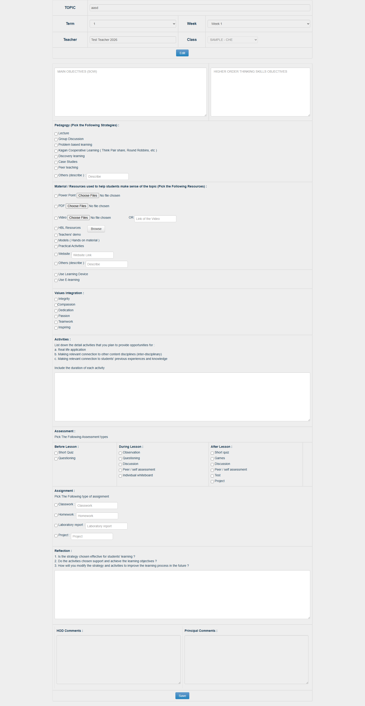

# Lesson Plan

## Overview

Fitur Lesson Plan memungkinkan guru membuat, melihat, menyalin (copy), dan mengelola rencana pembelajaran (lesson plan) per **term + week** untuk kelas yang diampu. Form pembuatan dan pengeditan lesson plan mengacu penuh pada standar kurikulum Bina Bangsa School sebagaimana direplikasi langsung (mirroring) dari teacher web legacy:
`https://teachers.binabangsaschool.com/new_lesson_plan/create2.php?id=103581`.

Form tersebut mencakup struktur komprehensif mulai dari:
- **Header metadata:** Topic, Term, Week dinamis (berdasarkan data `academic_year_week` untuk term terkait), Class-Subject assignment (`SubjectYear`), dan Teacher (readonly).
- **Objectives:** Main Objectives (SOW disalin manual) dan Higher Order Thinking Skills Objectives.
- **Pedagogy Checkboxes:** 7 strategi terstandarisasi + opsi `Others (describe)` dengan input teks deskripsi.
- **Material / Resources Checkboxes & Files:** 
  * Checkbox `Power Point` dengan multiple file upload (`ppt_material[]`)
  * Checkbox `PDF` dengan multiple file upload (`pdf_material[]`)
  * Checkbox `Video` dengan multiple file upload (`video_material[]`) ATAU tautan URL video (`videolink_material`)
  * Checkbox `HBL Resources` dengan tombol Browse modal
  * Checkbox non-file: `Teachers' demo`, `Models ( Hands on material )`, `Practical Activities`
  * Checkbox `Website` dengan input URL teks `website_material`
  * Checkbox `Others` dengan input teks deskripsi `other_material`
- **Learning Device & E-Learning Checkboxes:** `Use Learning Device` dan `Use E-learning`.
- **Values Integration Checkboxes:** 6 nilai BBS (`Integrity`, `Compassion`, `Dedication`, `Passion`, `Teamwork`, `Inspiring`).
- **Activities:** Rich Text / Textarea dengan panduan aplikasi nyata, koneksi interdisipliner, dan pengalaman sebelumnya beserta durasi.
- **Assessment Checkboxes:**
  * Before Lesson: `Short Quiz`, `Questioning`
  * During Lesson: `Observation`, `Questioning`, `Discussion`, `Peer / self assessment`, `Individual whiteboard`
  * After Lesson: `Short quiz`, `Games`, `Discussion`, `Peer / self assessment`, `Test`, `Project`
- **Assignment Checkboxes & Texts:** 4 jenis penugasan (`Classwork`, `Homework`, `Laboratory report`, `Project`) masing-masing dengan checkbox pengaktif dan isian teks instruksi.
- **Reflection:** Textarea refleksi guru dilengkapi 3 pertanyaan pemandu.
- **Review & Comments:** Catatan peninjauan dari **HOD** (`hodcomment`) dan **Principal** (`principalcomment`).
- **Sub-Menu Lesson Plan Viewer (Khusus HOD & Principal):** Menu terdedikasi di Teacher Portal (`client-teacher`) dengan akses terbatas via `usePrincipalOrHod`, memungkinkan HOD dan Principal memantau (read-only) seluruh lesson plan guru dan memberikan review feedback melalui textarea comment interaktif (mengadopsi alur komentar review seperti di Principal Portal).
- **Multi-File Upload & Standard Renaming:** Guru dapat mengunggah banyak file (multiple files) untuk setiap kategori material (Power Point, PDF, Video), dengan format penamaan file otomatis di backend/storage:  
  `[CATEGORY] - [Topic] - Term [Term] - Week [Week] - [Counter].[ext]`  
  *(Contoh: `PPT - Chemical Reactions - Term 1 - Week 3 - 01.pptx`, `PDF - Chemical Reactions - Term 1 - Week 3 - 01.pdf`).*

**Target implementasi (dua portal & backend):**
- Backend: `api_nest/src/modules/lesson-plan/` (NestJS 10 + TypeORM 0.3.10 + PostgreSQL) — selaras dengan implementasi entitas eksisting di `smartbag`.
- Frontend Teacher Portal: `bbs/client-teacher/src/views/lessonPlan/` (React + Redux, JavaScript) — pengguna utama (guru).
- Frontend Admin Portal: `bbs/client/src/views/lessonPlan/` (React + Redux, JavaScript) — mirroring; admin dapat membantu membuat/mengubah lesson plan atas nama guru dan memberikan komentar atas nama HOD/Principal.

## Problem / Motivation

1. **Standarisasi kurikulum dan pedagogi BBS:** Setiap lesson plan harus mengikuti format terstruktur sekolah dengan komponen checkbox terstandarisasi (strategi pedagogi, nilai integrasi BBS, jenis asesmen berkala, dan perangkat e-learning).
2. **Material pendukung pembelajaran (Material / Resources):** Guru dapat melampirkan file materi presentasi (PPT), dokumen lembar kerja/modul (PDF), maupun video pembelajaran secara langsung pada bagian materi, atau menyertakan tautan video dan website.
3. **Fleksibilitas input & auto-save:** Di legacy, form `create2.php` memungkinkan update header terpisah (`edithead`/`saveupdate`) dan input bertahap dengan checkbox dan field assignment terperinci.
4. **Monitoring & Review:** Memastikan kepatuhan submit mingguan dan memfasilitasi HOD serta Principal memberikan feedback langsung pada rencana ajar guru.

## Referensi Analisis (Berdasarkan `create2.php?id=103581`)

Analisis langsung terhadap halaman `https://teachers.binabangsaschool.com/new_lesson_plan/create2.php?id=103581`, script `js/allinput_insert2.js`, dan `js/selectterm.js`:

| Bagian Form | Komponen & Input | Deskripsi & Nilai Legacy (Mirroring Murni) |
|-------------|-------------------|---------------------------------------------|
| **Header** | Text & Select | - `topic`: Text input. - `term`: Select (Term 1, 2, 3, 4). - `ls_week`: Select dinamis dari kalender akademik `academic_year_week` untuk term yang dipilih (misal Term 1: Week 1–10, Term 2: Week 11–20, dst). - `class`: Select class-subject yang diampu (`SubjectYear`). - `teacher`: Text readonly (nama guru dari auth session / `teacherId`). - Toggle button `Edit` / `Save Edit` (`edithead` kon=0/1) memproteksi header agar tidak terubah tanpa sengaja. |
| **Objectives** | Textarea | - `main_objectives`: Textarea (placeholder: "MAIN OBJECTIVES (SOW)") — disalin manual oleh guru dari SOW. - `higher_objectives`: Textarea (placeholder: "HIGHER ORDER THINKING SKILLS OBJECTIVES"). |
| **Pedagogy** | Checkbox Group + Text | - **7 Checkboxes (`pedagogy[]`):**   1. `lecture`: Lecture   2. `Group Discussion`: Group Discussion   3. `Problem based learning`: Problem based learning   4. `Kagan Cooperative Learning`: Kagan Cooperative Learning ( Think Pair share, Round Robbins, etc )   5. `Discovery learning`: Discovery learning   6. `Case Studies`: Case Studies   7. `Peer teaching`: Peer teaching - **Text input (`other_pedagogy`):** Checkbox `Others` + isian teks bebas untuk mendeskripsikan metode lain. |
| **Material / Resources** | Checkbox Group + File Inputs + Links | - **File Uploads & Links:**   * Checkbox `Power Point` + `<input name="ppt_material[]" type="file" multiple>`   * Checkbox `Pdf` + `<input name="pdf_material[]" type="file" multiple>`   * Checkbox `Video` + `<input name="video_material[]" type="file" multiple>` OR input teks URL `videolink_material` - **HBL Resources:** Checkbox `HBL Resources` + tombol browse modal (`#browse_hbl_resources`). - **Checkboxes non-file:**   * `Teachers demo`: Teachers' demo   * `Models ( Hands on material )`: Models ( Hands on material )   * `Practical Activities`: Practical Activities - **Texts:**   * Checkbox `Website` + input teks `website_material`   * Checkbox `Others` + input teks `other_material` |
| **Learning Device & E-Learning** | Checkboxes | - `learning_device`: Checkbox `Use Learning Device` (value: 1). - `elearning`: Checkbox `Use E-learning` (value: 1). |
| **Values Integration** | Checkbox Group | - **6 Checkboxes (`value_integrated[]`):**   1. `Integrity`   2. `Compassion`   3. `Dedication`   4. `Passion`   5. `Teamwork`   6. `Inspiring` |
| **Activities** | Rich Text / Textarea | - `activities`: Textarea panduan durasi & aktivitas (Real life application, inter-disciplinary, connection to previous knowledge). |
| **Assessment** | Checkbox Groups | - **Before Lesson (`assesment_before[]`):**   * `Short Quiz`, `Questioning` - **During Lesson (`assesment_during[]`):**   * `Observation`, `Questioning`, `Discussion`, `Peer / self assessment`, `Individual whiteboard` - **After Lesson (`assesment_after[]`):**   * `Short quiz`, `Games`, `Discussion`, `Peer / self assessment`, `Test`, `Project` |
| **Assignment** | Checkbox + Text Input | - 4 Kategori tugas, masing-masing dengan checkbox pengaktif dan text input rincian:   1. `Classwork`: Checkbox + input teks `classwork_assignment`   2. `Homework`: Checkbox + input teks `homework_assignment`   3. `Laboratory report`: Checkbox + input teks `lab_assignment`   4. `Project`: Checkbox + input teks `project_assignment` |
| **Reflection** | Textarea | - `reflection`: Textarea refleksi guru setelah mengajar, dilengkapi panduan 3 pertanyaan pemandu. |
| **Review & Comments** | Textarea Readonly (Reviewer Editable) | - `hodcomment`: Komentar catatan review dari Head of Department. - `principalcomment`: Komentar catatan review dari Principal. |

## Scope

### In Scope
- **Form Pembuatan & Pengeditan Lengkap (`create2.php`)**:
  - Implementasi seluruh bagian form input di frontend (`client-teacher` dan `client`).
  - Dinamika dropdown Term (1-4) ke Week berdasarkan validasi `academic_year_week` untuk term terpilih.
  - Checkbox multi-select: Pedagogy (7 opsi + others text), Values Integration (6 opsi), Materials (PPT, PDF, Video, HBL, demo, models, practical, website, others), Assessment Before (2 opsi), Assessment During (5 opsi), Assessment After (6 opsi).
  - Checkbox Device & Platform: `Use Learning Device`, `Use E-learning`.
  - Checkbox + input: Assignment (Classwork, Homework, Laboratory report, Project).
  - Material Multi-File Uploads: Upload multiple file untuk PPT, PDF, Video terhubung ke entity `File` di `api_nest` dengan aturan auto-rename.
- **Auto-Rename File Format (Multi-File)**:
  - Format penamaan baku pada backend storage:  
    `[CATEGORY] - [Topic] - Term [Term] - Week [Week] - [Counter].[ext]`  
    *Contoh:*
    * `PPT - Chemical Reactions - Term 1 - Week 3 - 01.pptx`
    * `PDF - Chemical Reactions - Term 1 - Week 3 - 01.pdf`
    * `VIDEO - Chemical Reactions - Term 1 - Week 3 - 01.mp4`
- **Sub-Menu Lesson Plan Viewer (Khusus HOD & Principal)**:
  - Menu khusus di Teacher Portal (`bbs/client-teacher`) dengan hak akses terbatas: hanya tampil dan dapat diakses jika `usePrincipalOrHod` bernilai `true` (HOD atau Principal/VP).
  - Tampilan membaca (read-only) seluruh lesson plan yang dibuat oleh guru-guru di bawah departemen/campus.
  - Form textarea comment interaktif yang mengadopsi alur feedback/review approval dari Principal Portal (`ais_legacy/principals_tool`), memungkinkan HOD atau Principal menyimpan komentar review secara real-time.
- **Backend (`api_nest`)**:
  - Penyelarasan dengan entitas eksisting `LessonPlan` (header), `LessonPlanDetail` (body & checkbox configurations), dan `LessonPlanComment` (komentar HOD & Principal).
  - Endpoint CRUD lengkap: Create draft/submit, Update detail, Update header, Copy lesson plan, Multi-file upload dengan auto-renaming, Query library, Comments HOD/Principal (view & save), dan No-Submission list.
- **Frontend Dual Portal**:
  - Teacher Portal (`bbs/client-teacher`): Form create/edit interaktif dengan layout persis `create2.html`, viewer detail, library view, modal copy, sub-menu Lesson Plan Viewer khusus HOD/Principal.
  - Admin Portal (`bbs/client`): Mirroring tampilan dengan hak akses perbantuan guru dan pengisian komentar HOD/Principal.

### Out of Scope
- Modul kuesioner teknologi SAMR / Engagement-Enhancement-Extension (di `create2.html` statusnya di-comment out oleh BBS).
- Integrasi otomatis pengambilan teks SOW (Main Objectives tetap diisi manual oleh guru dengan referensi tautan SOW).
- Lesson Plan Preschool (fokus fase ini adalah Primary & Secondary sesuai `create2.php`).
- Approval status workflow (Lesson Plan tidak memerlukan approval status approve/reject, melainkan review & feedback comment dari HOD dan Principal).

## Acceptance Criteria

- [ ] **AC-1 (Header & Dinamika Week):** Guru memilih Term 1 s/d 4 → Dropdown Week terisi otomatis dengan rentang minggu yang valid untuk term tersebut berdasarkan kalender akademik (`academic_year_week`). Kelas otomatis dibatasi pada kelas yang diampu guru (`SubjectYear`) pada AY aktif.
- [ ] **AC-2 (Objectives):** Tersedia field textarea untuk `Main Objectives (SOW)` dan `Higher Order Thinking Skills Objectives`.
- [ ] **AC-3 (Pedagogy Checkboxes):** Terdapat 7 pilihan checkbox strategi pedagogi terstandarisasi BBS (`lecture`, `Group Discussion`, `Problem based learning`, `Kagan Cooperative Learning`, `Discovery learning`, `Case Studies`, `Peer teaching`) dan checkbox `Others` beserta input teks `other_pedagogy`.
- [ ] **AC-4 (Values Integration):** Guru dapat mencentang 6 nilai integrasi BBS (`Integrity`, `Compassion`, `Dedication`, `Passion`, `Teamwork`, `Inspiring`).
- [ ] **AC-5 (Material / Resources & Multi-File Uploads with Auto-Rename):**
  - Checkbox `Power Point` mendukung multi-file upload (`.ppt`, `.pptx`, `.key`).
  - Checkbox `Pdf` mendukung multi-file upload (`.pdf`).
  - Checkbox `Video` mendukung multi-file upload (`.mp4`, `.3gp`, `.avi`, `.flv`) ATAU input tautan URL teks `videolink_material`.
  - **Auto-Rename Format:** File yang diunggah otomatis di-rename saat disimpan dengan format:  
    `[CATEGORY] - [Topic] - Term [Term] - Week [Week] - [Counter].[ext]`  
    *(Contoh: `PPT - Chemical Reactions - Term 1 - Week 3 - 01.pptx`, `PDF - Chemical Reactions - Term 1 - Week 3 - 01.pdf`).*
  - Checkbox `HBL Resources` dengan tombol Browse modal.
  - Checkbox non-file: `Teachers demo`, `Models ( Hands on material )`, `Practical Activities`.
  - Checkbox `Website` dengan input URL teks `website_material`.
  - Checkbox `Others` dengan input teks `other_material`.
- [ ] **AC-6 (Learning Device & E-Learning):** Terdapat checkbox `Use Learning Device` dan `Use E-learning`.
- [ ] **AC-7 (Activities):** Terdapat editor untuk Activities lengkap dengan petunjuk panduan aplikasi nyata dan durasi.
- [ ] **AC-8 (Assessment Checkboxes):** Terdapat 3 kelompok asesmen:
  - Before Lesson: `Short Quiz`, `Questioning`
  - During Lesson: `Observation`, `Questioning`, `Discussion`, `Peer / self assessment`, `Individual whiteboard`
  - After Lesson: `Short quiz`, `Games`, `Discussion`, `Peer / self assessment`, `Test`, `Project`
- [ ] **AC-9 (Structured Assignment):** Terdapat 4 jenis tugas (`Classwork`, `Homework`, `Laboratory report`, `Project`). Masing-masing memiliki checkbox penanda dan text input untuk instruksi tugas.
- [ ] **AC-10 (Reflection):** Menampilkan textarea refleksi dengan 3 pertanyaan pemandu yang tertera jelas di atas field input.
- [ ] **AC-11 (HOD & Principal Review Comments & Sub-Menu Viewer):**
  - **Sub-Menu Lesson Plan Viewer:** Terdapat sub-menu khusus di Teacher Portal (`client-teacher`) dengan rute `/lesson-plan-viewer` yang hanya dapat diakses oleh HOD & Principal (diproteksi dengan hook `usePrincipalOrHod`).
  - **Read-Only Data:** HOD dan Principal dapat membaca seluruh lesson plan guru (filter AY, Term, Week, Subject, Teacher).
  - **Review Comment Form:** Menampilkan form textarea input komentar mirip dengan review/comment modal di Principal Portal (`ais_legacy/principals_tool`), di mana reviewer dapat mengetik feedback dan menyimpannya ke endpoint komentar.
  - Komentar yang sudah tersimpan dapat dilihat oleh guru pembuat lesson plan dalam mode readonly.
- [ ] **AC-12 (Copy Lesson Plan):** Fungsi copy menduplikasi seluruh data header, objectives, checkbox pedagogy, values integration, materials, activities, assessment, dan assignment ke target AY / Class yang dipilih, tanpa menyalin komentar review dan refleksi guru lama.

## Screenshots & Reference UI

1. **Form Create & Edit Lengkap (`create2.php`):**
   *Capture visual layout form `https://teachers.binabangsaschool.com/new_lesson_plan/create2.php?id=103581`:*
   

2. **Daftar Lesson Plan Guru (`new_lesson_plan/`):**
   

3. **Lesson Plan Library Campus (`lesson_plan_library`):**
   

4. **File Referensi HTML Legacy:**
   - Form lengkap: `features/lesson-plan/reference/create2.html`
   - List halaman utama: `features/lesson-plan/reference/new_lesson_plan.html`
   - Library viewer: `features/lesson-plan/reference/lesson_plan_library.html`
