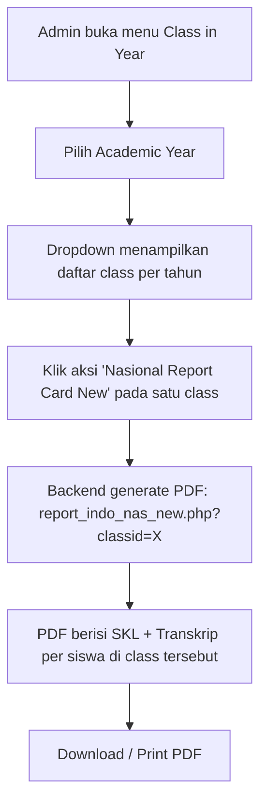

# National Report Card (Nasional Report Card)

## 1. Overview

Feature ini menghasilkan **dokumen resmi kelulusan per siswa**: **Surat Keterangan Lulus (SKL)** dan **Transkrip Nilai**, dalam format PDF yang bisa dicetak. Dokumen di-generate per class (satu PDF berisi banyak siswa) dan mencakup periode **3 tahun terakhir** dari data nilai siswa.

Di legacy, menu ini bernama **"Nasional Report Card New"** (file `report_indo_nas_new.php`) dan varian lama **"Nasional Report Card Old"** (`report_indo_nas.php`). Keduanya berada dalam **kelompok menu "Report Card"** di menu **Class in Year** pada portal admin (`ais_new`), bersama Report Card, E-Report Card, Medal, Form Ijazah, Check Ijazah, Ijazah Excel, Leaps, FTP Evaluation, dan FTP T1-T4.

Pada smartbag, fitur ini **belum ada** — terdaftar sebagai gap pada `FEATURE_COMPARISON.md` (bagian Grading & Report). Berdasarkan clue analisis bbs-notes, National Report merupakan bagian dari alur **GPA Report National** yang menggabungkan GPA Calculator + Transcript + NAS Ranking.

**Status di smartbag:** ❌ Belum ada module `national-report` di `api_nest`. Feature brief ini mengusulkan module baru.

## 2. Workflow / Flowchart

**User flow (frontend):**
| Langkah | Aksi | Hasil |
|---------|------|-------|
| 1 | Buka menu Class in Year | Tabel class per AY (dengan tombol aksi per baris) |
| 2 | Pilih AY | Daftar class tahun tersebut |
| 3 | Klik "Nasional Report Card New" pada satu class | Download PDF SKL + Transkrip untuk semua siswa class itu |

**Data flow (backend):**
| Langkah | Proses | Endpoint |
|---------|--------|----------|
| 1 | Terima classid (base64) | GET/POST `report_indo_nas_new.php?classid=<base64>` |
| 2 | Decode classid → ambil class + daftar siswa | Query class → students |
| 3 | Untuk tiap siswa: kumpulkan nilai final (SKL: 3 mapel + rata; Transkrip: 13 mapel + rata) | Query nilai per level (AS PUM & SA1 / FYA & IGCSE PUM / FYA June) |
| 4 | Generate PDF (html2pdf) berisi SKL + Transkrip semua siswa | Output PDF download |

**Mapping endpoint legacy → smartbag:**
| Legacy | Fungsi | Smartbag (proposed) |
|--------|--------|---------------------|
| `report_indo_nas_new.php` | Nasional Report Card New (SKL + Transkrip) | `GET /api/v1/national-reports/:classId/pdf` |
| `report_indo_nas.php` | Nasional Report Card Old | `GET /api/v1/national-reports/:classId/pdf?version=old` |

## 3. Problem / Motivation

1. **Legacy tanpa API terstruktur** — `report_indo_nas_new.php` adalah script PHP + html2pdf yang menghasilkan file download langsung; tidak ada API JSON yang bisa dipakai frontend React smartbag.
2. **Data nilai tersebar** — nilai SKL/Transkrip diambil dari kombinasi sumber per level (AS PUM & SA1 untuk JC2, FYA & IGCSE PUM untuk Sec 4, FYA June untuk lainnya). Smartbag belum memiliki aggregator nilai lintas level ini.
3. **Dokumen resmi penting** — SKL dan Transkrip adalah dokumen yang dibutuhkan siswa untuk pendaftaran universitas / kebutuhan administrasi; kebutuhan fungsionalnya jelas dan mendesak.
4. **Belum ada module di smartbag** — gap di FEATURE_COMPARISON, sehingga fitur ini perlu dibuat dari nol (endpoint + generator PDF + view).

## 4. Referensi Analisis

| Item | Legacy | Keterangan |
|------|--------|------------|
| Halaman | `Class in Year` → kelompok "Report Card" → Nasional Report Card New/Old | Menu admin `ais_new` |
| Endpoint New | `library/html2pdf/examples/report_indo_nas_new.php?classid=<base64>` | Generate PDF (SKL + Transkrip) |
| Endpoint Old | `library/html2pdf/examples/report_indo_nas.php?classid=<base64>` | Varian lama |
| Param | `classid` — **base64 dari class id** (contoh `MjQwNQ==` = `2405`) | Encode/decode di sisi server |
| Output | PDF download (html2pdf), 1 PDF per class berisi banyak siswa | Contoh: JC2 Mendel AY 2024/2025 = 42 halaman |
| Struktur isi | Per siswa: halaman **SKL** (3 mapel + rata) + halaman **Transkrip** (13 mapel + rata) | Lihat reference/ PDF |
| Data nilai | SKL: Pendidikan Agama, PPKN, Bahasa Indonesia. Transkrip: 13 mapel (Agama, PPKN, B.Indo, B.Ing, B.Mandarin, Matematika, Biologi, Kimia, Komputer, Fisika, Keterampilan Umum, Penjas, Seni & Prakarya) | Dari OCR PDF |
| Status smartbag | ❌ Belum ada | Brief ini mengusulkan |

## 5. Scope

**In Scope:**
- Generate PDF Nasional Report Card (SKL + Transkrip) per class
- Filter class per Academic Year (default tampil AY terbaru, bisa pilih AY 3 tahun terakhir)
- Dua varian: New (default) dan Old (untuk kompatibilitas dokumen lama)
- Download PDF (file attachment / print)
- Dual portal: Admin Portal (semua campus) + Teacher Portal (campus masing-masing, bila role diizinkan)
- Format angka nilai: 2 desimal, rata-rata dihitung dan ditampilkan

**Out of Scope:**
- Pengelolaan data siswa/class (modul terpisah: `class-in-year`)
- Input/edit nilai (modul grading terpisah)
- Approval/penandatanganan digital SKL (enhancement)
- NAS Ranking per campus (feature brief terpisah — lihat Catatan)
- Transcript mandiri tanpa SKL (enhancement — bisa re-use generator)

## 6. User Stories

| ID | Sebagai | Saya ingin | Agar |
|----|---------|-----------|------|
| US-1 | Admin | generate PDF Nasional Report Card untuk satu class | membagikan dokumen SKL + Transkrip ke siswa |
| US-2 | Admin | memilih Academic Year sebelum generate | mengambil data class per tahun yang tepat |
| US-3 | Admin | memilih varian New atau Old | menyesuaikan format dokumen dengan kebutuhan |
| US-4 | Teacher (bila diizinkan) | generate untuk class di campus sendiri | memfasilitasi siswa tanpa harus lewat admin |
| US-5 | Admin | mengunduh PDF sebagai file | menyimpan/mengirim dokumen resmi |

## 7. Acceptance Criteria

| ID | Kriteria |
|----|----------|
| AC-1 | Admin dapat membuka halaman "Class in Year" dan melihat daftar class per AY |
| AC-2 | Admin dapat memilih AY dan melihat class class tahun tersebut |
| AC-3 | Klik "Nasional Report Card New" menghasilkan PDF yang berisi SKL + Transkrip semua siswa di class itu |
| AC-4 | Setiap siswa mendapat halaman SKL (3 mapel + rata-rata) dan halaman Transkrip (13 mapel + rata-rata) |
| AC-5 | Format nilai 2 desimal, rata-rata benar dihitung |
| AC-6 | Varian Old menghasilkan format dokumen yang berbeda (legacy format) |
| AC-7 | Download PDF berfungsi dan file valid (bukan error/404) |
| AC-8 | Hanya role yang diizinkan yang dapat mengakses (permission di SUBJECT_MODULES) |
| AC-9 | Fitur tersedia di Admin Portal dan Teacher Portal (sesuai scope role) |

## 8. UI / UX Changes

**Guidelines:**
- Menu induk: **Class in Year** (tabel class per AY)
- Per baris class: dropdown/kumpulan aksi report (Report Card, E-Report Card, Medal, Form Ijazah, Check Ijazah, Ijazah Excel, **Nasional Report Card New**, **Nasional Report Card Old**, Leaps, FTP Evaluation, FTP T1-T4)
- Klik "Nasional Report Card New/Old" → memicu download PDF (bisa dengan konfirmasi / loading state)
- Filter AY di bagian atas tabel

**Affected Portals:**
| Portal | Keterangan |
|--------|------------|
| ✅ Admin Portal | Kelola class per tahun, generate dokumen semua campus |
| ✅ Teacher Portal | Lihat class campus sendiri, generate bila diizinkan |
| ❌ Student Portal | Tidak ada aksi generate (hanya menerima dokumen dari admin/teacher) |

**Screenshot:** Screenshot legacy dari halaman Class in Year + hasil PDF dapat dilihat pada `reference/` (file PDF asli yang di-scrap dari portal ASD).

## 9. API Changes

| Method | Endpoint | Deskripsi |
|--------|----------|-----------|
| GET | `/api/v1/class-in-year?academicYearId=` | Daftar class per AY (reuse modul `class-in-year` bila ada) |
| GET | `/api/v1/national-reports/:classId/pdf?version=new\|old` | Generate & download PDF Nasional Report Card |

Referensi detail JSON request/response: `api-contract.md`.

## 10. Database Changes

Tidak ada tabel baru khusus untuk **generate** PDF — data dibaca dari tabel yang sudah ada:
- `class` / `class_room` (classid)
- `student` + `class_student` (daftar siswa per class)
- Nilai: `student_grade` / `secondary-gpa-*` (GP Value × Unit), sumber per level (AS PUM & SA1 / FYA & IGCSE PUM / FYA June)

Namun untuk **nilai final SKL/Transkrip** perlu dipastikan ada data yang bisa di-aggregate. Jika smartbag belum menyimpan PUM/FYA/SA1 secara terstruktur, perlu modul penyimpanan nilai terlebih dahulu (lihat Catatan).

Referensi detail: `schema.md`.

## 11. Business Rules / Validation

| # | Aturan |
|---|--------|
| 1 | Permission: hanya role dengan SUBJECT_MODULES `national-report` yang bisa akses |
| 2 | `classId` wajib valid dan aktif |
| 3 | AY wajib dipilih (default AY terbaru) |
| 4 | Siswa tanpa data nilai → nilai ditampilkan kosong/0 atau disertakan placeholder (perlu keputusan) |
| 5 | Format nilai: 2 desimal, rata-rata dihitung dari mapel yang ada |
| 6 | Varian Old hanya untuk kompatibilitas; New adalah default |
| 7 | PDF harus bisa di-download, bukan redirect ke halaman kosong |

## 12. Error Handling

| Kasus | Kode | Pesan |
|-------|------|-------|
| Class tidak ditemukan | 404 | Class not found |
| AY tidak valid | 400 | Invalid academic year |
| Tidak ada data nilai siswa | 422 | No grade data for this class |
| Role tidak diizinkan | 403 | Forbidden |
| Generator PDF gagal | 500 | Report generation failed |

## 13. Dependencies

- Modul `class-in-year` (daftar class per AY) — perlu dicek keberadaannya di `api_nest`
- Modul nilai/GPA (`secondary-gpa-grading-scale`, `secondary-gpa-subject-unit`) — sumber GP Value × Unit
- Data PUM/FYA/SA1/IGCSE per level — perlu konfirmasi apakah sudah tersimpan di smartbag
- Library generate PDF (report engine / html2pdf equivalent) di backend
- FEATURE_COMPARISON gap "Grading & Report"
- Fitur terkait: `features/teacher-cv/`, `features/appraisal-summary/`, GPA Calculator
