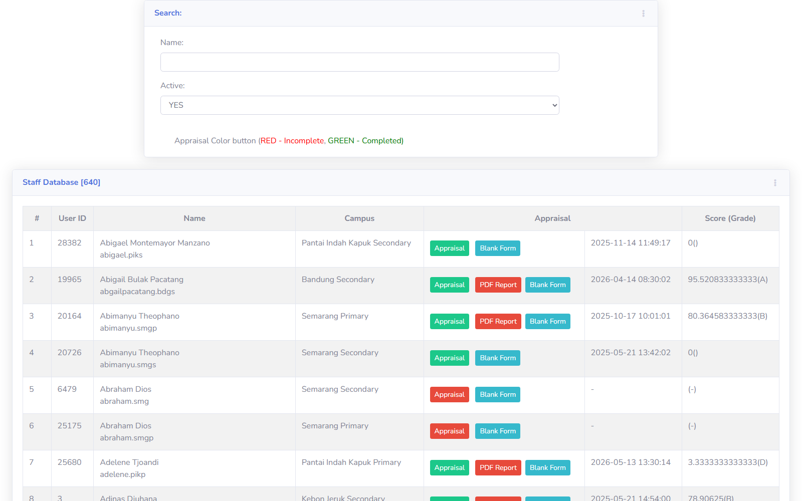

# PETALS Lesson Observation Input

## Overview

Fitur **Lesson Observation (PETALS) Input** adalah form untuk Principal/HOD meng-input skor observasi kelas guru berdasarkan rubrik **PETALS** — 18 item observasi yang dikelompokkan ke 5 dimensi (P, E, T, A, L). Setiap item diberi mark 0-4 via dropdown, lalu skor per dimensi dihitung otomatis dan ditampilkan sebagai kartu ringkasan. Form juga memiliki 2 textarea: **Strength** dan **Areas of Concern**. Data yang di-input menjadi sumber agregasi untuk halaman **PETALS Summary Report** (`features/petals/`).

Direplikasi dari teacher web: `staff/asd_observation.php` (dibuka dari menu "New Apprisal Teachers" id 329 via tombol observasi di `asd_staff_app_new.php`).

## Problem / Motivation

- Skor PETALS di `petals_summary.php` (report view) bersumber dari form input yang tersebar di teacher web legacy — **tidak ada form input terstruktur di sistem baru** (`bbs` + `api_nest`).
- Form legacy `asd_observation.php` adalah halaman PHP server-side + JS jQuery (`js/asd_observation.js`) yang memuat item rubrik dari service `services/app_get_observation.php` dan menyimpan via `services/update_appraisal_new.php`.
- Petugas (Principal/HOD) perlu meng-input skor observasi per guru per AY, lengkap dengan catatan Strength/Areas of Concern, dari portal baru.

## Referensi Analisis (dari teacher web)

| Item | Nilai |
|------|-------|
| Halaman legacy | `staff/asd_observation.php?userid=<id>&tname=<nama>&tipe=1` |
| Menu induk | "New Apprisal Teachers" id 329 → `staff/asd_staff_app_new.php` (daftar guru + tombol Appraisal/observasi) |
| JS handler | `staff/js/asd_staff_app_asd_new.js` baris 152-156: `window.open('asd_observation.php?userid=<id>&tname=<nama>&tipe=1')` |
| Form JS | `staff/js/asd_observation.js` |
| Load data | POST `services/app_get_observation.php` (body: `staffid=<id>`) |
| Hitung total | POST `services/app_get_observation_total2.php` (body: `staffid=<id>`) |
| Simpan skor | POST `services/update_appraisal_new.php` (body: `value&recid&staffid&user_update&state`) |
| Rubrik | `staff/files/PETALS Form.pdf` — Lesson Observation (PETALS) Report |
| Dimensi | P=Pedagogy (3 item), E=Experiences of Learning (3), T=Tone of Environment (5), A=Assessment for Learning (6), L=Learning Content (2) |
| Skor max | P(0-12), E(0-12), T(0-20), A(0-24), L(0-8) — total 76 = 100% |

## Scope

### In Scope
- Form input skor observasi per guru: 18 item dropdown mark 0-4, dikelompokkan per dimensi P/E/T/A/L.
- Kartu ringkasan skor per dimensi + average (%) yang update otomatis saat mark berubah.
- Textarea Strength & Areas of Concern per guru.
- Save (simpan per item + catatan), status Completed/Incomplete.
- List guru untuk observasi (dari modul employee, filter campus + AY).
- Permission: hanya Principal/HOD/Staff — teacher biasa tidak bisa meng-input.
- Frontend Teacher Portal (`client-teacher`) — pengguna utama (Principal/HOD).
- Frontend Admin Portal (`client/`) — mirroring: admin dapat membantu input lintas campus.

### Out of Scope
- Report view PETALS — terpisah (`features/petals/`).
- Appraisal EPMS/Work Review (`asd_appraisal_new.php` — 18 dimensi, skor 100, grade A-D) — modul terpisah.
- Appraisal Lock/Unlock workflow.
- Export Excel/Print form observasi.

## User Stories

### As a Principal/HOD
I want to input PETALS observation scores for each teacher in my campus
So that the appraisal data is recorded and reflected in the PETALS summary report.

### As a Principal/HOD
I want to see the dimension scores (P/E/T/A/L) and average update automatically while I mark each item
So that I can quickly verify the total score before saving.

### As a Principal/HOD
I want to write Strength and Areas of Concern for each teacher
So that the teacher gets constructive feedback from the observation.

## Acceptance Criteria

- [ ] **AC-1:** Halaman menampilkan form observasi untuk satu guru: 18 item dropdown mark 0-4, dikelompokkan ke 5 seksi (P/E/T/A/L) dengan label rubrik persis dari PETALS Form.pdf.
- [ ] **AC-2:** Kartu ringkasan P/E/T/A/L + Average (%) ter-update otomatis saat mark diubah; perhitungan = `(P+E+T+A+L)/76*100%`.
- [ ] **AC-3:** Textarea Strength & Areas of Concern tersedia dan tersimpan.
- [ ] **AC-4:** Tombol Save menyimpan via API; data tersimpan per item + header observasi; status menjadi Completed bila semua item di-mark (atau sesuai config).
- [ ] **AC-5:** List guru untuk observasi menampilkan guru di campus user (Principal/HOD) dengan filter nama + AY; status observasi (Completed/Incomplete) terlihat.
- [ ] **AC-6:** Hanya role Principal/HOD/Staff yang bisa mengakses — teacher biasa mendapat 403.
- [ ] **AC-7:** Empty state jika tidak ada guru di campus.

## UI / UX Changes

### UI / UI Guidelines

1. **Layout**: dua kolom — kiri: kartu ringkasan P/E/T/A/L + Average (fixed, `#holder_ofminis` di legacy); kanan: tabel 18 item rubrik dengan dropdown mark 0-4 per item, dikelompokkan per seksi dimensi.
2. **Header**: "PETALs Form of {TeacherName}" + tombol back ke list guru.
3. **Actions**: tombol Save; indikator status per guru (hijau = Completed, merah = Incomplete) di list.
4. **Screenshot referensi dari teacher web:**
   - List guru (menu induk New Appraisal Teachers — daftar guru + tombol Appraisal merah/hijau + kolom Score/Grade + link Blank Form/PDF Report):

   **Staff Database — daftar guru untuk observasi:**
   

   - Form observasi: `asd_observation.php?userid=<id>&tname=<nama>&tipe=1` (tidak ada capture tersedia — layout mengikuti deskripsi di AC-1/AC-2: 18 item mark 0-4 per seksi P/E/T/A/L + kartu ringkasan + 2 textarea)

### Affected Portals
- [x] Admin (client/) — mirroring; admin dapat membantu input lintas campus
- [ ] Student (client-student/)
- [x] Teacher (client-teacher/) — pengguna utama (Principal/HOD role)

### Dual Portal (Mirroring)

| Portal | Lokasi | Peran |
|--------|--------|-------|
| Teacher Portal | `bbs/client-teacher/src/views/petals-observation/` | **Pengguna utama** — Principal/HOD input observasi per campus-nya. |
| Admin Portal | `bbs/client/src/views/petals-observation/` | **Mirroring** — admin input/edit atas nama Principal/HOD lintas campus. |

Aturan akses backend:
- Teacher Portal: Principal/HOD mengelola data per campus-nya (`req.user` campusId).
- Admin Portal: admin punya permission tambahan `PETALS_MANAGE` sehingga dapat akses lintas campus.

## API Changes

| Method | Path | Description |
|--------|------|-------------|
| GET | `/api/v1/petals/observations/items` | List 18 item rubrik PETALS (label, dimensi, max mark, urutan) |
| GET | `/api/v1/petals/observations?campusId=&ay=&teacherId=` | List observasi (status, skor per dimensi, average) untuk list guru |
| GET | `/api/v1/petals/observations/:id` | Detail observasi: mark per item + strength + areas_of_concern |
| POST | `/api/v1/petals/observations` | Buat observasi baru untuk guru (draft) |
| PUT | `/api/v1/petals/observations/:id/items` | Simpan mark per item (bulk) |
| PUT | `/api/v1/petals/observations/:id` | Update strength/areas_of_concern + status (submit) |
| DELETE | `/api/v1/petals/observations/:id` | Soft delete observasi (draft) |

Detail lengkap di `api-contract.md`.

## Database Changes

### New Tables
- `petals_observation_item` — 18 item rubrik (config, di-seed)
- `teacher_observation` — header observasi per guru per AY
- `teacher_observation_score` — mark 0-4 per item per observasi

### Migrations
- `npm run migration:generate --name=create-petals-observation` (di `api_nest`)

### Seed Data
- **`seed-data.json`** di folder ini — **18 indikator rubrik PETALS** (static config, di-seed sekali ke tabel `petals_observation_item`). Ini satu-satunya seed terkait PETALS yang diperlukan.
- Field per item: `id`, `dimension` (P/E/T/A/L), `label`, `maxMark` (4), `sortOrder`, `activeStatus`.
- Skor penilaian guru TIDAK di-seed — skor adalah hasil observasi (modul ini), bukan data awal.

Detail lengkap di `schema.md`.

## Business Rules / Validation

1. Mark per item: integer 0-4 (dropdown). Dimensi max: P=12 (3 item), E=12 (3), T=20 (5), A=24 (6), L=8 (2).
2. Average = `(P+E+T+A+L) / 76 * 100%` — dihitung backend & frontend live.
3. Satu guru bisa punya banyak observasi (beda AY/observer). Kombinasi unik `(teacher_id, academic_year_id, observer_id)` untuk observasi aktif.
4. Observer diambil dari `req.user.id` (Principal/HOD yang login).
5. Status: `DRAFT` (belum lengkap) / `SUBMITTED` (lengkap & dikunci) — mirip status Completed/Incomplete di legacy.
6. Strength & Areas of Concern opsional, max 1000 karakter.
7. `strength`/`areasOfConcern` adalah **catatan teks bebas** di level observasi — **tidak ada relasi/tagging ke dimensi PETALS** (P/E/T/A/L). Catatan ini hanya informasi tambahan untuk pembaca report, bukan data terstruktur per dimensi.

## Error Handling

| Error | HTTP Code | Message |
|-------|-----------|---------|
| Teacher not found | 404 | "Teacher not found" |
| Teacher not in campus | 400 | "Teacher is not in your campus" |
| Item not found | 404 | "Observation item not found" |
| Mark out of range | 400 | "Mark must be between 0 and 4" |
| Unauthorized (teacher role) | 403 | "You don't have permission to input PETALS observation" |
| Observation already submitted | 409 | "Observation is already submitted" |

## Dependencies

- Backend (`api_nest`):
  - Entity `Employee` (`src/modules/employee/entities/employee.entity.ts`) — teacher/observer.
  - Entity `Campus`, `AcademicYear` — relasi.
  - Decorator: `@CheckPermissions`, `@Auth`.
- Frontend:
  - `bbs-client-common`, `CDataTable`, `makeApiRequestThunk` + `fromApi.js` + `useFromApi`.
- Modul report `features/petals/` — konsumen data observasi (agregasi).
