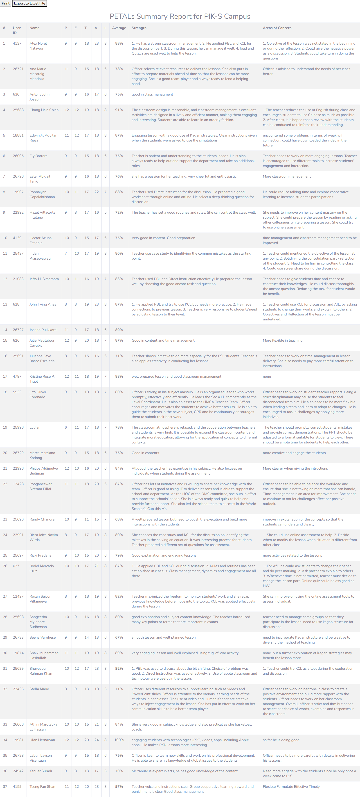

# PETALS Summary Report

## Overview

Fitur **PETALS Summary Report** menampilkan ringkasan hasil **Lesson Observation** guru per campus dalam bentuk tabel agregat. Setiap guru memiliki skor pada 5 dimensi (P, E, T, A, L) plus rata-rata persentase, serta catatan Strength dan Areas of Concern dari observer. Halaman bersifat read-only (report view) dengan dua aksi: Print dan Export to Excel. Fitur ini adalah bagian dari modul **Staff/HR — Appraisal & Performance** — pengguna utamanya Principal/HOD.

> **PETALS = Lesson Observation framework**, BUKAN appraisal EPMS. Akronimnya: **P**edagogy, **E**xperiences of Learning, **T**one of Environment, **A**ssessment for Learning, **L**earning Content. Skor di-entry per item observasi (mark 0-4) di halaman `asd_observation.php` — lihat bagian "Alur Input Skor" di bawah dan `notes.md` NQ-03.

**Implementasi di dua portal:** Teacher Portal (`client-teacher`) untuk Principal/HOD sebagai pengguna utama, dan Admin Portal (`client/`) sebagai **mirroring** di mana admin dapat melakukan perbantuan pengelolaan (input/edit/export) atas nama Principal/HOD.

Direplikasi dari teacher web: `staff/petals_summary.php` (menu id 343, diakses via proxy zone AIS).

## Problem / Motivation

- Teacher web legacy memiliki halaman `staff/petals_summary.php` yang menampilkan ringkasan appraisal guru per campus — tidak ada API terstruktur, di-render PHP server-side, diakses via proxy `zone.binabangsaschool.com`.
- Smartbag (`bbs` + `api_nest`) belum punya modul appraisal/performance sama sekali — tidak ada entitas `TeacherAppraisal` atau `PetalsScore`.
- Data appraisal saat ini tersimpan di database legacy (staff module) dan tidak bisa diakses dari sistem baru tanpa API.
- Perlu report view untuk Principal/HOD melihat ringkasan skor appraisal guru per campus, dengan kemampuan export ke Excel.

## Referensi Analisis (dari teacher web)

| Item | Nilai |
|------|-------|
| Halaman legacy | `staff/petals_summary.php` (diakses via proxy zone AIS, 200 OK) |
| Menu id | 343 (`getmenulist.json[21]`) |
| Link menu | `../../staff/petals_summary.php` |
| Role | Staff/Principal — **tidak muncul** di sidebar teacher (tidak ada di home_direct.html) |
| Akses langsung | 404 Not Found |
| Akses via rmenu | `home.php?rmenu=petals_summary` — render shell + iframe fallback (empty links) |
| Akses via proxy | `zone.binabangsaschool.com/ais/teachers/link_preschool_dashboard.php?links=<base64 path>` — berhasil render |
| Campus | PIK-S (Panta Indah Kapuk Secondary) — hardcoded di halaman |
| Tombol | Print (`window.print()`), Export to Excel (`print_petals_summary.php`) |
| Export trigger | Download file (konfirmasi dari Playwright: "Download is starting") |
| Varian multi-campus | **E-PETALS**: `staff/epetals_summary_asd.php` (shell, userid=586) → `epetals_summary.php?camp_id=X` per campus (KJ-P s/d BPN-P) — lihat `notes.md` |
| Chart | **`ais/asd/epetal_chart.php`** — Chart.js "AVG Per Campus" bar chart (`epetals_chart.js`) — enhancement |
| Tingkatan appraisal | Teacher / HOD / **Principal** (`asd_staff_app_principal_new.php` + service `staff_get_staff_principal_new.php`) |

## Scope

### In Scope
- Report view: tabel skor appraisal guru per campus (5 dimensi + average + strength/concern).
- Data columns: `#`, `User ID`, `Name`, `P`, `E`, `T`, `A`, `L`, `Average`, `Strength`, `Areas of Concern`.
- Filter by campus (default: campus user login).
- Export to Excel (download XLS/CSV).
- Print view (print-friendly CSS).
- Permission: hanya Principal/HOD/Staff yang bisa akses (bukan teacher biasa).
- Frontend Teacher Portal: halaman PETALS di `client-teacher` — pengguna utama (Principal/HOD role).
- Frontend Admin Portal (`client/`) — mirroring: admin dapat melihat & membantu mengelola data appraisal lintas campus.

### Out of Scope
- Input/edit skor observasi (form `asd_observation.php` / `asd_appraisal_new.php`) — PETALS **hanya report view**; input skor tetap di teacher web legacy (modul terpisah).
- Workflow approval appraisal — terpisah (EPMS / Appraisal Lock/Unlock).
- Dril-down ke detail observasi per guru — hanya summary.
- Role Teacher melihat skor sendiri — enhancement.
- Perbandingan antar campus — enhancement.

### Alur Input Skor (referensi — di luar scope report)
Skor PETALS di-entry oleh Principal/HOD di teacher web legacy, bukan di halaman report ini. Alur lengkap hasil reverse-engineer (lihat `notes.md` NQ-03):

1. **`staff/asd_staff_app_new.php`** (menu "New Apprisal Teachers", id 329) — daftar guru + tombol "Appraisal" (hijau = Completed, merah = Incomplete) + kolom Score (Grade) + link Blank Form/PDF Report.
2. Klik "Appraisal" → **`asd_appraisal_new.php?userid=<id>&tname=<nama>&tipe=1`** (form appraisal 18 dimensi, skor 100, grade A-D).
3. Form observasi PETALS: **`asd_observation.php?userid=<id>&tname=<nama>&tipe=1`** — judul "PETALs Form of <nama>", 18 item dropdown mark 0-4 (dikelompokkan ke P/E/T/A/L: 3/3/5/6/2 item), 2 textarea Strength & Areas of Concern.
4. Simpan via service `services/update_appraisal_new.php` (POST `value&recid&staffid&user_update&state`); data load via `services/app_get_observation.php`.
5. Skor di-agregasi ke `petals_summary.php` (report view ini).

## User Stories

### As a Principal/HOD
I want to view PETALS summary report for my campus
So that I can monitor teacher appraisal scores and identify areas for improvement.

### As a Principal/HOD
I want to export the PETALS report to Excel
So that I can analyze the data offline or share with other stakeholders.

## Acceptance Criteria

- [ ] **AC-1:** Halaman PETALS menampilkan tabel dengan kolom: #, User ID, Name, P, E, T, A, L, Average (%), Strength, Areas of Concern.
- [ ] **AC-2:** Data ditampilkan per campus (sesuai campus user login) — opsional filter campus dropdown.
- [ ] **AC-3:** Tombol Print mencetak halaman dalam format print-friendly.
- [ ] **AC-4:** Tombol Export to Excel men-download file (XLS/CSV) dengan data yang sama.
- [ ] **AC-5:** Hanya role Principal/HOD/Staff yang bisa mengakses — teacher biasa mendapat 403.
- [ ] **AC-6:** Data diurutkan berdasarkan User ID atau Name (default ASC).
- [ ] **AC-7:** Empty state jika tidak ada data appraisal untuk campus tersebut.

## UI / UX Changes

### UI / UI Guidelines

1. **Layout**: halaman full-width dengan header "PETALs Summary Report for {Campus} Campus" — tabel Bootstrap striped di bawahnya.
2. **Actions**: dua tombol di atas tabel — "Print" dan "Export to Excel".
3. **Screenshot referensi dari teacher web:**

   **PETALS Summary Report untuk PIK-S Campus:**
   

### Affected Portals
- [x] Admin (client/) — mirroring; admin dapat melihat & mengelola data appraisal per campus
- [ ] Student (client-student/)
- [x] Teacher (client-teacher/) — pengguna utama (Principal/HOD role melihat & mengelola skor)

### Dual Portal (Mirroring)

Implementasi dilakukan di **dua portal** dengan satu set API yang sama:

| Portal | Lokasi | Peran |
|--------|--------|-------|
| Teacher Portal | `bbs/client-teacher/src/views/petals/` | **Pengguna utama** — Principal/HOD melihat & mengelola appraisal per campus (report view + input skor). |
| Admin Portal | `bbs/client/src/views/petals/` | **Mirroring** — admin melihat semua data appraisal (lintas campus) dan dapat membantu mengelola (input/edit/export) atas nama Principal/HOD. |

Aturan akses backend:
- Teacher Portal: Principal/HOD mengelola data per campus-nya (`req.user` campusId).
- Admin Portal: admin punya permission tambahan `PETALS_MANAGE` sehingga dapat akses lintas campus (mirroring + perbantuan).

## API Changes

| Method | Path | Description |
|--------|------|-------------|
| GET | `/api/v1/petals/report` | Get PETALS summary report (by campus) |
| GET | `/api/v1/petals/export` | Export PETALS report to Excel (download) |

## Database Changes

### New Tables
- `teacher_appraisal` — menyimpan data appraisal per guru (skor P/E/T/A/L, strength, areas_of_concern, campus_id, academic_year_id, observer_id)

### Columns (teacher_appraisal)

| Column | Type | Null | Notes |
|--------|------|------|-------|
| id | int PK | no | autoincrement |
| teacher_id | int FK → employee.id | no | index |
| campus_id | int FK → campus.id | no | index |
| academic_year_id | int FK → academic_year.id | no | |
| observer_id | int FK → employee.id | no | yang melakukan observasi |
| score_p | int | no | skor dimensi P (0-12) |
| score_e | int | no | skor dimensi E (0-12) |
| score_t | int | no | skor dimensi T (0-20) |
| score_a | int | no | skor dimensi A (0-24) |
| score_l | int | no | skor dimensi L (0-8) |
| strength | text | yes | catatan kekuatan |
| areas_of_concern | text | yes | catatan area perbaikan |
| active_status | enum(ACTIVE, INACTIVE) | no | ACTIVE |

### Migrations
- `npm run migration:generate --name=create-teacher-appraisal` (di `api_nest`)

### Seed Data
- **Tidak ada seed data di folder ini** — tabel `teacher_appraisal` terisi dari **hasil agregasi observasi** (`features/petals-observation/`), bukan dari seed.
- Seed indikator PETALS (18 item rubrik) berada di `features/petals-observation/seed-data.json` — itu satu-satunya seed terkait PETALS yang diperlukan.

## Business Rules / Validation

1. Skor P (0-12), E (0-12), T (0-20), A (0-24), L (0-8) — total maksimal 76 poin (100%).
2. Average = `(P + E + T + A + L) / 76 * 100%`.
3. Satu teacher bisa memiliki banyak record appraisal (berbeda AY/observer).
4. Report hanya menampilkan data untuk campus user login.
5. Export Excel menggunakan format yang sama dengan tabel.

## Error Handling

| Error | HTTP Code | Message |
|-------|-----------|---------|
| No data for campus | 404 | "No appraisal data found for this campus" |
| Unauthorized (teacher role) | 403 | "You don't have permission to access PETALS report" |
| Invalid campus | 400 | "Campus not found" |

## Dependencies

- Backend (`api_nest`):
  - Entity `Employee` (`src/modules/employee/entities/employee.entity.ts`) — relasi teacher/observer.
  - Entity `Campus` — relasi campus.
  - Modul referensi: `src/modules/lesson/` (pola CRUD), `src/modules/employee/` (relasi).
  - Decorator: `@CheckPermissions` (`src/decorators/permission.decorator.ts`), `@Auth` (`src/decorators/auth.decorator.ts`).
  - Export Excel: bisa pakai `exceljs` atau library serupa (NestJS).
- Frontend:
  - `bbs-client-common` (shared lib), `CDataTable` dari `@coreui/react`.
  - `makeApiRequestThunk` + `fromApi.js` + `useFromApi` (BUKAN axios).