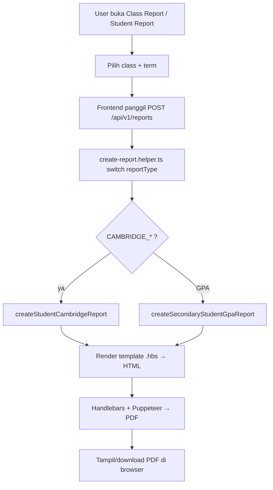

# Prelim Report & GPA (June/Nov)

## 1. Overview

Feature ini menghasilkan **Prelim Report Card** (IGCSE / AS Level / A Level) dan **GPA Report** (Mid / June / Nov) — dokumen nilai yang di-generate per siswa. Di smartbag fitur ini **sudah terimplementasi**; brief ini mendokumentasikan implementasi smartbag dan membandingkannya dengan legacy.

**Status di smartbag:** ✅ Sudah ada. Pipeline report terpusat di `api_nest` (`src/helpers/create-report.helper.ts` → helper report → template `.hbs` → PDF), dengan frontend di `bbs` (client + client-teacher).

### Mapping Endpoint Legacy → Smartbag

| Legacy | Fungsi | Smartbag |
|--------|--------|----------|
| `prelimreport_igcse.php?classid=<b64>` | Prelim Report Card IGCSE | `POST /api/v1/reports` `reportType=CAMBRIDGE_IGCSE` |
| `prelimreport_aslevel.php?classid=<b64>` | Prelim Report Card AS Level | `POST /api/v1/reports` `reportType=CAMBRIDGE_ASLEVEL` |
| `prelimreport_alevel.php?classid=<b64>` | Prelim Report Card A Level | `POST /api/v1/reports` `reportType=CAMBRIDGE_ALEVEL` |
| `mid_gpa.php?classid=<b64>` | GPA Mid | `POST /api/v1/reports` `reportType=GPA` + `term` |
| `gpa.php?classid=<b64>` | GPA June | `POST /api/v1/reports` `reportType=GPA` + `term` |
| `gpa_nov.php?classid=<b64>` | GPA Nov | `POST /api/v1/reports` `reportType=GPA` + `term` |

---

## 2. Workflow / Flowchart

**Data flow (backend):**
| Langkah | Proses |
|---------|--------|
| 1 | Terima `{ studentReportId, term, reportType }` via `POST /api/v1/reports` |
| 2 | `create-report.helper.ts` men-dispatch berdasarkan `ReportTypeEnum` |
| 3 | `CAMBRIDGE_*` → `createStudentCambridgeReport()` — ambil nilai prelim (PRELIMINARY) + PUM + moderation + conduct/remark |
| 4 | `GPA` → `createSecondaryStudentGpaReport()` — hitung GP Value × unit per subject |
| 5 | Render `.hbs` → HTML (createReportHtml) → Puppeteer PDF |

---

## 3. Problem / Motivasi Brief Ini

1. **Legacy vs smartbag sangat berbeda arsitekturnya** — legacy menghasilkan PDF langsung di server (html2pdf PHP), smartbag menyimpan HTML lalu merender PDF client-side (pdfmake).
2. **Konsolidasi report type** — legacy punya 6 endpoint terpisah (3 prelim + 3 GPA); smartbag hanya 1 controller `reports` dengan parameter `reportType` + `term`.
3. **Data nilai tersebar** — prelim butuh PUM/predicted grade/moderation; GPA butuh GP Value × unit. Perlu dokumentasi sumber datanya.

---

## 4. Referensi Analisis

| Item | Legacy | Smartbag |
|------|--------|----------|
| Entry point | Menu Class in Year → Report Card group | Menu Report → Class Report / Student Report |
| Endpoint | `library/html2pdf/examples/*.php?classid=<b64>` | `POST /api/v1/reports` |
| Param | `classid` (base64 dari class id) | `{ studentReportId, term, reportType }` |
| PDF | html2pdf (PHP) server-side | Handlebars + Puppeteer (BE), pdfmake (FE) |
| Threshold | Script PHP | Modul `threshold` + `syllabus` + `gradeSchema` |
| Moderation | `moderate_component_prelim_new.php` | `grade-moderation` (`bulk-update`, `student-grades`) |
| Locking | `view_lock_prelim.php` (lock_as/ig/a2) | — (belum teridentifikasi setara) |

---

## 5. Scope

**In Scope:**
- Prelim Report Card: IGCSE (Sec 4 + JC1), AS Level (JC2, term 2), A Level (JC2, term 4)
- GPA Report: Mid (semua level), June/Nov (JC2) — via `reportType=GPA` + `term`
- Konfigurasi threshold/syllabus/grade schema untuk prelim
- Moderation nilai prelim
- Konfigurasi grading scale + subject unit untuk GPA

**Out of Scope:**
- Nasional Report Card (SKL + Transkrip) — feature brief terpisah (`national-report`)
- Transcript mandiri
- NAS Ranking

---

## 6. User Stories

| ID | Sebagai | Saya ingin | Agar |
|----|---------|-----------|------|
| US-1 | Admin/Teacher | generate Prelim Report Card per siswa | memberi hasil prelim ke siswa |
| US-2 | Admin/Teacher | generate GPA Report per term | memantau performa siswa |
| US-3 | Admin | mengatur threshold/grade boundary prelim | nilai prelim sesuai standar |
| US-4 | Admin | melakukan moderation nilai prelim | nilai konsisten antar paper |
| US-5 | Admin | mengatur grading scale + subject unit GPA | kalkulasi GPA benar |

---

## 7. Acceptance Criteria

| ID | Kriteria |
|----|----------|
| AC-1 | `POST /api/v1/reports` dengan `reportType=CAMBRIDGE_*` menghasilkan HTML prelim report yang benar |
| AC-2 | `POST /api/v1/reports` dengan `reportType=GPA` menghasilkan HTML GPA report yang benar |
| AC-3 | Term memetakan ke semester dengan benar (term 2 → semester 1, dst) |
| AC-4 | Kalkulasi GPA = Σ(GP Value × unit) / Σ(unit) benar |
| AC-5 | Prelim A Level memakai gradebook composite (AS + prelim) |
| AC-6 | PDF yang dihasilkan valid dan bisa di-render |

---

## 8. UI / UX Changes

**Admin Portal (`client`):**
- Menu **Report** → **Class Report** (`/class-report/:classYearId/:term/:reportType`) — render prelim/GPA report per class
- Menu **Report** → **Student Report** (`/student-report`) — daftar report per siswa
- Menu **Moderation** (`/moderation/add`, `/moderation/list`)
- Halaman threshold: `/threshold`, `/threshold-as-prelim`
- Halaman Cambridge grade: `/student-cambridge-actual-grade`
- Halaman secondary GPA: `/secondary-gpa-gs`, `/secondary-gpa-su`

**Teacher Portal (`client-teacher`):**
- Menu **Classrooms** → `/classrooms/:classYearId/:term/:reportType` (Class Report Viewer)
- Menu **Grade** → IGCSE / A Level / AS Level Gradebook (`/cambridge-gradebook/*`)
- Tidak ada Student Report / Threshold / Moderation di teacher nav

---

## 9. API Changes

| Method | Endpoint | Deskripsi |
|--------|----------|-----------|
| POST | `/api/v1/reports` | Generate report (body: `studentReportId`, `term`, `reportType`) |
| POST | `/api/v1/reports/update` | Regenerate report |
| GET | `/api/v1/reports`, `GET /api/v1/reports/:id`, `PUT /api/v1/reports/:id` | CRUD report |
| POST | `/api/v1/reports/disable-undisable-view-report` | Toggle visibilitas report |
| GET | `/api/v1/threshold/subject/:subjectId` | Threshold per subject |
| POST | `/api/v1/grade-moderation/bulk-update` | Moderation nilai |
| GET/POST | `/api/v1/gpaGradingScales`, `/api/v1/gpaSubjectUnits` | Konfigurasi GPA |

Referensi detail: `api-contract.md`.
