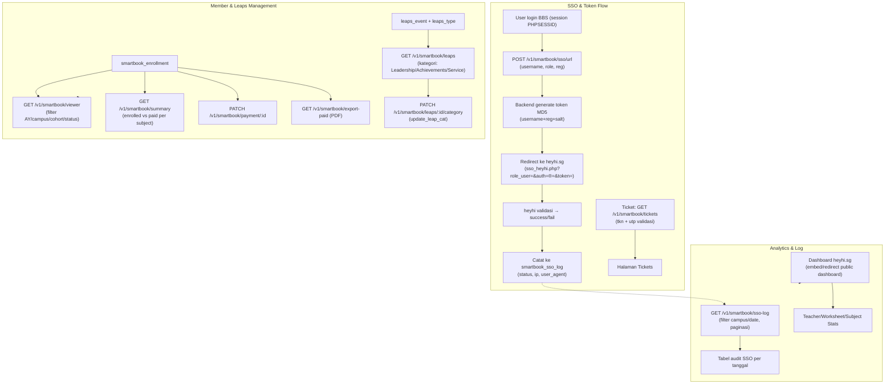
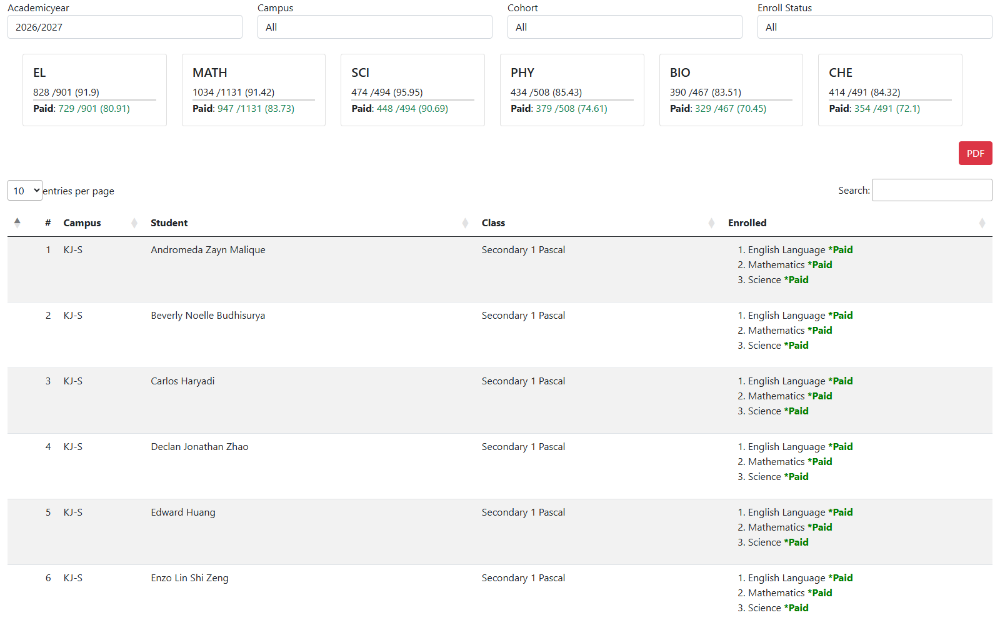
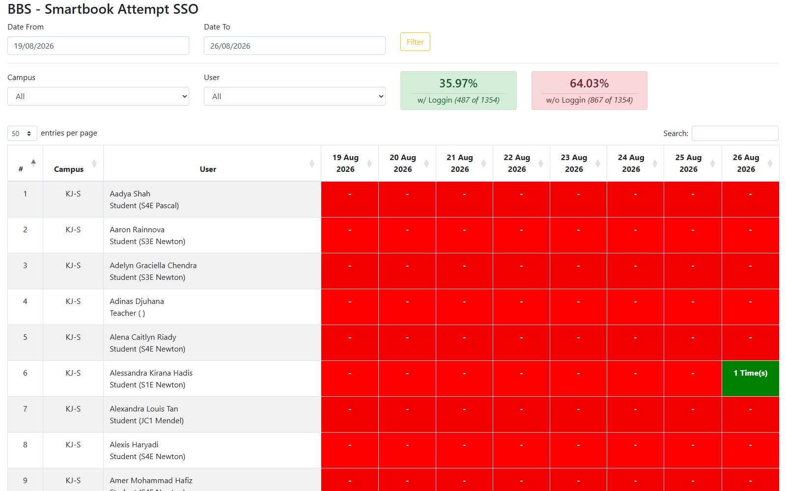

# Smartbook Integration — Full Manage dengan Third-party heyhi.sg

## Overview

Fitur **Smartbook Integration** adalah paket lengkap integrasi BBS dengan platform e-learning/kerja siswa **heyhi.sg** (vendor Smartbook). Bukan sekadar viewer status pembayaran — ini mencakup **full management**: SSO ke platform heyhi, manajemen member/enrollment, audit log SSO, modul Leaps (learning engagement dengan kategori Leadership/Achievements/Service), dashboard analitik heyhi, serta mekanisme token/ticket. Semua endpoint legacy direplikasi menjadi API terstruktur di `api_nest` dan UI di `bbs` (Admin + Teacher portal).

Modul-modul legacy yang direplikasi:
| Komponen | File legacy | Fungsi |
|----------|-------------|--------|
| SSO Smartbook | `teachers.binabangsaschool.com/sso_heyhi.php` | SSO user guru ke platform heyhi.sg (role_user, auth, reg, token) |
| SSO link | `link_ais.php`, `link_ais2.php`, `link_principals_asd.php` | Redirect SSO antar portal dengan token + form_param base64 |
| Member Viewer | `ais/asd/smartbook/viewer.php` | Paid viewer — status enroll vs paid per subject |
| SSO Log | `ais/teachers/smartbook/login_log` | Audit trail semua percobaan SSO (2MB tabel) |
| Leaps | `teachers/leaps/`, `leaps_pri/`, `leaps_asd/` | Learning engagement — entry, report, viewer, kategori (Leadership/Achievements/Service), update_leap_cat |
| Stats dashboards | `clientreport.heyhi.sg/public/dashboard/*` | 3 dashboard analitik (Teacher/Worksheet/Subject Stats) |
| Survey | `home.php` menu "Smartbook Survey" | Survei Smartbook |
| Token | `ais_new/index.php/tickets/gettoken_nya` | Validasi tkn+utp (MD5) → halaman Tickets |
| Export PDF | `library/html2pdf/examples/smartbook_paid_report.php` | Export laporan paid |
| Update Payment | `update_payment.php` | Update status payment student |

## Workflow / Flowchart

### Flowchart



### Penjelasan Langkah-langkah

**1. Alur SSO (Single Sign-On ke heyhi.sg)**

| Langkah | Proses | Keterangan |
|---------|--------|------------|
| 1.1 | User login BBS | Session PHPSESSID aktif (login ASD). |
| 1.2 | Request SSO URL | Backend generate URL `sso_heyhi.php?role_user=1&auth=<base64 username>&reg=<base64>&token=<MD5>`. `auth` = base64(username), `reg` = base64(region, misal "4"), `token` = MD5(username+reg+salt). |
| 1.3 | Redirect ke heyhi.sg | Browser dibawa ke platform vendor dengan token valid. |
| 1.4 | Validasi & audit | Jika token tidak valid → "Access Denied, Username invalid!" (legacy behavior). Semua percobaan dicatat ke `smartbook_sso_log`. |

**2. Alur Member & Leaps Management**

| Langkah | Proses | Keterangan |
|---------|--------|------------|
| 2.1 | Member Viewer | Filter AY (27/26/25), campus (6), cohort (Sec1–JC2), status (Enrolled/Paid/Not Paid/None) → statistik per subject + tabel per student. |
| 2.2 | Update payment | Ubah status payment student (optimistic lock). |
| 2.3 | Export PDF | Generate laporan paid (per subject & per student). |
| 2.4 | Leaps | Lihat data learning engagement per kategori (Leadership/Achievements/Service); update kategori leaps. |

**3. Alur Analytics & Log**

| Langkah | Proses | Keterangan |
|---------|--------|------------|
| 3.1 | SSO Log | Audit trail per user per tanggal (default 7 hari terakhir, paginasi). |
| 3.2 | Dashboard heyhi | Embed/redirect ke 3 dashboard public heyhi.sg (Teacher/Worksheet/Subject Stats). |

**4. Skenario Lengkap (End-to-End)**

```
[Guru/Admin login BBS]
    ↓
[Klik "SSO Smartbook"] → [GET /v1/smartbook/sso/url] → [Redirect ke heyhi.sg → dashboard Smartbook]
    ↓
[Admin buka Smartbook Member Viewer]
    ↓
[Filter AY 2026/2027, campus PIK-S, cohort JC1, status Not Paid]
    ↓
[Statistik: EL 828/901 clear, 729 paid; MATH 1034/1131 ...] + [Tabel siswa]
    ↓
[Update payment siswa → Enrolled] / [Export PDF laporan paid]
    ↓
[Buka Smartbook Login Log] → [Tabel audit: user, campus, 19 Aug ... 26 Aug]
    ↓
[Buka Leaps] → [Lihat Leadership/Achievements/Service, update kategori]
    ↓
[Lihat dashboard stats heyhi (embed)]
```

## Problem / Motivation

- Legacy memisahkan banyak halaman untuk mengelola platform Smartbook (`sso_heyhi.php`, `viewer.php`, `login_log`, `leaps/`, dashboard heyhi, `gettoken_nya`, `update_payment.php`, `smartbook_paid_report.php`) — semuanya **belum ada API terstruktur** di sistem baru (`bbs` + `api_nest`).
- **Full management** dibutuhkan: tidak hanya melihat status paid (member viewer), tetapi juga mengelola SSO (generate/validasi token + audit), mengelola data Leaps (kategori & update), mengakses dashboard analitik heyhi, dan menangani ticket/token.
- SSO legacy menggunakan **token MD5 plain** (`auth`/`reg` hanya base64) — perlu diganti skema yang lebih aman (HMAC) di sistem baru, sambil tetap kompatibel dengan alur redirect ke heyhi.sg.
- Log SSO legacy 2MB tanpa pagination → masalah performa; perlu replikasi dengan paginasi + filter.

## Referensi Analisis (dari teacher web)

| Item | Nilai |
|------|-------|
| SSO URL | `teachers.binabangsaschool.com/sso_heyhi.php?role_user=1&auth=dGVhY2hlcjIwMjE4MQ==&reg=NA==&token=8e3a591226caad9a66fb948c9c6a348a` |
| SSO decode | `auth` → base64(`teacher202181`), `reg` → base64(`4`), `token` = MD5 32 hex |
| SSO gagal | `"Access Denied, Username invalid!"` (71 byte) — token invalid ditolak |
| Member Viewer | `ais/asd/smartbook/viewer.php` — title "BBS Smartbook - Paid Viewer"; filter ay(27/26/25), campus(-1,2,4,6,8,10,14), cohort(-1,7-17), status(-1,1,3,4,2) |
| Statistik | `EL Clear 828/901 (91.9) Paid 729/901 (80.91)`, MATH, SCI, PHY |
| Tabel | `# | Campus | Student | Class | Enrolled` |
| Login Log | `ais/teachers/smartbook/login_log` — 2MB, title "BBS - Smartbook Attempt SSO", kolom: #, Campus, User, 19 Aug2026 ... 26 Aug2026 |
| Leaps menu | `leaps/` (SD Menu), `viewer_leaps.php` (badge new), form `services/view_leaps_data.php`, dropdown Classroom |
| Leaps kategori | `leap_levels.php?iquwk=1&asndj=Leadership`, `iquwk=5&asndj=Achievements`, `iquwk=10&asndj=Service` (base64: `TGVhZGVyc2hpcA==`=Leadership, `QWNoaWV2ZW1lbnRz`=Achievements, `U2VydmljZQ==`=Service) |
| Update leaps | `$.post('services/update_leap_cat.php', {val, recid})` pada `[id^=leaps_cat]` |
| SSO Kotakode | link "SSO Kotakode" (display:none) dengan token string panjang — SSO ke platform lain |
| Dashboard heyhi | `clientreport.heyhi.sg/public/dashboard/8f589a1a-5693-4d87-926c-a2406b6d351d` (Teacher), `a596cec7-ef8c-4e4e-9a76-77dc468e4419` (Worksheet), `da204a56-968f-45a0-b326-1f6964a59b81` (Subject) — timeout dari jaringan lokal |
| Token | `ais_new/index.php/tickets/gettoken_nya?tkn=605ff764c617d3cd28dbbdd72be8f9a2&utp=e4da3b7fbbce2345d7772b0674a318d5` → halaman "Tickets" 36KB; `utp` = MD5("5"), MD5("7") |
| SSO link | `link_ais.php?campus=0` → redirect ke `leaps_pri/leaps.php`; `link_ais2.php?token=<md5>&id=<userid>` → form_param base64 (user_id, fullname, campus, campus_name, campus_code, user_type, HOD) |
| Export/Update | `smartbook_paid_report.php` (PDF), `update_payment.php` (POST) |

## Scope

### In Scope
- **SSO Management**: generate SSO URL ke heyhi.sg (auth/reg/token), redirect, validasi, dan catat ke SSO log. Ganti token MD5 → HMAC (tetap kompatibel redirect).
- **Member Viewer**: filter (AY, campus, cohort, status) + statistik enrolled/paid per subject + tabel detail per student.
- **Update payment**: ubah status payment student (Enrolled/Paid/Not Paid/None).
- **Export PDF**: laporan paid per subject & per student.
- **SSO Log**: audit trail percobaan SSO per user per tanggal, ter-paginasi, filter campus & rentang tanggal.
- **Leaps Management**: lihat data learning engagement per kategori (Leadership/Achievements/Service), update kategori (`update_leap_cat`).
- **Dashboard heyhi**: embed/redirect ke 3 dashboard analitik public.
- **Ticket/Token**: validasi `gettoken_nya` (tkn+utp) → halaman Tickets.
- Backend (`api_nest`): modul `smartbook` + `leaps` — controller, service, entity.
- Frontend: Admin Portal (`client/`) + Teacher Portal (`client-teacher/`).

### Out of Scope
- Sinkronisasi data real-time dengan heyhi.sg (anggap data tersedia via job `external-service-integration`).
- SSO Kotakode (platform lain) — dokumentasi saja, implementasi terpisah.
- Modul Leaps Entry input kompleks (assignment event) — hanya viewer + update kategori.
- Kompatibilitas penuh format token MD5 legacy (diganti HMAC).

## User Stories

### As a Teacher
I want to click "SSO Smartbook" and be taken directly to my Smartbook dashboard on heyhi.sg without re-entering credentials
So that I can access the learning platform seamlessly.

### As a Super Admin / Principal (HQ)
I want to see enrolled vs paid status per Smartbook subject across all campuses and cohorts
So that I can monitor platform penetration and follow up on unpaid students.

### As an Admin
I want to filter the member viewer by academic year, campus, cohort, and enroll status, then export the paid report as PDF or update a payment status
So that I can reconcile billing and support the finance team.

### As a Principal / Admin
I want to view the Smartbook SSO login log and the Leaps data (by Leadership/Achievements/Service category)
So that I can audit platform access and monitor student engagement.

### As an Admin
I want to access the heyhi.sg analytics dashboards (Teacher/Worksheet/Subject Stats)
So that I can review usage statistics without manual login to the vendor.

## Acceptance Criteria

- [ ] **AC-1:** Endpoint `POST /v1/smartbook/sso/url` menghasilkan URL SSO ke heyhi.sg (dengan token HMAC), dan klik "SSO Smartbook" me-redirect user ke dashboard Smartbook.
- [ ] **AC-2:** Setiap percobaan SSO (sukses/gagal) tercatat di `smartbook_sso_log` (user, campus, status, timestamp, ip).
- [ ] **AC-3:** Halaman Smartbook Member Viewer menampilkan filter (AY default aktif, campus All + 6, cohort All + Sec1–JC2, status All/Enrolled/Paid/Not Paid/None).
- [ ] **AC-4:** Statistik per subject menampilkan enrolled/clear dan paid (`EL Clear 828/901 (91.9) Paid 729/901 (80.91)`).
- [ ] **AC-5:** Tabel detail per student menampilkan `# | Campus | Student | Class | Enrolled`.
- [ ] **AC-6:** Export PDF laporan paid tersedia; update status payment berfungsi (optimistic lock).
- [ ] **AC-7:** Halaman SSO Log menampilkan tabel audit per user per tanggal, ter-paginasi, filter campus & rentang tanggal.
- [ ] **AC-8:** Halaman Leaps menampilkan data per kategori (Leadership/Achievements/Service) dan bisa update kategori.
- [ ] **AC-9:** Dashboard heyhi.sg dapat diakses (embed/redirect) dari menu.
- [ ] **AC-10:** Hanya role Admin / Principal (HQ) / Super Admin yang bisa mengakses — user lain 403.

## UI / UX Changes

### UI Guidelines

1. **Menu Smartbook** (di Teacher & Admin portal): SSO Smartbook, Member Viewer, SSO Log, Leaps, Stats dashboards.
2. **SSO**: tombol "SSO Smartbook" (badge "new" seperti legacy) → redirect ke heyhi.sg.
3. **Member Viewer**: filter bar (4 dropdown) + card statistik per subject + tabel DataTables.
4. **SSO Log**: tabel kolom per tanggal (19 Aug 2026, 20 Aug 2026, ...) menunjukkan aktivitas SSO per user.
5. **Leaps**: tabel per kategori (Leadership/Achievements/Service) + dropdown untuk update kategori.
6. **Screenshot referensi dari legacy web:**

   **Smartbook Member Viewer (Paid Viewer):**
   

   **Smartbook Login Log (audit SSO):**
   

   **Leaps Viewer:**
   

### Affected Portals
- [x] Admin (client/) — pengguna utama (Super Admin / Admin)
- [ ] Student (client-student/)
- [x] Teacher (client-teacher/) — SSO Smartbook, Principal HQ / Super Admin role

### Dual Portal (Mirroring)

| Portal | Lokasi | Peran |
|--------|--------|-------|
| Admin Portal | `bbs/client/src/views/smartbook-integration/` | **Pengguna utama** — Super Admin/Admin: member viewer, SSO log, export, update payment, dashboard stats. |
| Teacher Portal | `bbs/client-teacher/src/views/smartbook-integration/` | **SSO + mirroring** — teacher pakai tombol SSO Smartbook; Principal HQ/Super Admin lihat data lintas campus. |

Aturan akses backend:
- Teacher Portal: semua teacher bisa pakai SSO; hanya Principal (HQ)/Super Admin yang bisa lihat member viewer & SSO log lintas campus.
- Admin Portal: admin dengan permission `SMARTBOOK_MANAGE`.

## API Changes

| Method | Path | Description |
|--------|------|-------------|
| POST | `/api/v1/smartbook/sso/url` | Generate SSO URL ke heyhi.sg (body: roleUser, username, reg) |
| GET | `/api/v1/smartbook/campuses` | Daftar campus untuk filter |
| GET | `/api/v1/smartbook/cohorts` | Daftar cohort untuk filter |
| GET | `/api/v1/smartbook/viewer?ayId=&campusId=&cohortId=&status=` | Detail per student (campus, class, subject, enroll_status, paid_status) |
| GET | `/api/v1/smartbook/summary?ayId=&campusId=` | Agregasi enrolled/paid per subject |
| PATCH | `/api/v1/smartbook/payment/:id` | Update status payment student |
| GET | `/api/v1/smartbook/export-paid?ayId=&campusId=&cohortId=` | Export laporan paid → PDF |
| GET | `/api/v1/smartbook/sso-log?campusId=&dateFrom=&dateTo=&page=&limit=` | Riwayat percobaan SSO (paginasi) |
| GET | `/api/v1/smartbook/tickets?tkn=&utp=` | Validasi ticket/token → data halaman Tickets |
| GET | `/api/v1/smartbook/dashboards` | Daftar URL dashboard heyhi.sg (Teacher/Worksheet/Subject) |
| GET | `/api/v1/smartbook/leaps?campusId=&ayId=&category=` | Data Leaps per kategori |
| PATCH | `/api/v1/smartbook/leaps/:id/category` | Update kategori Leaps |

Detail lengkap di `api-contract.md`.

## Database Changes

### New Tables
- `smartbook_enrollment` — status enrollment & payment per student per subject per AY.
- `smartbook_sso_log` — riwayat percobaan SSO (user, campus, status, token, ip, timestamp).
- `smartbook_leaps` — data learning engagement per student (kategori Leadership/Achievements/Service).
- `smartbook_ticket` — ticket/token valid (tkn, utp, user, expire).

Detail lengkap di `schema.md`.

## Business Rules / Validation

1. SSO token: gunakan HMAC (username+reg+salt) — **bukan MD5 plain** seperti legacy (security fix).
2. `auth` dan `reg` di URL SSO tetap base64 (kompatibel dengan heyhi.sg).
3. Setiap SSO attempt (sukses/gagal) wajib dicatat ke `smartbook_sso_log` — termasuk "Access Denied" saat token invalid.
4. Statistik per subject dihitung dari `smartbook_enrollment` untuk AY terpilih.
5. Status payment valid: `ENROLLED`, `PAID`, `NOT_PAID`, `NONE`.
6. Leaps kategori valid: `LEADERSHIP`, `ACHIEVEMENTS`, `SERVICE`.
7. SSO Log default 7 hari terakhir, paginasi ketat (log bisa besar).
8. Export PDF hanya untuk AY yang sama.

## Error Handling

| Error | HTTP Code | Message |
|-------|-----------|---------|
| SSO token invalid | 401 | "Invalid SSO token" (log ke sso_log status INVALID_TOKEN) |
| Unauthorized (non-admin/principal) | 403 | "You don't have permission to access Smartbook" |
| No data for filters | 404 | "No smartbook data found for the selected filters" |
| Invalid AY/status/category | 400 | "Invalid academic year, enroll status, or leaps category" |
| Ticket invalid | 401 | "Token Invalid!" (mirror legacy) |
| Update conflict | 409 | "Enrollment has been updated by another user" |
| Export PDF failed | 500 | "Failed to generate paid report" |

## Dependencies

- Backend (`api_nest`):
  - Modul baru: `smartbook`, `leaps` (`leaps-event`, `leaps-type` sudah ada sebagai referensi).
  - Reuse: `external-service-integration` (sinkronisasi), `academic-year`, `campus`, `student`, `master-subjects`, `employee`, `auth`, `billing`/`payment`.
  - Crypto: `crypto` (HMAC untuk token SSO).
  - Decorator: `@CheckPermissions`, `@Auth`.
  - PDF: reuse modul `report`/`student-report` (template engine `src/templates`).
- Frontend:
  - `bbs-client-common`, `makeApiRequestThunk` + `fromApi.js` + `useFromApi`.
  - Chart/DataTables library yang sudah dipakai di `bbs`.
