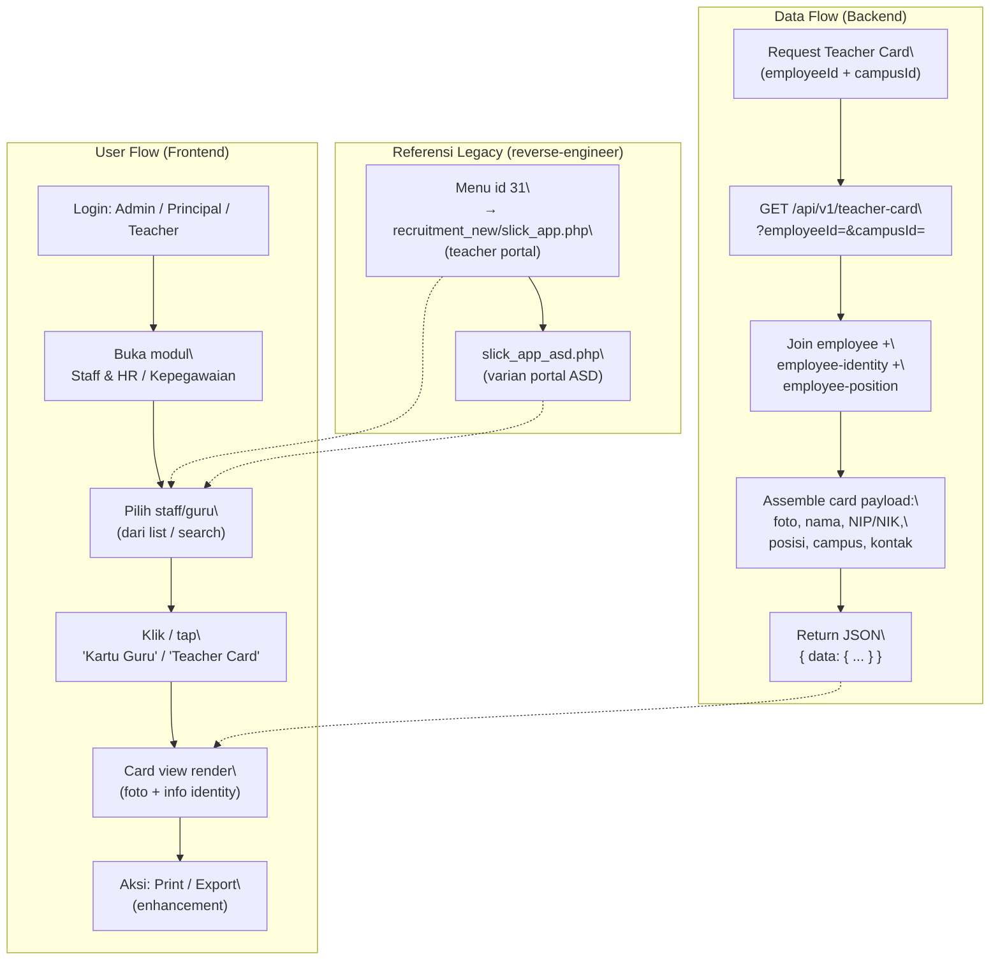

# Teacher Card (Kartu Guru)

## Overview

Fitur **Teacher Card (Kartu Guru)** menampilkan kartu identitas / profil ringkas (compact profile card) untuk setiap staff/guru di sistem. Kartu ini menampilkan foto, nama, NIP/NIK, posisi/jabatan, campus, dan informasi kontak dasar staff — mirip dengan kartu identitas fisik atau badge karyawan. Fitur diakses dari modul **Staff & HR / Kepegawaian** (section 9 dari teacher portal feature inventory). Di legacy teacher web, menu id **31** mengarah ke `recruitment_new/slick_app.php` di teacher portal, dengan varian `slick_app_asd.php` di portal ASD. Teacher Card bersifat **read-only view** — tidak ada fungsi edit data di sini.

## Workflow / Flowchart

### Flowchart



### Penjelasan Langkah-langkah

**1. Alur Pengguna (User Flow) — Sisi Frontend**

| Langkah | Aksi | Hasil |
|---------|------|-------|
| 1.1 | Login sebagai Admin / Principal / Teacher | Sistem verifikasi role; redirect ke portal sesuai role. |
| 1.2 | Buka modul Staff & HR / Kepegawaian | Menampilkan daftar/list staff atau menu terkait. |
| 1.3 | Pilih staff/guru tertentu | User memilih staff dari list (search/filter) atau dari konteks lain (form leave, appraisal). |
| 1.4 | Akses 'Kartu Guru' | Membuka halaman/modal teacher card untuk staff terpilih. |
| 1.5 | Lihat kartu | Frontend merender kartu: foto (atau placeholder), nama, NIP/NIK, posisi, campus, kontak, dll. |
| 1.6 | Aksi lanjutan | Print / export kartu sebagai PDF (enhancement — lihat Scope). |

**2. Alur Data (Data Flow) — Sisi Backend**

| Langkah | Proses | Keterangan |
|---------|--------|------------|
| 2.1 | Request data kartu | `GET /api/v1/teacher-card?employeeId=&campusId=` — endpoint khusus atau reuse `/api/v1/employees/:id` dengan join identity. |
| 2.2 | Join data employee | Backend melakukan JOIN antara `employee`, `employee-identity` (NIK/NIP/foto), dan `employee-position` (jabatan) untuk campus terkait. |
| 2.3 | Caching (opsional) | Card payload dapat di-cache per staff (karena jarang berubah) untuk mempercepat rendering. |
| 2.4 | Response | Return JSON payload lengkap kartu; frontend merender. |

**3. Skenario Lengkap (End-to-End)**

```
[Admin login → portal admin]
    ↓
[Buka Staff & HR → cari staff "Budi Santoso"]
    ↓
[Klik "Kartu Guru" pada profil Budi]
    ↓
[GET /api/v1/teacher-card?employeeId=4138]
    ↓
[Backend join employee(4138) + identity + position]
    ↓
[Return JSON: { nama, nip, nik, fotoUrl, posisi, campus, ... }]
    ↓
[Frontend render kartu profil + foto (default jika tidak ada)]
    ↓
[Admin dapat mencetak/menyimpan kartu]
```

## Problem / Motivation

- Legacy teacher web memiliki halaman kartu guru (`recruitment_new/slick_app.php`, menu id 31) yang di-render server-side oleh PHP tanpa API terstruktur.
- Smartbag (`api_nest` + `bbs`) sudah memiliki data employee, employee-identity (NIK/NIP/foto), dan employee-position (jabatan) di database, tetapi **belum ada view khusus** yang merender data tersebut sebagai kartu guru yang kompak dan siap cetak.
- Saat ini, data employee hanya ditampilkan dalam bentuk tabel/list atau form edit — tidak ada tampilan kartu profil ringkas (identity card style) yang memudahkan verifikasi identitas staff secara visual.
- Fitur kartu guru berguna untuk: verifikasi identitas saat onboarding, print badge/kartu fisik, tampilan profil cepat saat appraisal / form leave, dan kebutuhan administratif lainnya.

## Referensi Analisis (dari teacher web)

| Item | Nilai |
|------|-------|
| Halaman legacy (teacher portal) | `recruitment_new/slick_app.php` — menu id **31** di modul Staff & HR / Kepegawaian |
| Halaman legacy (portal ASD) | `slick_app_asd.php` — varian untuk portal ASD |
| Modul induk | Staff & HR / Kepegawaian (section 9) |
| Sumber data di api_nest | `employee`, `employee-identity`, `employee-position`, `employee-otp`, `employee-device`, `teacher`, `user-profile`, `board-teacher` |
| Status di smartbag | **Belum ada** — data employee sudah ada tapi belum ada view kartu guru khusus |
| Ketersediaan HTML dump | **Tidak ada** — hanya menu-id dan file reference yang tersedia |
| Dual portal | Admin Portal (`client/`) + Teacher Portal (`client-teacher/`) — mirroring |

> **Catatan:** Karena tidak ada HTML dump legacy yang tersedia, field dan layout kartu di dokumen ini bersifat **ESTIMASI/PROPOSAL** berdasarkan nama modul di api_nest. Lihat `notes.md` untuk daftar asumsi lengkap.

## Scope

### In Scope
- Tampilan kartu guru (read-only) berbasis data employee yang sudah ada.
- Seleksi staff: pilih staff tertentu (dari list, search, atau konteks lain) untuk dilihat kartunya.
- Data identity: foto (dengan placeholder jika tidak ada), nama lengkap, NIP, NIK, gender, tanggal lahir, posisi/jabatan, campus, kontak (email/telepon).
- Dual portal mirroring: Admin Portal (`client/`) + Teacher Portal (`client-teacher/`).
- Permission: Admin/Principal dapat melihat kartu semua staff; Teacher dapat melihat kartu sendiri.
- Placeholder foto: staff tanpa foto mendapat gambar default/placeholder.
- Print / export kartu sebagai PDF (enhancement — enhancement ini tetap in scope untuk desain API agar mendukung output data yang cukup untuk dicetak).

### Out of Scope
- Edit data employee — dikelola oleh modul terpisah (Employee Management / Staff Database).
- Flow recruitment / penerimaan staff baru — modul terpisah (`features/...`).
- Data gaji, kontrak, absensi — bukan bagian dari kartu identitas.
- Multiple photo / gallery — kartu hanya menampilkan satu foto profil utama.
- Signature / tanda tangan digital pada kartu (enhancement masa depan).
- Lock/unlock status appraisal — modul terpisah (`features/appraisal-lock/`).

## User Stories

### As a Teacher
I want to see my own teacher card (kartu guru) with my photo, NIP/NIK, and position
So that I can verify my identity data and use the card for administrative purposes (print, share).

### As an Admin / Principal
I want to view the teacher card of any staff in my campus
So that I can quickly verify their identity, position, and assignment without opening the full edit form.

### As an Admin / ASD
I want to view the teacher card of staff across all campuses
So that I can do cross-campus identity verification and administrative checks.

### As a User
I want a fallback placeholder photo displayed for staff without profile pictures
So that the card layout remains consistent even when photos are missing.

## Acceptance Criteria

- [ ] **AC-1:** Halaman kartu guru menampilkan data staff dalam format kartu profil (card layout) — foto, nama, NIP/NIK, posisi, campus, kontak.
- [ ] **AC-2:** User dapat memilih staff tertentu untuk dilihat kartunya (dari list, search, atau dari konteks lain).
- [ ] **AC-3:** Data identity yang ditampilkan sesuai dengan data di database (`employee` + `employee-identity` + `employee-position`).
- [ ] **AC-4:** Foto staff ditampilkan; jika tidak ada foto, tampilkan placeholder/default avatar.
- [ ] **AC-5:** Teacher dapat melihat kartu dirinya sendiri (self-view).
- [ ] **AC-6:** Admin/Principal dapat melihat kartu staff lain di campus-nya.
- [ ] **AC-7:** Admin ASD dapat melihat kartu staff lintas campus.
- [ ] **AC-8:** Fitur tersedia di Admin Portal (`client/`) dan Teacher Portal (`client-teacher/`) — dual portal mirroring.

## UI / UX Changes

### UI Guidelines

1. **Card layout:** Tampilan kartu berbentuk kotak/kartu profil — mirip identity card / badge karyawan, bukan tabel baris.
2. **Foto:** Bagian kiri/atas kartu menampilkan foto staff (lingkaran/persegi dengan border). Jika foto tidak tersedia: placeholder berupa inisial atau icon default user.
3. **Informasi identity:** Nama lengkap (besar/bold), NIP, NIK, gender, tempat/tanggal lahir, posisi/jabatan, campus, email, nomor telepon.
4. **Aksi:** Tombol/ikon "Print" atau "Export PDF" untuk mencetak kartu (enhancement).
5. **Responsive:** Kartu harus responsif — tampil baik di desktop (sidebar/modal) dan mobile.
6. **Screenshot legacy:**
   **Screenshot legacy tidak tersedia** — tidak ada HTML dump untuk `recruitment_new/slick_app.php`.

### Affected Portals
- [x] Admin (client/) — Admin/ASD melihat kartu staff lintas campus
- [ ] Student (client-student/)
- [x] Teacher (client-teacher/) — Teacher melihat kartu sendiri; Principal melihat kartu staff per campus

### Dual Portal (Mirroring)

| Portal | Lokasi | Peran |
|--------|--------|-------|
| Admin Portal | `bbs/client/src/views/teacher-card/` | Admin/ASD melihat kartu staff lintas campus, akses penuh ke semua staff. |
| Teacher Portal | `bbs/client-teacher/src/views/teacher-card/` | Teacher melihat kartu sendiri (self-view); Principal melihat kartu staff per campus-nya (`req.user` campusId). |

Aturan akses backend:
- Teacher Portal: Teacher hanya bisa melihat kartu dirinya sendiri (self); Principal bisa melihat staff di campus-nya.
- Admin Portal: Admin dengan akses ke modul Staff & HR dapat melihat kartu semua staff lintas campus.

## API Changes

| Method | Path | Description |
|--------|------|-------------|
| GET | `/api/v1/teacher-card?employeeId=&campusId=` | Ambil data kartu guru untuk staff tertentu (proposal endpoint baru) |
| GET | `/api/v1/employees/:id/card` | Alternatif: endpoint nested di bawah employees (reuse) |

Sebagai alternatif, endpoint `/api/v1/employees/:id` yang sudah ada dapat diperluas untuk menyertakan join ke `employee-identity` dan `employee-position`, sehingga frontend cukup membaca data employee yang sudah diperkaya. Lihat `api-contract.md` untuk detail.

## Database Changes

**Tidak ada tabel baru.** Fitur ini **hanya membaca** dari tabel/entity yang sudah ada di `api_nest`:

- `employee` (src/modules/employee/entities/employee.entity.ts) — data dasar staff
- `employee-identity` (src/modules/employee-identity/) — NIK, NIP, foto, dokumen
- `employee-position` (src/modules/employee-position/) — jabatan/posisi

Detail lengkap di `schema.md`.

## Business Rules / Validation

1. **Permission:** Staff aktif (active status) dapat melihat kartu sendiri. Admin/Principal perlu permission modul Staff & HR.
2. **Staff nonaktif/keluar:** Staff dengan status nonaktif/resigned sebaiknya tetap bisa diakses kartunya (untuk arsip) tetapi ditandai (misal badge "Nonaktif").
3. **Foto default:** Jika `photoUrl`/foto tidak tersedia di `employee-identity`, tampilkan placeholder (inisial nama atau icon default).
4. **NIP/NIK formatting:** NIP dan NIK ditampilkan dalam format yang sudah distandardisasi (tanpa mengubah data asli di database).
5. **Cache:** Card payload dapat di-cache (Redis / in-memory) per staff karena data jarang berubah — TTL misal 1 jam.
6. **Posisi ganda:** Jika staff memiliki multiple positions, tampilkan posisi utama (default/primary) atau list posisi teratas.

## Error Handling

| Error | HTTP Code | Message |
|-------|-----------|---------|
| Staff not found | 404 | "Staff not found" |
| Unauthorized (no access) | 403 | "You don't have permission to view this teacher card" |
| No photo available | 200 (with placeholder) | Foto tidak ada → placeholder otomatis (bukan error) |
| Invalid employeeId | 400 | "Invalid employee ID" |
| Campus mismatch | 400 | "Staff is not in your campus" (untuk Principal di teacher portal) |
| Data identity tidak lengkap | 200 (with partial data) | Kartu tetap ditampilkan dengan data yang tersedia — field kosong ditampilkan sebagai "-" |

## Dependencies

- Backend (`api_nest`):
  - Entity `Employee` (`src/modules/employee/entities/employee.entity.ts`) — data dasar staff.
  - Module `employee-identity` — NIK, NIP, foto, data kependudukan.
  - Module `employee-position` — jabatan/posisi staff.
  - Module `campus` — relasi campus.
  - Decorator: `@CheckPermissions`, `@Auth`.
  - Opsional: caching layer (Redis) untuk card payload.
- Frontend:
  - `bbs-client-common`, `CDataTable` (untuk list staff sebelum pilih kartu), `makeApiRequestThunk`, `fromApi.js` + `useFromApi`.
  - Card component (baru) untuk render layout kartu guru.
- Brief terkait (cross-reference):
  - `features/form-leave/` — menampilkan data employee pada form cuti.
  - `features/appraisal-new/` — gateway staff database yang juga menampilkan data employee.
  - `features/teacher-cv/` — CV guru yang lebih detail (brief terpisah).