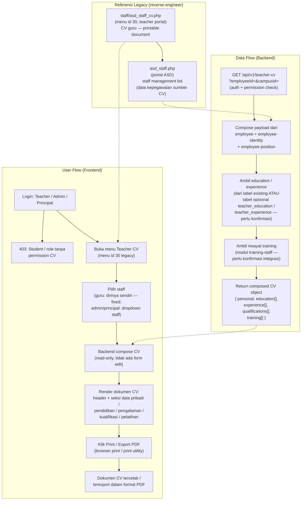

# Teacher CV

## Overview

Fitur **Teacher CV** menampilkan **Curriculum Vitae (CV / riwayat hidup)** per staff/guru dalam bentuk dokumen yang rapi dan **bisa dicetak (printable document)**. CV memuat riwayat yang tersusun dalam seksi-seksi: **data pribadi, pendidikan, pengalaman kerja, kualifikasi/sertifikasi, dan pelatihan** — semua dibaca (read-only) dari data kepegawaian yang sudah ada di sistem, bukan diinput lewat halaman ini.

Direplikasi dari teacher web: menu "Staff & HR / Kepegawaian" (modul section 9 dari teacher portal feature inventory) berisi menu id **30** yang mengarah ke `staff/asd_staff_cv.php` di teacher portal — halaman yang menampilkan CV seorang staff. Ada varian `asd_staff.php` di portal ASD yang merupakan halaman staff management (daftar/kelola staff) — fungsinya berbeda (management list vs CV view), namun saling terkait karena sama-sama membuka data kepegawaian yang sama.

> **Status analisis:** brief ini ditulis **tanpa HTML dump, tanpa probe, dan tanpa screenshot** untuk `staff/asd_staff_cv.php`. Seluruh detail layout/field di halaman ini adalah **ESTIMASI / PROPOSAL** — ditandai eksplisit di `notes.md`. Tidak ada nama field legacy yang dipastikan; semua nama field dalam dokumen ini adalah **proposal** untuk smartbag.

## Workflow / Flowchart

### Flowchart



### Penjelasan Langkah-langkah

**1. Alur Pengguna (User Flow) — Sisi Frontend**

| Langkah | Aksi | Hasil |
|---------|------|-------|
| 1.1 | Login sebagai Teacher / Admin / Principal | Sistem cek permission: jika role tanpa hak akses CV (mis. Student) → 403 Unauthorized. Jika berhak → menu Teacher CV tersedia. |
| 1.2 | Buka menu Teacher CV | Menu id 30 (legacy) di modul "Staff & HR / Kepegawaian". Di smartbag: route baru, mis. `/teacher-cv`. |
| 1.3 | Pilih staff | **Guru**: melihat CV dirinya sendiri (employeeId diambil dari `req.user` — tidak ada pilihan). **Admin/Principal**: dropdown/search daftar staff per campus untuk memilih siapa yang CV-nya ditampilkan. |
| 1.4 | Load data CV | Frontend memanggil `GET /api/v1/teacher-cv?employeeId=&campusId=` → backend compose payload CV lengkap. |
| 1.5 | Render dokumen | Halaman menampilkan CV seperti dokumen: header (foto + nama + NIP/NIK), seksi Data Pribadi, Pendidikan, Pengalaman Kerja, Kualifikasi/Sertifikasi, Pelatihan. |
| 1.6 | Print / Export PDF | Tombol Print/Export PDF → memicu browser print dialog / utility export. Dokumen diatur agar multi-page terpotong rapi di setiap seksi (lihat EC-02). |

**2. Alur Data (Data Flow) — Sisi Backend**

| Langkah | Proses | Keterangan |
|---------|--------|------------|
| 2.1 | Auth & permission | `@Auth` (JWT global guard) + `@CheckPermissions` subject modul Employee/HR. Validasi `employeeId` + `campusId` (scope campus). |
| 2.2 | Load identitas | Baca `employee` (nama, NIP, status aktif) + `employee-identity` (NIK, tanggal lahir, gender, alamat, kontak, foto). |
| 2.3 | Load kepegawaian | Baca `employee-position` (jabatan/posisi saat ini dan riwayat) — menjadi dasar seksi "Pengalaman Kerja" dan "Kualifikasi". |
| 2.4 | Load pendidikan/pengalaman | Jika data sudah ada di api_nest → baca langsung. Jika belum ada → baca dari tabel opsional `teacher_education` / `teacher_experience` (perlu konfirmasi dengan modul HR — lihat `schema.md`). |
| 2.5 | Load training | Riwayat pelatihan dari modul `training-staff` (perlu konfirmasi integrasi — lihat `notes.md`). |
| 2.6 | Compose & return | Susun object CV `{ personal, education[], experience[], qualifications[], training[] }` → response `{ data }`. Seksi kosong tetap dikembalikan sebagai array kosong (placeholder di frontend). |

**3. Skenario Lengkap (End-to-End)**

```
[Teacher / Admin Login]
    ↓
[Buka Menu Teacher CV (menu id 30 legacy) — modul Staff & HR / Kepegawaian]
    ↓
[Guru → CV otomatis untuk dirinya sendiri]
[Admin/Principal → pilih staff dari dropdown per campus]
    ↓
[GET /api/v1/teacher-cv?employeeId=4137&campusId=4]
    ↓
[Backend compose: employee + identity + position + education + experience + training]
    ↓
[Render dokumen CV (header, foto, seksi pribadi/pendidikan/pengalaman/kualifikasi/pelatihan)]
    ↓
[Klik Print / Export PDF]
    ↓
[Dokumen CV tercetak multi-page yang rapi]
```

## Problem / Motivation

- Teacher web legacy memiliki halaman `staff/asd_staff_cv.php` (menu id 30, teacher portal) yang menampilkan CV guru, namun **tidak ada API terstruktur** — seluruh CV di-render PHP server-side dan langsung disajikan sebagai halaman printable.
- Varian `asd_staff.php` di portal ASD adalah halaman staff management yang menyimpan/menampilkan data kepegawaian mentah — tanpa tampilan CV terstruktur yang bisa langsung dicetak.
- Smartbag (`bbs` + `api_nest`) **belum punya view khusus Teacher CV sama sekali** — tidak ada halaman, tidak ada endpoint composed-CV, tidak ada komponen render dokumen CV.
- Data identitas, pendidikan, pengalaman, dan kualifikasi **tersebar di beberapa modul employee** (`employee`, `employee-identity`, `employee-position`, dst.) — tidak ada satu agregasi yang menghasilkan dokumen CV utuh.
- Sekolah membutuhkan dokumen CV standar per staff (untuk arsip, akreditasi, pengajuan, keperluan administrasi) — harus bisa dicetak kapan saja dengan data terkini dari sumber tunggal (single source of truth: api_nest), bukan dokumen statis.

## Referensi Analisis (dari teacher web)

| Item | Nilai |
|------|-------|
| Halaman legacy (teacher portal) | `staff/asd_staff_cv.php` — halaman CV guru (curriculum vitae / riwayat hidup) dalam bentuk dokumen printable |
| Menu id (teacher portal) | **30** — di bawah modul "Staff & HR / Kepegawaian" (section 9 dari teacher portal feature inventory) |
| Varian portal ASD | `asd_staff.php` — halaman staff management di portal ASD (list/kelola data staff) — sumber data kepegawaian |
| Sumber data di api_nest | `employee` (data inti guru/staff), `employee-identity` (identitas: NIK, tanggal lahir, gender, alamat, foto), `employee-position` (jabatan/posisi), serta `employee-otp` / `employee-device` / `teacher` / `user-profile` (pendukung, umumnya tidak dipakai langsung untuk CV) |
| Status di smartbag | **BELUM ada** — tidak ada teacher-cv view di Admin Portal (`client/`) maupun Teacher Portal (`client-teacher/`); fitur ini brief baru |
| Ketersediaan referensi visual | **Tidak ada** — tidak ada HTML dump, probe, maupun screenshot untuk `asd_staff_cv.php`; seluruh detail UI/field adalah estimasi/proposal |
| Sifat fitur | Read-only view + print/export PDF — tidak ada input/edit data di halaman ini |

## Scope

### In Scope
- Tampilan CV **read-only** per staff — dokumen tersusun dengan seksi.
- Pilih staff: guru melihat CV sendiri (otomatis dari `req.user`); admin/principal memilih staff via dropdown/search.
- Seksi CV: **Data Pribadi**, **Pendidikan**, **Pengalaman Kerja**, **Kualifikasi/Sertifikasi**, **Pelatihan**.
- Print / Export PDF dari tampilan dokumen CV.
- Dual portal mirroring: Admin Portal (`client/`) + Teacher Portal (`client-teacher/`).
- Endpoint composed-CV: `GET /api/v1/teacher-cv?employeeId=&campusId=` (detail di `api-contract.md`).
- Placeholder "—" untuk data kosong pada seksi/field yang tidak terisi (lihat Business Rules & EC-01).

### Out of Scope
- **Edit data CV** — perubahan identitas/pendidikan/pengalaman adalah tanggung jawab modul HR (staff management) terpisah, bukan dari halaman CV.
- **Input pendidikan / pengalaman kerja baru** — tidak ada form CRUD di fitur ini.
- Data lain yang tidak berkaitan dengan CV (mis. absensi, penilaian, gaji) — tidak ditampilkan.
- Manajemen staff (list/edit staff) — ini fungsi `asd_staff.php` / modul HR, bukan fitur ini.

## User Stories

### As a Teacher
I want to view and print my own Curriculum Vitae (CV) with my personal data, education, work experience, qualifications, and training
So that I can submit/attach a correct, up-to-date CV whenever the school requires it without retyping everything.

### As an Admin / Principal
I want to open the CV of any staff member in my campus
So that I can verify their qualifications and work history for administrative, accreditation, or HR purposes.

### As an Admin (portal ASD / central)
I want to view the CV of any staff across campuses
So that central HR can prepare documents for school-wide reporting and audits.

### As a Principal (teacher portal)
I want to print the CV of staff in my campus
So that the printed document is consistent with the data in the system (single source of truth).

## Acceptance Criteria

- [ ] **AC-1:** Halaman Teacher CV menampilkan dokumen CV staff dengan seksi Data Pribadi, Pendidikan, Pengalaman Kerja, Kualifikasi/Sertifikasi, dan Pelatihan.
- [ ] **AC-2:** Data yang ditampilkan berasal dari sumber yang benar di api_nest — `employee` (nama/NIP/status), `employee-identity` (NIK/DOB/gender/alamat/kontak/foto), `employee-position` (jabatan), plus sumber pendidikan/pengalaman/training yang terkonfirmasi.
- [ ] **AC-3:** Guru hanya dapat melihat CV dirinya sendiri (employeeId dari `req.user`); tidak ada selector staff untuk role guru.
- [ ] **AC-4:** Admin/Principal dapat memilih staff (dropdown/search) per campus untuk melihat CV-nya.
- [ ] **AC-5:** Tombol Print / Export PDF berfungsi — dokumen tercetak multi-page dengan pemotongan halaman yang rapi.
- [ ] **AC-6:** Seksi/field kosong ditampilkan placeholder "—" (atau seksi disembunyikan sesuai keputusan EC-01) — tidak ada error/crash.
- [ ] **AC-7:** Permission: Student / role tanpa hak akses CV mendapat 403; staff nonaktif tetap bisa dilihat oleh admin (EC-03).
- [ ] **AC-8:** Fitur tersedia di dua portal — Admin Portal (`client/`) dan Teacher Portal (`client-teacher/`) — dengan scope campus sesuai role (Dual Portal mirroring).

## UI / UX Changes

### UI / UI Guidelines

1. **Layout dokumen**: halaman menampilkan CV seperti dokumen (A4-ready) — header di atas (foto, nama, NIP/NIK, jabatan), diikuti seksi-seksi.
2. **Seksi tersusun**: urutan seksi Data Pribadi → Pendidikan → Pengalaman Kerja → Kualifikasi/Sertifikasi → Pelatihan (urut desain — konfirmasi ke modul HR bila ada standar lain).
3. **Mode read-only**: tidak ada form edit; seluruh field ditampilkan sebagai teks/label-value.
4. **Tombol aksi**: tombol **Print** dan **Export PDF** di header halaman (di luar area dokumen agar tidak ikut tercetak).
5. **Pemilihan staff**: guru → langsung ke CV sendiri; admin/principal → dropdown/search staff dengan scope campus.
6. **Screenshot referensi dari teacher web:**

   **Screenshot legacy tidak tersedia** — tidak ada HTML dump, probe, maupun screenshot untuk `staff/asd_staff_cv.php` pada saat brief ini ditulis. Layout CV di atas adalah proposal berdasar konsep "CV / riwayat hidup printable". Saran re-probe untuk konfirmasi layout di `notes.md`.

### Affected Portals
- [x] Admin (client/) — **pengguna utama** (Admin/ASD melihat CV staff lintas campus)
- [ ] Student (client-student/)
- [x] Teacher (client-teacher/) — mirroring; guru melihat/mencetak CV sendiri; Principal melihat CV staff per campus-nya

### Dual Portal (Mirroring)

| Portal | Lokasi | Peran |
|--------|--------|-------|
| Admin Portal | `bbs/client/src/views/teacher-cv/` | **Pengguna utama** — Admin/ASD melihat CV staff lintas campus (permission HR/Employee). |
| Teacher Portal | `bbs/client-teacher/src/views/teacher-cv/` | **Mirroring** — Guru melihat CV sendiri (read-only, employeeId dari `req.user`); Principal melihat CV staff per campus-nya (`req.user.campusId`). |

Aturan akses backend:
- Teacher Portal: guru → hanya dirinya sendiri (403 bila memaksa employeeId lain); Principal → staff dalam campus-nya.
- Admin Portal: admin dengan permission modul Employee/HR dapat melihat lintas campus.

## API Changes

| Method | Path | Description |
|--------|------|-------------|
| GET | `/api/v1/teacher-cv?employeeId=&campusId=` | Composed CV payload — personal + education[] + experience[] + qualifications[] + training[] (read-only) |

Detail lengkap di `api-contract.md`.

## Database Changes

- **Tidak ada tabel baru yang WAJIB** untuk menampilkan CV — seluruh data dapat di-compose dari entitas existing: `employee`, `employee-identity`, `employee-position` (dan modul training bila diintegrasikan).
- **Perlu konfirmasi**: data **pendidikan** dan **pengalaman kerja** mungkin belum memiliki tabel di api_nest. Bila benar belum ada, diusulkan tabel opsional:
  - `teacher_education` — riwayat pendidikan (level, institusi, jurusan, tahun lulus)
  - `teacher_experience` — riwayat pengalaman kerja (perusahaan, posisi, periode, deskripsi)
- Kedua tabel di atas **OPSIONAL dan perlu konfirmasi dengan modul HR** — jangan dibuat tanpa keputusan modul HR. Detail lengkap di `schema.md`.

### Migrations
- Hanya jika tabel opsional disetujui: `npm run migration:generate --name=create-teacher-education` dan `npm run migration:generate --name=create-teacher-experience` (di `api_nest`).

### Seed Data
- Tidak ada seed data — data CV berasal dari data kepegawaian existing.

## Business Rules / Validation

1. **Permission:** guru hanya dapat melihat CV sendiri; admin/principal dapat melihat per scope campus; role tanpa hak (mis. student) → 403.
2. **Staff aktif:** staff nonaktif (INACTIVE) tetap bisa dilihat CV-nya oleh admin/principal (lihat EC-03), tapi guru nonaktif tidak bisa login — sehingga hanya admin yang mengakses.
3. **Seksi kosong:** seksi/field kosong ditampilkan placeholder "—"; keputusan tampil seksi kosong vs sembunyikan seksi penuh mengikuti keputusan EC-01.
4. **Urutan seksi:** Data Pribadi → Pendidikan → Pengalaman Kerja → Kualifikasi/Sertifikasi → Pelatihan (usulan — konfirmasi modul HR).
5. **Format tanggal:** tanggal mengikuti format konsisten (proposal: `DD MMMM YYYY` untuk tampilan; ISO 8601 di API). Periode pengalaman: `startDate`–`endDate`, endDate kosong = "Sekarang" / "Present".
6. **Kualifikasi:** seksi kualifikasi/sertifikasi diisi dari data sertifikasi jika tersedia; jika tidak ada sumber terstruktur, seksi ditampilkan placeholder (perlu konfirmasi modul HR).
7. **Read-only:** endpoint tidak menerima body tulis — hanya GET; tidak ada POST/PUT/PATCH/DELETE pada resource ini.

## Error Handling

| Error | HTTP Code | Message |
|-------|-----------|---------|
| Staff not found | 404 | "Employee not found" |
| Invalid employeeId / campusId | 400 | "Invalid employee or campus id" |
| Unauthorized (role tanpa hak / student) | 403 | "You don't have permission to view teacher CV" |
| Campus mismatch (akses staff di luar scope campus) | 403 | "Employee is not in your campus" |
| Data kosong (semua seksi kosong) | 200 + placeholder | Response tetap 200 dengan array kosong; frontend menampilkan "—" (tidak error) |
| Format query salah | 400 | "Invalid query parameter" |

## Dependencies

- Backend (`api_nest`):
  - Entity `Employee` (`src/modules/employee/entities/employee.entity.ts`) — data inti guru/staff (nama, NIP, status).
  - Entity `EmployeeIdentity` (modul `employee-identity`) — NIK, tanggal lahir, gender, alamat, kontak, foto.
  - Entity `EmployeePosition` (modul `employee-position`) — jabatan/posisi (dasar seksi pengalaman & kualifikasi).
  - Modul pendukung: `employee-otp`, `employee-device`, `teacher`, `user-profile` (umumnya tidak langsung dipakai untuk CV).
  - Decorator: `@Auth`, `@CheckPermissions` — subject modul Employee/HR.
- Frontend:
  - `bbs-client-common`, `makeApiRequestThunk` + `fromApi.js` + `useFromApi`.
  - Print/export utility (browser `window.print()` atau komponen export PDF existing di `bbs`).
- Brief terkait (cross-reference, tanpa duplikasi):
  - `features/training-staff/` — riwayat pelatihan guru; berpotensi menjadi sumber seksi **Pelatihan** di CV (perlu konfirmasi integrasi).
  - Modul HR / staff management (setara `asd_staff.php` di portal ASD) — sumber data kepegawaian yang dibaca CV.
