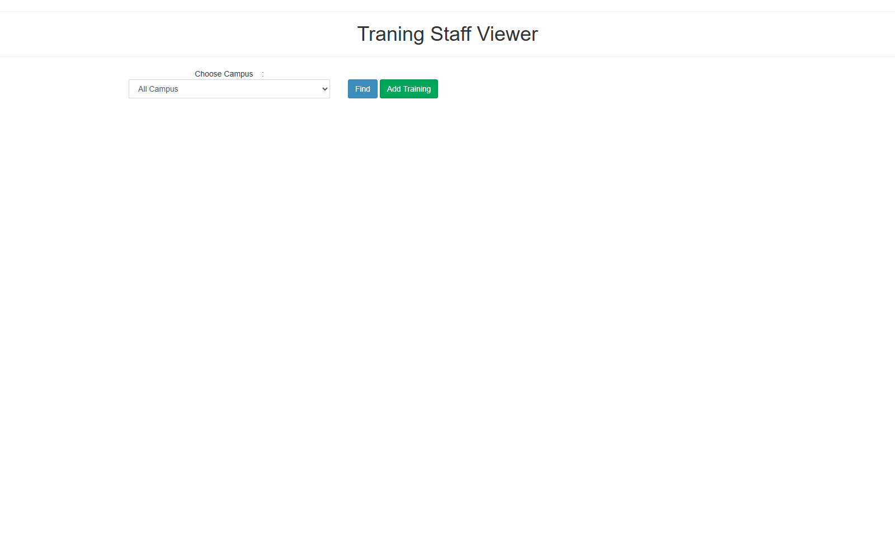

# Training Staff

## Overview

Fitur **Training Staff** adalah modul **CRUD riwayat pelatihan (training) per staff/guru** pada modul **Staff & HR / Kepegawaian** di portal teacher. Fitur ini memungkinkan pengguna untuk:

- **Melihat daftar (list) pelatihan** per campus dengan filter campus (semua campus atau campus tertentu).
- **Menambah (Add Training)** pelatihan baru melalui form lengkap 11 field.
- **Mengedit (Edit)** pelatihan yang sudah ada (record id).
- **Menetapkan (assign) satu atau banyak staff** ke sebuah pelatihan (multi-staff tag selector).
- **Inline update** satu field/subject langsung dari tabel (mekanisme legacy `update_subjectais.php`).

Direplikasi dari teacher web: halaman legacy `ais/teachers/trainnig_staff.php` berjudul **"Traning Staff Viewer"** (keduanya typo di legacy — "trainnig" dan "Traning"). Fitur ini adalah salah satu dari tiga fitur Staff & HR yang di-reverse-engineer, dan **satu-satunya dengan data lengkap** (HTML dump + screenshot).

Di FEATURE_COMPARISON, fitur ini tercatat sebagai **gap #13 ("Training Staff / Recruitment")** — `api_nest` **belum memiliki modul training** sama sekali. Modul terdekat yang ada: `employee`, `employee-identity`, `teacher`. Oleh karena itu brief ini **mengusulkan tabel baru** (`staff_training` + `staff_training_staff`) dan modul API baru.

Smartbag menerapkan dual-portal: **Admin Portal** (`bbs/client`) sebagai pengguna utama (Admin/ASD lintas campus) dan **Teacher Portal** (`bbs/client-teacher`) sebagai mirroring (Principal per campus; guru melihat riwayat pelatihan sendiri).

## Workflow / Flowchart

### Flowchart

```mermaid
flowchart TB
    subgraph DataFlow["Data Flow (Backend)"]
        direction TB
        A1["User login\n(hak TRAINING_STAFF)"] --> A2["GET /v1/training-staff\n?campusId=&page=&pageSize=\n(list pelatihan per campus)"]
        A2 --> A3["GET /v1/training-staff/:id\n(detail pelatihan + staff ter-assign)"]
        A3 --> A4["POST /v1/training-staff\n(body: CreateTrainingStaffDto\n+ staffIds[])"]
        A4 --> A5["staff_training table\n(upsert record pelatihan)"]
        A5 --> A6["staff_training_staff table\n(join multi-staff)"]
        A2 --> A7["PATCH /v1/training-staff/:id\n(update + upsert staff assignment)"]
        A7 --> A5
        A6 --> A8["DELETE /v1/training-staff/:id\n(soft delete active_status=INACTIVE)"]
    end

    subgraph UserFlow["User Flow (Frontend)"]
        direction TB
        B1["Buka halaman Training Staff"] --> B2["Pilih campus\n(select #campus — 0 = All Campus)"]
        B2 --> B3["Klik Find (#search)\nGET list → inject #studentlist"]
        B3 --> B4["Tabel hasil pelatihan\n(title, tanggal, venue, staff, ...)"]
        B4 --> B5["Klik Add Training (#addtraining)\nform recid=0 → inject #studentlist"]
        B5 --> B6["Isi 11 field form\n+ pilih staff (multi-tag)"]
        B6 --> B7["Klik Save (#savetraining)\nPOST save → iziToast sukses\n→ trigger #search (reload list)"]
        B4 --> B8["Klik Edit (recid=n)\nform terisi data lama"]
        B8 --> B6
        B4 --> B9["Inline update field\n(subjectchange_ → PATCH field)"]
    end

    subgraph LegacyRef["Referensi Legacy (reverse-engineer)"]
        direction TB
        C1["trainnig_staff.php\n\"Traning Staff Viewer\" (typo legacy)\ncampus select + #search + #addtraining\n+ #studentlist"] --> C2["get_trainnig_staff.php\n(typo legacy, list HTML)"]
        C1 --> C3["get_add_trainnig_staff.php\n(recid=0 → form)"]
        C1 --> C4["services/savetraining.php\n(save/upsert training)"]
        C1 --> C5["services/update_subjectais.php\n(inline update field)"]
    end

    A6 -.-> B4
    A8 -.-> B3
    C2 -.-> B3
    C3 -.-> B5
    C4 -.-> B7
    C5 -.-> B9
```

### Penjelasan Langkah-langkah

**1. Alur Pengguna (User Flow) — Sisi Frontend**

| Langkah | Aksi | Hasil |
|---------|------|-------|
| 1.1 | Buka halaman Training Staff (modul Staff & HR / Kepegawaian) | Halaman menampilkan campus selector, tombol Find, dan tombol Add Training. |
| 1.2 | Pilih campus | `<select id="campus">` — 25 opsi; value 0 = "All Campus", lalu 1=KJ-P ... 25=KG-PS (lihat Referensi Analisis). |
| 1.3 | Klik Find (`#search`) | `POST get_trainnig_staff.php { campus }` → response HTML di-inject ke `#studentlist` (tabel hasil pelatihan). |
| 1.4 | Klik Add Training (`#addtraining`) | `POST get_add_trainnig_staff.php { recid: 0 }` → form add (recid=0 = record baru) di-inject ke `#studentlist`. |
| 1.5 | Isi form | 11 field: title, participation, datefrom, dateto, venue, conducted_by, city, country_id, details, comments, staff_id (tag selector multi-staff). |
| 1.6 | Klik Save (`#savetraining`) | `POST services/savetraining.php` dengan semua field + recid; response JSON `{ edited: '1' }` → iziToast "Data Successfully Save!" → trigger `#search` (reload list). Gagal → warning "Failed Save!". |
| 1.7 | Edit | Klik tombol save pada baris yang sudah ada (attribute `recid`) → form terisi data lama → save = update. |
| 1.8 | Inline update | Change pada `[id^="subjectchange_"]` → `POST services/update_subjectais.php { recid, isi }` → response `'1'` = sukses, else gagal. |

**2. Alur Data (Data Flow) — Sisi Backend**

| Langkah | Proses | Keterangan |
|---------|--------|------------|
| 2.1 | List pelatihan | `GET /v1/training-staff?campusId=&page=&pageSize=` — list pelatihan (filter campus jika bukan "All Campus"); join `staff_training_staff` → staff ter-assign. |
| 2.2 | Ambil detail/form | `GET /v1/training-staff/:id` — detail pelatihan + staff ter-assign (untuk prefill form edit). |
| 2.3 | Save (create/update) | `POST /v1/training-staff` (create) / `PATCH /v1/training-staff/:id` (update) — upsert record di `staff_training`, lalu sinkronisasi relasi di `staff_training_staff` (hapus assignment lama, insert assignment baru). |
| 2.4 | Inline update | `PATCH /v1/training-staff/:id/field` (atau `PATCH /v1/training-staff/:id` partial) — update satu field (subjek/isi) tanpa me-replace seluruh record. |
| 2.5 | Delete | `DELETE /v1/training-staff/:id` — soft delete via `active_status = INACTIVE` (bukan hard delete). |
| 2.6 | Response | Semua response dibungkus `{ data }` mengikuti konvensi `api_nest`; success/failed dikirim ke frontend untuk iziToast. |

**3. Pemetaan Endpoint Legacy → API Baru**

| Endpoint Legacy | Metode Legacy | Fungsi | Endpoint Smartbag (proposal) |
|-----------------|---------------|--------|------------------------------|
| `get_trainnig_staff.php` | `$.post` | List pelatihan per campus (HTML) | `GET /api/v1/training-staff?campusId=` |
| `get_add_trainnig_staff.php` | `$.post` | Ambil form add/edit (recid) | `GET /api/v1/training-staff/:id` (detail untuk form) |
| `services/savetraining.php` | `$.post` | Save/upsert training (create & update) | `POST /api/v1/training-staff` + `PATCH /api/v1/training-staff/:id` |
| `services/update_subjectais.php` | `$.post` | Inline update satu field | `PATCH /api/v1/training-staff/:id` (partial, hanya field yang dikirim) |
| — (tidak ada di legacy) | — | Delete record | `DELETE /api/v1/training-staff/:id` (soft delete) |
| — (dropdown country di form) | — | Data negara untuk `country_id` | `GET /api/v1/countries` |

**4. Skenario Lengkap (End-to-End)**

```
[User login — Admin/Principal (hak TRAINING_STAFF)]
    ↓
[Buka halaman Training Staff (modul Staff & HR / Kepegawaian)]
    ↓
[Pilih campus "PIK-S" → Klik Find]
    ↓
[List pelatihan PIK-S tampil di #studentlist]
    ↓
[Klik Add Training → form recid=0 muncul]
    ↓
[Isi: title="Workshop Kurikulum", participation="Peserta",
 datefrom="2026-07-10", dateto="2026-07-12", venue="Hotel X",
 conducted_by="Kemendikbud", city="Jakarta", country_id=102,
 details="...", comments="...", staff_id=[4137, 4138]]
    ↓
[Klik Save → POST savetraining → iziToast "Data Successfully Save!"]
    ↓
[Trigger #search → list refresh → pelatihan baru tampil]
```

## Problem / Motivation

- Teacher web legacy memakai **PHP + AJAX posts** tanpa API terstruktur: semua operasi (list, form, save, inline update) dilakukan via `$.post` ke endpoint PHP yang mengembalikan HTML/JSON mentah. Tidak ada kontrak API yang jelas, tidak ada validasi terpusat, dan tidak ada soft delete.
- **Data training staff tidak tersimpan terstruktur di smartbag.** `api_nest` belum punya modul training sama sekali — tidak ada entity `StaffTraining`, tidak ada tabel relasi staff-training, tidak ada endpoint-nya. Di FEATURE_COMPARISON tercatat sebagai **gap #13 ("Training Staff / Recruitment")**.
- **Training staff dibutuhkan untuk CV guru dan riwayat pengembangan profesional (professional development).** Riwayat pelatihan adalah bagian penting dari portofolio guru: dipakai untuk menilai kompetensi, menjadi seksi CV guru (`features/teacher-cv`), dan sebagai bahan pertimbangan appraisal/penilaian kinerja (`features/appraisal-summary`).
- Legacy mendukung **assign multi-staff** (tag selector `#form-field-tags`) dan **filter campus** — kebutuhan ini harus dipertahankan di smartbag.
- Perlu modul CRUD yang bersih: list + filter campus, add/edit dengan 11 field, assign multiple staff, validasi tanggal, soft delete, export, dan dual portal (Admin + Teacher).

## Referensi Analisis (dari teacher web)

| Item | Nilai |
|------|-------|
| Halaman legacy | `ais/teachers/trainnig_staff.php` — header **"Traning Staff Viewer"** (typo legacy: "Traning") |
| File pendukung | `get_trainnig_staff.php`, `get_add_trainnig_staff.php`, `services/savetraining.php`, `services/update_subjectais.php` |
| Campus selector | `<select id="campus">` — 25 opsi: 0="All Campus", 1=KJ-P, 2=KJ-S, 3=PIK-P, 4=PIK-S, 5=BDG-P, 6=BDG-S, 7=SMG-P, 8=SMG-S, 9=MLG-P, 10=MLG-S, 11=MUSIC, 12=BPN-P, 13=BLS, 14=BPN-S, 15=BBSO, 16=KJ-PS, 17=PIK-PS, 18=BDG-PS, 19=SMG-PS, 20=MLG-PS, 21=BPN-PS, 22=TKK, 23=KG-P, 24=KG-S, 25=KG-PS |
| Tombol | `#search` (Find, btn-primary), `#addtraining` (Add Training, btn-success) |
| Container hasil | `<div id="studentlist">` — hasil list/form di-inject di sini |
| Field form (11) | `title`, `participation`, `datefrom`, `dateto`, `venue`, `conducted_by`, `city`, `country_id`, `details`, `comments`, `staff_id` |
| Field tambahan | `recid` (dari attribute tombol save — 0 = baru, n = edit) |
| Staff selector | `#form-field-tags` — tag selector multi-staff |
| Datepicker | class `datepickerformat2`, format `yyyy-mm-dd` (datefrom, dateto) |
| Inline update | `[id^="subjectchange_"]` (attr `recid`, value `isi`) → `services/update_subjectais.php` |
| Response save | JSON `{ edited: '1' }` → sukses iziToast "Data Successfully Save!" + trigger `#search`; else warning "Failed Save!" |
| Modul | Staff & HR / Kepegawaian (teacher portal) |
| Status di smartbag | **Belum ada module** — gap #13 di FEATURE_COMPARISON ("Training Staff / Recruitment") |
| Modul terdekat di api_nest | `employee`, `employee-identity`, `teacher` |
| Screenshot | `screenshots/training_staff.png` |

## Scope

### In Scope
- **CRUD pelatihan (training staff):** list, detail, create, update, soft delete.
- **Filter campus** — 0 = All Campus, atau campus tertentu (25 opsi sesuai legacy).
- **Assign multiple staff** ke satu pelatihan (tag selector multi, `staffIds[]`).
- **Tanggal mulai/selesai** (datefrom, dateto) dengan format `yyyy-mm-dd`.
- **Negara** (`country_id`) — dropdown dari `GET /v1/countries`.
- **Export** daftar pelatihan (CSV/Excel — enhancement ringan, lihat edgecases jika perlu).
- **Dual portal** — Admin Portal (`client/`) sebagai pengguna utama + Teacher Portal (`client-teacher/`) sebagai mirroring.
- **Inline update** satu field dari tabel (mekanisme legacy `update_subjectais` dipertahankan — lihat EC-08).

### Out of Scope
- **Approval workflow** — pelatihan tidak perlu persetujuan atasan (enhancement).
- **Dokumen lampiran** (sertifikat/file pelatihan) — enhancement.
- **Sinkronisasi sertifikasi** eksternal — enhancement.
- **Integrasi appraisal** — riwayat training tidak otomatis memengaruhi skor appraisal (enhancement; lihat `features/appraisal-summary`).
- **Penjadwalan/reminder pelatihan** — enhancement.
- Portal Student (`client-student/`) tidak terlibat.

## User Stories

### As a Teacher
I want to see the training history (riwayat pelatihan) assigned to me, so that I can verify my professional development record and add trainings I attended.

### As a Teacher
I want to add my own training record (title, date, venue, organizer, city, country), so that my CV reflects the trainings I have participated in.

### As an Admin / Principal
I want to manage (add/edit/delete) training records for all staff in my campus (or all campuses), so that training data is complete and accurate.

### As an Admin / Principal
I want to assign multiple staff to one training record, so that a single training event can be associated with many participants at once.

### As an Admin
I want to filter trainings by campus and export the list, so that I can produce reports per campus and share them with school management.

## Acceptance Criteria

- [ ] **AC-1:** Halaman menampilkan campus selector (0 = All Campus + 25 campus) dan dua tombol: Find dan Add Training — sesuai legacy.
- [ ] **AC-2:** Klik Find memanggil `GET /v1/training-staff?campusId=` dan hasil (list pelatihan) tampil di container hasil (`#studentlist`). Filter campus diterapkan dengan benar.
- [ ] **AC-3:** Klik Add Training menampilkan form dengan **11 field** (title, participation, datefrom, dateto, venue, conducted_by, city, country_id, details, comments) + staff selector multi.
- [ ] **AC-4:** Save (create) mengirim semua field + `staffIds[]`; sukses menampilkan toast "Data Successfully Save!" dan list ter-reload. Gagal menampilkan warning "Failed Save!".
- [ ] **AC-5:** Edit (recid ≠ 0) menampilkan form terisi data lama; Save meng-update record dan sinkronisasi assignment staff (upsert).
- [ ] **AC-6:** Delete menghapus record secara soft (`active_status = INACTIVE`) dan tidak memutus referensi histori.
- [ ] **AC-7:** Inline update satu field (mekanisme `subjectchange_`) meng-update field tersebut tanpa me-replace seluruh record (lihat EC-08).
- [ ] **AC-8:** Multi-staff assignment — satu pelatihan dapat di-assign ke banyak staff; daftar staff (nama) tampil pada list/detail.
- [ ] **AC-9:** Validasi — title wajib; `datefrom <= dateto`; minimal 1 staff; country_id valid; staff harus aktif (lihat Business Rules).
- [ ] **AC-10:** Permission — Admin/Principal dapat mengelola (lintas campus untuk Admin, campus sendiri untuk Principal); guru dapat melihat riwayat sendiri (dan menambah untuk dirinya jika diizinkan). Teacher biasa tanpa hak akses → 403.
- [ ] **AC-11:** Dual portal — fitur tersedia di Admin Portal dan Teacher Portal dengan scope akses sesuai role (lihat Dual Portal).
- [ ] **AC-12:** Export daftar pelatihan (per campus) tersedia (CSV/Excel).

## UI / UX Changes

### UI / UX Guidelines

1. **Campus selector** di atas halaman — dropdown `<select id="campus">` dengan opsi "All Campus" (0) + 25 campus (mengikuti legacy).
2. **Dua tombol**: `Find` (btn-primary, `#search`) dan `Add Training` (btn-success, `#addtraining`).
3. **Tabel hasil** di container `#studentlist` — kolom minimal: Title, Participation, Tanggal (Mulai–Selesai), Venue, City/Country, Staff ter-assign, aksi Edit/Delete. Gunakan CDataTable untuk pagination.
4. **Form add/edit** — 11 field: title, participation, datefrom, dateto, venue, conducted_by, city, country_id (dropdown), details (textarea), comments (textarea), staff_id (tag selector multi `#form-field-tags`).
5. **Datepicker** — format `yyyy-mm-dd` (class legacy `datepickerformat2`); validasi `datefrom <= dateto`.
6. **Inline update** — untuk field yang boleh diedit langsung dari tabel (mekanisme `subjectchange_`), tampilkan kontrol input-inline; sukses/gagal ditampilkan via toast.
7. **Toast feedback** — gunakan iziToast (atau setara) seperti legacy: "Data Successfully Save!" (sukses) / "Failed Save!" (gagal).
8. **Screenshot referensi dari teacher web:**

   **Training Staff legacy (`trainnig_staff.php` — "Traning Staff Viewer"):**
   

### Affected Portals
- [x] Admin (client/) — **pengguna utama** (Admin/ASD/Principal lintas campus)
- [ ] Student (client-student/)
- [x] Teacher (client-teacher/) — mirroring; Principal mengelola per campus-nya; guru melihat & menambah riwayat sendiri

### Dual Portal (Mirroring)

| Portal | Lokasi | Peran |
|--------|--------|-------|
| Admin Portal | `bbs/client/src/views/training-staff/` | **Pengguna utama** — Admin/ASD mengelola training semua staff lintas campus (filter campus bebas). |
| Teacher Portal | `bbs/client-teacher/src/views/training-staff/` | **Mirroring** — Principal mengelola training per campus-nya (`req.user` campusId); guru melihat riwayat pelatihan sendiri (dan menambah riwayat pribadi jika permission mengizinkan). |

Aturan akses backend:
- Teacher Portal: Principal scope `req.user.campusId`; guru biasa read-only untuk daftar campus lain dan hanya bisa mengelola riwayat sendiri.
- Admin Portal: admin dengan permission `TRAINING_STAFF` (atau permission modul Staff & HR setara) dapat mengelola lintas campus.

## API Changes

| Method | Path | Description |
|--------|------|-------------|
| GET | `/api/v1/training-staff?campusId=&page=&pageSize=` | List pelatihan (filter campus + pagination) |
| GET | `/api/v1/training-staff/:id` | Detail pelatihan + staff ter-assign (untuk form edit) |
| POST | `/api/v1/training-staff` | Create pelatihan baru (11 field + `staffIds[]`) |
| PATCH | `/api/v1/training-staff/:id` | Update pelatihan + sinkronisasi assignment staff (upsert); juga untuk inline update satu field |
| DELETE | `/api/v1/training-staff/:id` | Soft delete (active_status = INACTIVE) |
| GET | `/api/v1/countries` | Dropdown `country_id` (existing atau to-create — lihat Dependencies) |

Detail lengkap (DTO, validasi, contoh JSON) di `api-contract.md`.

## Database Changes

### New Tables
- `staff_training` — master record pelatihan: id, title, participation, date_from, date_to, venue, conducted_by, city, country_id, details, comments, active_status, created_at/updated_at.
- `staff_training_staff` — join table multi-staff: (training_id, employee_id) — satu training bisa punya banyak staff, satu staff bisa punya banyak training.

### Modified Tables
- Tidak ada tabel existing yang dimodifikasi — modul baru. Relasi memakai `employee` (staff) dan `country` yang sudah ada.

### Migrations
- `npm run migration:generate --name=create-staff-training` (tabel `staff_training`)
- `npm run migration:generate --name=create-staff-training-staff` (tabel `staff_training_staff`)

### Seed Data
- Data negara (`country`) — diambil dari modul `country` yang sudah ada di `api_nest` jika tersedia; jika belum ada, seeder country perlu dibuat (lihat schema.md).

Detail lengkap di `schema.md`.

## Business Rules / Validation

1. **Permission:** Admin/Principal dengan hak `TRAINING_STAFF` (atau permission modul Staff & HR setara) dapat mengelola. Guru biasa hanya melihat riwayat sendiri; tanpa hak → 403.
2. **Tanggal:** `datefrom <= dateto` — jika `datefrom > dateto` → 400 (lihat EC-01).
3. **Title wajib:** `title` tidak boleh kosong → 400.
4. **Country default:** `country_id` boleh kosong saat create — gunakan default (mis. ID negara Indonesia / `country_id` default sistem) dan dapat diubah dari dropdown (lihat EC-03).
5. **Staff minimal 1:** satu pelatihan wajib punya minimal 1 staff ter-assign (`staffIds` minimal 1) — lihat EC-02.
6. **Staff aktif:** staff yang di-assign harus berstatus aktif (`active_status = ACTIVE`); staff nonaktif tidak bisa ditambahkan ke pelatihan baru, dan penanganan untuk pelatihan lama lihat EC-06.
7. **Campus scope:** Admin/ASD bebas pilih semua campus; Principal terbatas pada campus sendiri (`req.user.campusId`); filter campus diterapkan saat list.
8. **Duplicate check:** hindari duplikasi pelatihan dengan judul + rentang tanggal yang sama persis untuk kombinasi staff yang sama (lihat EC-05).
9. **Soft delete:** delete = `active_status = INACTIVE`; data histori tetap tersimpan (penting untuk CV guru).
10. **Upsert assignment:** saat update, assignment lama dihapus dan assignment baru di-insert (sinkronisasi `staff_training_staff`).

## Error Handling

| Error | HTTP Code | Message |
|-------|-----------|---------|
| Training not found | 404 | "Training record not found" |
| Validation (title kosong, country invalid, dll.) | 400 | "Validation failed: ..." |
| Date range invalid (datefrom > dateto) | 400 | "Date from must be before or equal to date to" |
| Unauthorized (teacher tanpa hak) | 403 | "You don't have permission to manage training staff" |
| Staff not found / inactive | 404 / 400 | "Staff not found" / "Staff is not active" |
| Duplicate training | 409 | "Training with same title and date range already exists" |
| Country not found | 400 | "Country not found" |

## Dependencies

- Backend (`api_nest`):
  - Entity `Employee` (`src/modules/employee/entities/employee.entity.ts`) — staff/guru dan actor admin/principal.
  - Entity `Country` — untuk `country_id` (perlu cek apakah modul `country` sudah ada; jika belum, buat entity + seeder country).
  - Modul terdekat yang dijadikan referensi implementasi: `employee`, `employee-identity`, `teacher`.
  - Decorator: `@CheckPermissions`, `@Auth`.
  - Pagination: `src/common/dto/page-meta.dto`.
- Frontend:
  - `bbs-client-common`, `CDataTable`, `makeApiRequestThunk` + `fromApi.js` + `useFromApi` (tag selector multi-staff memakai komponen tag/select yang sudah ada).
- Brief terkait (cross-reference, tanpa duplikasi):
  - `features/teacher-cv/` — riwayat training menjadi seksi CV guru.
  - `features/appraisal-summary/` — riwayat pengembangan profesional sebagai konteks appraisal.
  - `features/teacher-card/` — profil staff tempat riwayat training ditampilkan.
  - FEATURE_COMPARISON — gap #13 ("Training Staff / Recruitment").
